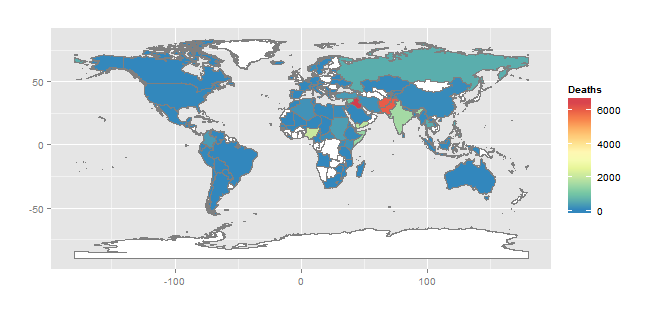

```{r setup, include=FALSE}
knitr::opts_chunk$set(echo = TRUE)
```


## Prontuario

## Algunas ideas básicas y conceptos

### Motivación para aprender Estadística 

Actualmente la estadística esta presente en la mayoría de problemas en distintas areas del conocimiento, como lo son la  Medicina, Economía, Biología, Ciencias sociales, Psicología etc. En todos estas disciplinas siempre es posible usar técnicas de estadística para resolver alguna o varias preguntas usando los datos del del problema en cuestion. Veamos algunos ejemplos:

*  ¿La aspirina reduce el riesgo de ataques cardíacos? (Investigación médica)
*  ¿Hay menos especies de aves en Puerto Rico después del huracán María? (Biología)
*  ¿Una cierta marca de gasolina realmente limpia el motor? (Química e Ingeniería Mecánica)
*  Evaluación costo-beneficio de la vacunación en un pais (Politica Economica y Gobierno)
*  ¿Funciona la capacitación para el manejo de la ira? (Psicología y Derecho)
*  ¿Los programas de viajero frecuente aumentan la venta de boletos aéreos? (Negocio)
*  ¿Realmente el asistencialismo reduce la pobreza? (Ciencias Sociales y Economía)

La estadística puede resolver todas las preguntas anteriores, quizas todas con el mismo método. 

> ¿Que es la estadística?.

* Primera Idea: Estadística es la ciencia de los datos o de la información. Respecto a esto la estadística resulve las siguientes preguntas:

    + ¿Como recolectar los datos? 
    + ¿Como analizar los datos?
    + ¿Como presentar los resultados?
    

* Segunda Idea: Estadística es la ciencia de la incertidumbre.

    + ¿De donde proviene esa incertidumbre?
    + ¿Que tipos de incertidumbre?
    + ¿Como tratarla?


La Estadística comprende los métodos usados para recolectar los datos, la organización y presentación de la información recolectada y la extracción de conclusiones mediante la aplicación de técnicas adecuadas a los datos de la muestra. 


### Conceptos básicos en Estadística.

Para entender gran parte del curso se deben tener presente los siguientes conceptos:

> Población

En Estadística se refiere a población como el conjunto de individuos u objetos que poseen la característica o características que se desea estudiar. En un sentido más estadístico, una población es el conjunto de mediciones de una cierta característica en todos los individuos u objetos de estudio. Entiendase por individuos u objetos a personas, plantas, animales, maquinas, etc.


> Muestra

Es una parte de la población y es el conjunto de mediciones que han sido realmente recolectados o seleccionados. La extracción de la muestra es un paso  importante porque es a partir de ella que se sacan conclusiones acerca de la población. El tamaño de la muestra depende del esquema que se usa para su selección. 


> Muestra Aleatoria

Es una muestra bien representativa de la población. Se considera que cada elemento de la población ha tenido la misma oportunidad de formar parte de la muestra. Las conclusiones basadas en una muestra aleatoria son confiables.

> Variable

Es la característica que se desea estudiar. Por ejemplo, si estamos interesados en saber ¿Qué música escuchan los colegiales?, ¿Cúal es la variable en este ejemplo?

> Dato

Es un valor particular de la variable.

> Parámetro

Es un valor que caracteriza a una población. El valor del parámetro se considera constante y por lo general es desconocido.

> Estadístico

Es un valor que se calcula con base a los datos que se toman en la muestra y el cual es usado para estimar el valor del parámetro. El valor del estadístico es conocido y varía con la muestra tomada.

> Censo

Es un listado de una o más características de todos los elementos de una población. Los censos poblacionales se hacen cada 10 años a nivel mundial.

> Encuesta

Es un listado de una o más características de todos los elementos de una muestra.

### División de la estadística

* Estadistica Descriptiva: Conjunto de técnicas y métodos que son usados para recolectar la información a ser evaluada, organizarla, y presentarla en forma de tablas y gráficas. También se incluyen aquí el cálculo de medidas estadísticas de centralidad y de variabilidad.

* Estadistica Inferencial: Conjunto de técnicas y métodos que son usados para sacar conclusiones generales acerca de una población usando datos de una muestra tomada de ella.

### Tipos de Datos

* Datos Cuantitativos. Son aquellos que resultan de hacer mediciones o conteos. Se clasifican a su vez en dos subtipos:

    + Datos Discretos: Son los que resultan de hacer conteos y por lo general son números enteros.
    + Datos Continuos. Son los que resultan de hacer mediciones y pueden asumir cualquier valor de la recta real.
  
Ejemplos: Como datos discretos podemos tener: Número de hijos, Años de estudio, Número de empleados en una empresa, Número de cigarrillos que una persona fuma al día, etc. Para datos continuos tenemos por ejemplo el Peso de una persona en lb, estatura, temperatura del ambiente, etc.


* Datos Cualitativos o Categóricos. Son aquellos que expresan atributos o categorías. Para facilitar el análisis estadístico de este tipo de datos frecuentemente se codifican a números, esta codificación da lugar a dos subtipos de datos categóricos:

    + Datos Nominales. Son caracteristicas o cualidades cuyas categorías no tienen un orden establecido. Pueden ser numéricos o no numéricos.
   
    + Datos Ordinales. Son caracteristicas o cualidades cuyas categorías  tienen un orden prestablecido. Pueden ser numéricos o no numéricos. 
    
Ejemplos: El género de una persona es un dato nominal no numérico, también lo es deporte favorito, música favorita, etc. El número de seguro social de una persona es un dato nominal numérico. El grado de interes por un tema (Bajo, Alto), calificaciones durante el semestre (F, D, C, B, A). Entre los ejemplos de variables ordinales se incluyen escalas de actitud que representan el grado de satisfacción o confianza y las puntuaciones de evaluación de las preferencias.


En la imagen arriba se puede aprecial los tipos de datos o variables. 
  
  
### Técnicas de Muestreo

> Muestreo

Muestreo se define como el proceso de pasos y técnicas para llevar a cabo la extracción de la muestra. El muestreo se debe realizar garantizando que la muestra seleccionada sea aleatoria. Existen varias técnicas para hacer muestreo, a continuación se enumeran las cuatro principales.


1. Muestreo Aleatorio simple. Se usa cuando a cada elemento de la población se le quiere dar la misma oportunidad de ser elegido en la muestra.

Despues de fijar el tamaño de la muestra $n$,  los elementos que la compongan se deben elegir aleatoriamente entre los $N$ de la población. Para hacer que el proceso sea aleatorio los individuos se deben etiquetar (números por ejemplo), y luego serán seleccionados usando computadora u otro método adecuado. 

2. Muestreo Estratificado. Se usa cuando se conoce de antemano que la población está dividida en estratos, que son equivalentes a categorías y los cuales por lo general no son de igual tamaño. Luego, de cada estrato se saca una muestra aleatoria, usualmente proporcional al tamaño del estrato. 

Este tipo de muestreo consiste en considerar categorías típicas diferentes entre sí (estratos) que poseen gran homogeneidad respecto a alguna característica (se puede estratificar, por ejemplo, según la profesión, el municipio de residencia, el sexo, el estado civil, etc.). Lo que se pretende con este tipo de muestreo es asegurarse de que todos los estratos de interés estarán representados adecuadamente en la muestra. Cada estrato funciona independientemente, pudiendo aplicarse dentro de ellos el muestreo aleatorio simple o el estratificado para elegir los elementos concretos que formarán parte de la muestra.


3. Muestreo por conglomerados (“Clusters”). En este caso la población se divide en grupos llamados conglomerados. Luego se elige al azar un cierto número de ellos y todos los elementos de los conglomerados elegidos forman la muestra.

En el muestreo por conglomerados la unidad muestral es un grupo de elementos de la población que forman una unidad, a la que llamamos conglomerado. Las unidades hospitalarias,  los departamentos universitarios, una caja de determinado producto, etc., son conglomerados naturales. En otras ocasiones se pueden utilizar conglomerados no naturales como, por ejemplo, las urnas electorales. Cuando los conglomerados son áreas geográficas suele hablarse de "muestreo por áreas". El muestreo por conglomerados consiste en seleccionar aleatoriamente un cierto numero
de conglomerados (el necesario para alcanzar el tamaño muestral establecido) y en investigar después todos los elementos pertenecientes a los conglomerados elegidos. 


4. Muestreo Sistemático. Se usa cuando los datos de la población están ordenados en forma numérica. La primera observación es elegida al azar de entre los primeros elementos de la población y las siguientes observaciones son elegidas guardando la misma distancia entre si.  Este procedimiento exige, numerar todos los elementos de la población, pero en lugar de extraer n números aleatorios sólo se extrae uno. Se parte de ese número aleatorio i, que es un número elegido al azar, y los elementos que integran la muestra son los que ocupa los lugares i, i+k, i+2k, i+3k,...,i+(n-1)k, es decir se toman los individuos de k en k, siendo k el resultado de dividir el tamaño de la población entre el tamaño de la muestra: k= N/n. El número i que empleamos como punto de partida será un número al azar entre 1 y k.

### Formas de recolección de datos

1. Haciendo entrevistas personales. Puede ser el método más efectivo en muchas ocasiones pero es costoso y requiere bastante tiempo para ser ejecutado.

2. Haciendo entrevistas por teléfono. Tiene la desventaja de que el entrevistado puede no ser sincero en sus contestaciones.

3. Mediante cuestionarios emitidos por correo. Es costoso y por lo general no más del 30% de los entrevistados retornan el cuestionario.

4. Por observación directa.

5. A través de  Internet.

6. Usando simulación por computadoras.

## Introducción a RStudio

### ¿Qué es R?

R es un software gratuito y un lenguaje de programación de código abierto desarrollado en 1995 en la Universidad de Auckland como un entorno para la informática estadística y los gráficos (<https://www.stat.auckland.ac.nz/~ihaka/downloads/R-paper.pdf>). Desde entonces, R se ha convertido en uno de los entornos de software dominantes para el análisis de datos y es ampliamente  utilizado por una variedad de disciplinas científicas. R es particularmente popular por sus capacidades gráficas. 

### ¿Por qué debería usar R?

Puede haber muchas razones particulares para usar uno u otro programa de computación. Aquí tratare de resumir algunas razones generales de porque usar R.

1. Es gratuito, esto implica muchas ventajas y más si eres estudiante!

2. R funciona en cualquier lugar: R esta disponible para diferentes tipos de hardware y software. Esto significa que R está disponible para Windows, sistemas Unix (como Linux), y  Mac.

3. Proporciona una plataforma muy competitiva para la programación de nuevos métodos estadísticos de una manera fácil y sencilla.

4. Contiene rutinas estadísticas avanzadas no disponibles en otros paquetes.

5. Tiene capacidades gráficas con las cuales se pueden realizar gráficos detallados y muy atractivos.

### ¿Qué puede hacer R?

Con R se pueden hacer muchas cosas relacionadas con el análisis  y visualización de datos. Puedes contruir tus propias funciones, paquetes, y hacer las graficas con un estilo propio. 

*  Gráficos descriptivos 


*  Mapas



*  Crear tus propios documentos e informes  desde Rmarkdown.


### ¿Cómo empiezo?

1. Lo primero es instalar R, a continuación esta el enlace de descarga <https://cran.r-project.org/> para usuarios de Windows, Linux o Mac.

2. Descargar e Instalar RStudio, se puede descargar en <https://www.rstudio.com/products/rstudio/download/> para usuarios de Windows, Linux o Mac.


### RStudio: Un entorno de desarrollo integrado (IDE) para R

RStudio es un entorno de desarrollo integrado (IDE) que le permite interactuar con R más fácilmente. RStudio es similar al RGui estándar, pero es considerablemente más fácil de usar. Tiene más menús desplegables, ventanas con múltiples pestañas y muchas opciones de personalización. La primera vez que abras RStudio, verás tres ventanas. Una cuarta ventana está oculta por defecto, pero se puede abrir haciendo clic en el menú desplegable Archivo, luego en Nuevo archivo y luego en R Script. Puede encontrar información detallada sobre cómo usar RStudio en el sitio web  <https://support.rstudio.com/hc/en-us/sections/200107586-Using-RStudio>


### Tips básicos para usar R adecuadamente


* R es ejecutado mediante una o más lineas de comandos. Esto requiere que escriba o copie y pegue comandos después de un símbolo del sistema (>) que aparece cuando abre R. Después de escribir un comando en la consola R y presionar Enter en su teclado, se ejecutará el comando. Si su comando no está completo, R emite una solicitud de continuación (significada por un signo más: +). Alternativamente, puede escribir un script en la ventana del script, seleccionar un comando y hacer clic en el botón Run.

* R es sensible a las mayúsculas. Asegúrese de que la ortografía y el uso de mayúsculas y minúsculas sean correctos.

* Los comandos en R también se llaman funciones. El formato básico de una función en R es: nombre.función (argumento, opciones).

* La flecha hacia arriba (^) en su teclado se puede utilizar para mostrar los comandos anteriores que ha escrito en la consola R.

* El símbolo $\$$ se usa para seleccionar una columna particular dentro de la tabla (por ejemplo, tabla$columna).

* Cualquier texto sobre el que no desee que actúe R (como comentarios, notas o instrucciones) debe ir precedido del símbolo #. 

### Operaciones y funciones básicas en R

R también funciona como una calculadora, veamos 

> Aritmetica 

```{r,comment=NA}
## suma
4+4
## multiplicación
3*10
# división
25/4
```

> Asignando objetos 

Los anteriores resultados los podemos guardar en un objeto, y a la vez hacer operaciones con esos objetos. 

```{r,comment=NA}
## suma
a <- 4+4 ## Guarda en a el resultado de 4+4
a # pido que me muestre el valor de a
## multiplicación
b <- 3*10  ## Guarda en b el resultado de 3*10
b
# división
c <- 25/5  ## Guarda en c el resultado de 25/5
c

d <- a + b + c ## Guarda en d las suma de a,b,c.
d
```

> La función `print()`

Esta función se utiliza para visualizar el contenido de un objeto, veamos 


```{r,comment=NA}
## Imprimiendo un mensaje 
print("Hola a todos")
## Imprimiendo el objeto x
x <- 25
print(x)
```

> Funcion `paste()`

La función `paste()`  se usa para concatenar dos o mas objetos en R, veamos unejemplo en conjunto con la función `print()`.

```{r,comment=NA}
## Imprimiendo un mensaje 
est <- 31
print(paste("Hola a todos los",est,"estudiantes de mi clase ESMA3101"))
```

> Vectores numéricos

En R un vector numérico  es un objeto que contiene valores numéricos. Siempre se contruye con la `c()` y dentro del parentesis van los valores del vector separados por comas. 

Ejemplo: Suponga que conoce el GPA de 20 estudiantes del colegio, 12 mujeres y 8 hombres:

Mujeres: 3.25 3.78 3.78 2.47 3.24 2.89 2.41 3.61 2.59 2.99 2.56 2.44.

Hombres: 3.22 2.75 3.17 3.38 3.85 2.18 3.68 2.10.

Vamos a construir un vector numérico para el GPA

```{r,comment=NA}
GPA <- c(3.25, 3.78, 3.78, 2.47, 3.24, 2.89, 2.41, 3.61, 2.59, 2.99, 2.56, 2.44,3.22, 2.75, 3.17, 3.38, 3.85, 2.18, 3.68, 2.10)
print(GPA)
```

> Vectores de caracteres

A diferencia de los vectores numéricos, los vectores de caracteres contienen categorias. Ejemplos:

```{r,comment=NA}
## Grado de satisfacción sobre algun tema
Grado_satisfaccion <- c("Bueno", "Regular", "Malo")
print(Grado_satisfaccion)
## Estatus marital
Estatus <- c("Soltero","Casado", "Viudo", "Separado")
print(Estatus)
```


> Función `rep()`

La función `rep()` sirve para repetir un objeto una cantidad determinado numero de veces. Esta función crea un vector automaticamente sin la necesidad de usar el comando `c()`.

Ejemplo: Repita el número 5 diez veces. Asigne el resultado a un objeto `x`

```{r,comment=NA}
x <- rep(5,10)
print(x)
```


Ejemplo: Repetir el mensaje "Soy Colegial" 10 veces y asignelo a un objeto llamado Colegio, luego imprima usando ` `print`.


```{r,comment=NA}
## Repetir 10 veces "Soy Colegial"
Colegio <- rep("Soy Colegial",10)
print(Colegio)
```
Ejemplo: Crear un objeto llamado `Genero` con los datos de los 20 estudiantes (12 mujeres y 8 hombres). Usar la función  `rep()`, luego use `print()` para imprimir el vector de caracteres.


```{r,comment=NA}
Genero <- c(rep("Mujer",12),rep("Hombre",8))
print(Genero)
```

Supongamos que la concentración de los 20 estudiantes esta distribuida de la siguiente manera: Los cinco primeros son de QUIM, los tres siguientes son de BIOL, los siguientes ocho son de ECON, y los cuatro restantes son de PSIC. Crear un vector de caracteres con la concentración de los estudiantes.

```{r,comment=NA}
Concentracion <- c(rep("QUIM",5),rep("BIOL",3),rep("ECON",8),rep("PSIC",4))
print(Concentracion)
```

> Data frames en R

Un data frame en R se usa para almacenar tablas de datos. Es una lista de vectores de igual longitud. Por ejemplo, vamos a contruir un data frame  con los vectores que construimos anteriormente: `GPA`, `Genero` y `Concentracion`, y le asignaremos el nombre `Etudiantes`. La función para crear un data frame es `data.frame`

```{r,comment=NA}
Students <- data.frame(GPA,Genero,Concentracion)
print(Students)
```

Ahora como vemos, tenemos un tabla de datos con la información de los 20 estudiantes. 

Puede usar el comando `View(Students)` para mostrar la tabla de datos en una nueva pestaña de R. 