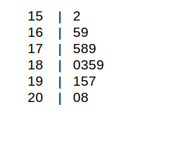

```{r setup, include=FALSE}
knitr::opts_chunk$set(echo = TRUE)
```

## Estadística descriptiva

En este capítulo se verán las técnicas que se usan para la organización y presentación de datos en tablas y gráficas, así como el cálculo de medidas estadísticas de tendencia central y de dispersión. Se considerarán solamente datos univariados y bivariados.

## Organización de datos Cuantitativos Discretos.


### Tablas de Frecuencias:

Los datos cuantitativos discretos se organizan en tablas, llamadas Tablas de Distribución de frecuencias. Tipos de frecuencias:


*  **Frecuencia absoluta:** Indica el número de veces que se repite un valor de la variable.
    
*  **Frecuencia relativa:** Indica la proporción con que se repite un valor. Se obtiene dividiendo la frecuencia absoluta entre el tamaño de la muestra. Para una mejor interpretación es más conveniente multiplicarla por 100 para
trabajar con una Frecuencia relativa porcentual.


*  **Frecuencia absoluta acumulada:** Indica el número de valores que son menores o iguales que el valor dado.
    
    
*  **Frecuencia relativa  acumulada:** Indica el porcentaje de datos que son menores o iguales que el valor dado.
    
**Ejemplo:** Usaremos los datos de 50 estudiantes de cierta universidad. Los datos están en formato plano `txt`, por lo tanto la forma de leerlos es la siguiente.


```{r, comment=NA,echo=T,eval=T}
Estudiantes <- read.table("/datos/DirectorioR/figure_out/estudiantes.txt",header = T)
head(Estudiantes)
```

Otra forma de leer los datos es directamente desde internet usando la función `fread()` de la librería `data.table`. Para esto debe tener una conexión a internet. 

```{r, comment=NA,echo=T,eval=F,message=FALSE,warning=FALSE}
library(data.table)
Estudiantes <- fread("https://didier-murillo.netlify.com/estudiantes.csv",header = TRUE)
head(Estudiantes)
```

Vamos a construir una tabla de frecuencias paso a paso para la variable discreta `hermanos` que se refiere al número de hermanos de cada estudiante.

*   **Paso 1: Encontrar las frecuencias usando la función `table`.**

```{r, comment=NA,echo=T,eval=T}
frecuencias <- table(Estudiantes$hermanos)
frecuencias
```
*   **Paso 2: Encontrar las frecuencia  relativas dividiendo por el número de registros.**

```{r, comment=NA,echo=T,eval=T}
frec_relativa <- frecuencias/50
frec_relativa
```

*   **Paso 3: Encontrar las frecuencia  absolutas acumuladas. Esto lo hace la función `cumsum()`**

```{r, comment=NA,echo=T,eval=T}
frecuencias_acum <- cumsum(frecuencias)
frecuencias_acum
```

*   **Paso 4: Encontrar la frecuencia relativa  acumulada. Esto se hace dividiendo por el numero de registros.**


```{r, comment=NA,echo=T,eval=T}
frecuencias_abs_acum <- frecuencias_acum/50
frecuencias_abs_acum 
```

Mediante un data frame se puede crear la tabla de frecuencias

```{r, comment=NA,echo=T,eval=T}
Obs <- sort(unique(Estudiantes$hermanos),F)
Frecuencia_Abs <- as.vector(frecuencias)
Frecuencia_Relativa <- as.vector(frec_relativa)
Frecuencia_Acum <- as.vector(frecuencias_acum)
Frecuencia_Abs_Acum <- as.vector(frecuencias_abs_acum)
table_frec <- data.frame(Obs,Frecuencia_Abs,Frecuencia_Relativa, Frecuencia_Acum, Frecuencia_Abs_Acum)
table_frec
```

Finalmente encontramos que la tabla de frecuencia para la variable número de hermanos es:

```{r, comment=NA,echo=F,eval=T}
library(knitr)
library(kableExtra)
kable(table_frec) %>%
  kable_styling(bootstrap_options = "striped", full_width = F, position = "left")
```

Algunas interpretaciones para esta tabla son:

1. De las frecuencias absolutas se puede interpretar por ejemplo que hay 15 estudiantes que no tienen hermanos o que hay 10 que tienen 2 hermanos.

2. De la frecuencia relativa podemos decir que el 30 % de los estudiantes no tienen hermanos o que el 14 % de los estudiantes tienen tres hermanos.

3. De La frecuencia acumulada se puede decir por ejemplo que hay 44 estudiantes que tienen entre 0 y 3 hermanos o que hay 27 estudiantes que tienen menos de dos hermanos. 

4. De la frecuencia relativa acumulada se puede concluir que el número de estudiantes con más de 3 hermanos es el 12 % o que el porcentaje de estudiantes que tienen hermanos es del 70 %. 


## El plot de puntos (“Dotplot”)

La gráfica más elemental es el plot de puntos (“Dotplot”) que consiste en colocar un punto cada vez que se repite un valor. Esta gráfica permite explorar la simetría y el grado de variabilidad de la distribución de los datos con respecto al centro, el grado de concentración o dispersión de los datos con respecto al valor central y permite detectar la presencia de valores atípicos (“outliers”).

```{r, comment=NA,echo=T,eval=T,message=FALSE,warning=FALSE}
library(ggplot2)
ggplot(Estudiantes, aes(x = Estudiantes$hermanos)) + 
  geom_dotplot(fill = "green", color = "black") + 
  ggtitle("Dotplot para Número de hermanos")  + xlab("Número de hermanos") + ylab("conteos")
```

En este caso no tenemos presencia de valores anormales ("outliers").

A continuación hacemos un Dotplot para la variable cuantitativa - discreta `edad` para ilustrar la presencia de datos anormales.

```{r, comment=NA,echo=F,eval=T,message=FALSE,warning=FALSE}
Estudiantes1 <- read.table("/datos/DirectorioR/figure_out/estudiantes.txt",header = T)
library(ggplot2)
ggplot(Estudiantes1, aes(x = Estudiantes1$edad)) + 
  geom_dotplot(method="histodot" ,fill = "red", color = "black") + 
  ggtitle("Dotplot para edad")  + xlab("Edad") + ylab("conteos")
```

Observamos que la edad de los estudiantes se situa entre los 17 y los 26 años aproximadamente, pero vemos la presencia de un dato  a la izquierda de la gráfica y otros a la derecha muy alejados del grupo del centro, estos valores se conocen como datos anormales. 

## Organización de datos Cuantitativos Continuos.

Cuando los datos son de una variable continua o de una variable discreta que asume muchos valores distintos, ellos se agrupan en clases que son representadas por intervalos y luego se construye una tabla de frecuencias, cada frecuencia absoluta (relativa porcentual) representa el número (porcentaje) de datos que caen en cada intervalo.

*   Recomendaciones acerca del número de intervalos de clases:

    + El número de intervalos de clases debe variar entre 5 y 12.
    + Se debe evitar que hayan muchas clases con frecuencia baja o cero, de ocurrir ello es recomendable reducir el número de clases.
    + A un mayor número de datos le corresponde un mayor número de clases.
    
Una regla bien usada es que el número de clases $k$ debe ser aproximadamente igual a la raíz cuadrada del número de datos. También está la regla de Sturges, en donde el número de clases está dado por 
$$k = 1+3.3*log(n)$$
Donde $n$ es el número de datos. Una vez que se determina el número de clases se calcula la amplitud de cada clase usando la siguiente fórmula:
$$Amplitud=\frac{máximo - mínimo}{k}$$
Usualmente la amplitud debe ser redondeada al siguiente número.

También se debe tener encuenta la **Marca de clase o Punto Medio**, que se refiere a el punto medio de cada intervalo y es el valor que representa a todo el intervalo para el cálculo de algunos valores.

La siguiente función construye una tabla de frecuencias para variables continuas. Para usar esta función solo debe copiar el código  y ejecutarlo en su consola de `RStudio`. 


```{r, comment=NA,echo=T,eval=T}
tabla_frecuencia <- function(datos) {
  k <- nclass.Sturges(datos)
  intervalos <- cut(datos, breaks = k)
  tabla2 <- as.data.frame(table(intervalos))
  tabla2 <- transform(tabla2, frec_relativa = prop.table(Freq),frec_acumu = cumsum(Freq))
  tabla2 <- transform(tabla2, frecuencia_abs_acum = cumsum(frec_relativa))
  midpoints <- function(x, dp=2){
    lower <- as.numeric(gsub(',.*','',gsub('\\(|\\[|\\)|\\]','', x)))
    upper <- as.numeric(gsub('.*,','',gsub('\\(|\\[|\\)|\\]','', x)))
    return(round(lower+(upper-lower)/2, dp))
  }
  tabla2 <- transform(tabla2, MC = midpoints(intervalos))
  tabla2
}
```

Ejemplo para la variable `peso`


```{r, comment=NA,echo=T,eval=T}
tabla_frecuencia(Estudiantes$peso)
```

Ejemplo para la variable `estatura`

```{r, comment=NA,echo=T,eval=T}
tabla_frecuencia(Estudiantes$estatura)
```

Algunas interpretaciones de la tabla de frecuencia de `estatura`.

*  Hay 11 estudiantes con estatura entre 157 y 161 centimetros

*  El 24 % de los estudiantes tienen una estatura entre 166 y 170 centimetros. 

*  Hay 43 estudianete con la estatura entre 153 y 174 centimetros. 

*  El 72 % de los estudiantes tienene una estatura entre 153 y 170 centimetros. 

### Histograma

Es la gráfica de la tabla de distribución de frecuencias para datos agrupados, consiste de barras cuyas bases son los intervalos de clases y cuyas alturas son proporcionales a las frecuencias absolutas (o relativas) de los correspondientes intervalos. En un histograma las barras más altas identifican los valores más comunes en la muestra. Aquellas gráficas donde los datos se agrupan alrededor de un valor central se dice que son simétricas, mientras que aquellas que tienen más datos a un lado que a otro se dice que están sesgadas,  presentando “sesgo a la derecha” cuando las barras más altas se posicionan al principio de la gráfica y “sesgo a la izquierda” cuando las barras más grandes aparecen a la derecha de la gráfica. 

Con los resultados de la tabla de frecuencia construida arriba para el peso de los estudiantes y usando los puntos medios `MC` y las frecuencas absolutas  podemos hacer manualmente  un histograma de frecuencias para el `peso` de los estudiantes.


Para hacer un Histograma en R puede usar la función `hist()` veamos,


```{r, comment=NA,echo=T,eval=T}
hist(Estudiantes$peso)
```

La función `hist()` tiene opciones para colocar el nombre o título del histograma, también para asignar nombres a los ejes x-y. También se puede cambiar el color de las barras en el histograma. 

```{r, comment=NA,echo=T,eval=T}
hist(Estudiantes$peso, col="green",xlab = "Peso", ylab = "Frecuencias",main = "Histograma de frecuencias para peso")
```

Puede usar el paquete `ggplot2` para hacer la misma gráfica.

```{r, comment=NA,echo=T,eval=T}
ggplot(data=Estudiantes, aes(x = Estudiantes$peso)) + 
  geom_histogram(binwidth=6,col="black",fill="white") + ggtitle("Histograma para peso")  + xlab("Peso")
```

Para la variable `gpa`

```{r, comment=NA,echo=T,eval=T}
ggplot(data=Estudiantes, aes(x = Estudiantes$gpa)) + 
  geom_histogram(binwidth=0.25,col="black",fill="white") + ggtitle("Histograma para GPA")  + xlab("GPA")
```

### Histogramas simétricos y sesgados.


> Histograma sesgado a izquierda

Se refiere a un histograma sesgado a la izquierda cuando las barras más altas estan al final de la gráfica.

```{r, comment=NA,echo=F,eval=T,message=FALSE,warning=FALSE}
set.seed(12345)
num.samples <- 10000
U <-  runif(num.samples)
X <- (256*U)^(1/4)
asimetric1 <- as.data.frame(X)
ggplot(data=asimetric1, aes(x = X)) + 
  geom_histogram(binwidth = 0.12,col="black",fill="green") + ggtitle("Histograma sesgado a izquierda")  + xlab("GPA")
```

> Histograma Simétrico

Un histograma es simétrico si hay aproximadamente la misma cantidad de datos al lado izquierdo y en el lado dereho. 

```{r, comment=NA,echo=F,eval=T,message=FALSE,warning=FALSE}
set.seed(123)
simetric <- abs(rnorm(10000,3.2,0.25))
simetric <- as.data.frame(simetric)
ggplot(data=simetric, aes(x = simetric)) + 
  geom_histogram(col="black",fill="white") + ggtitle("Histograma Simétrico")  + xlab("GPA")
```


> Histograma sesgado a derecha

Se refiere a un histograma sesgado a derecha cuando hay menos datos al lado derecho del histograma. En otras palabras un histograma es sesgado a derecha cuando las barras más altas estan al comienzo de la gráfica.

```{r, comment=NA,echo=F,eval=T,message=FALSE,warning=FALSE}
set.seed(1234)
asimetric2 <- c(rgamma(10000,2,2))
asimetric2 <- as.data.frame(asimetric2)
ggplot(data=asimetric2, aes(x = asimetric2)) + 
  geom_histogram(col="black",fill="orange") + ggtitle("Histograma sesgado a derecha")  + xlab("GPA") + xlim(0,4)
```

Para resumir, veamos los tres tipos de histogramas que podemos encontrar.

```{r, comment=NA,echo=F,eval=T,message=FALSE,warning=FALSE}
p1 <- ggplot(data=asimetric1, aes(x = X)) + 
  geom_histogram(binwidth = 0.12,col="black",fill="green") + ggtitle("Sesgado a izquierda")  + xlab("GPA")
p2 <- ggplot(data=simetric, aes(x = simetric)) + 
  geom_histogram(col="black",fill="white") + ggtitle("Simétrico")  + 
  xlab("GPA")
p3 <- ggplot(data=asimetric2, aes(x = asimetric2)) + 
  geom_histogram(col="black",fill="orange") + ggtitle("Sesgado a derecha")  + xlab("GPA") +
  xlim(0,4)
library(gridExtra)
grid.arrange(p1,p2,p3,ncol = 3)
```


## Presentación de datos cualitativos 

En este caso los datos también se pueden organizar en tablas de frecuencias, pero las frecuencias acumuladas no tienen mucho significado, excepto cuando la variable es ordinal


```{r, comment=NA,echo=T,eval=T}
frecuencia_area <- table(Estudiantes$area)
frecuencia_area 
frecuencia_relativa_area <- frecuencia_area/50
frecuencia_relativa_area <- as.vector(frecuencia_relativa_area)
frecuencia_relativa_area 
tabla_frecuencia <- data.frame(frecuencia_area,frecuencia_relativa_area)
tabla_frecuencia
```

Las frecuencias acumuladas no son importantes si las variables son nominales como el caso de la variable `area`

### Gráficos de barras

Las gráficas de barras pueden ser verticales u horizontales. Usando la función `ggplot` obtenemos:

> Grafica de barras para la variable `area`

```{r, comment=NA,echo=T,eval=T}
ggplot(Estudiantes, aes(x = Estudiantes$area,fill = Estudiantes$area)) + geom_bar(position="dodge") + 
  ggtitle("Gráfico de barras para región geográfica del estudiante") + xlab("Región geográfica del estudiante") + ylab("Número de estudiantes") 
```

Según la gráfica de barras, la región geográfica de donde provienen los estudiantes con mayor frecuancia  es el oeste. En último lugar está el Norte. 


> Grafica de barras para la variable `nota_esma`

```{r, comment=NA,echo=T,eval=T}
ggplot(Estudiantes, aes(x = Estudiantes$nota_esma,fill = Estudiantes$nota_esma)) + geom_bar(position="dodge") + 
  ggtitle("Gráfico de barras para notas de los estudiante en ESMA") +
  xlab("Notas") + ylab("Número de estudiantes") 
```

Según la gráfica de barras, las notas con mayor frecuencia son en primer lugar la C, seguido de la D. La nota A esta en el tercer lugar.


### Gráficos de barras por grupos

Se pueden comparar grupos usando graficas de barras. Por ejemplo podemos tomar las variables area y trabaja y comparar mediante un gráfico de barras por grupos.

```{r, comment=NA,echo=T,eval=T}
# Gráfico de barras por grupos
ggplot(Estudiantes, aes(fill=Estudiantes$trabaja,  x=Estudiantes$area)) + 
    geom_bar(position="dodge") + 
  ggtitle("Grafico de barras por grupos: Región y opción de trabajo.") + xlab("Región geográfica del estudiante") + ylab("Número de estudiantes") 
```


### Gráficas Circulares

Este tipo de gráfica se usa cuando se quiere tener una idea de la contribución de cada valor de la variable al total. Aunque es usada más para variables cualitativas, también podría usarse para variables cuantitativas discretas siempre que la variable no asuma muchos valores distintos.

```{r, comment=NA,echo=T,eval=T}
frec <- table(Estudiantes$area)
frec
```

Ahora creamos dos vectores 

```{r, comment=NA,echo=T,eval=T,fig.width=6,fig.height=6}
Area <- c("Centro","Este",  "Norte","Oeste","Otra","Sur" )
num_Area <-c(7, 6, 4, 13, 10, 10 )
pct <- round(num_Area/sum(num_Area)*100)
Area <- paste(Area, pct) # add percents to labels 
Area <- paste(Area,"%",sep="") # ad % to labels 
pie(num_Area,labels = Area, col=rainbow(length(Area)),
  	main="Gráfico de sectores para región geográfica del estudiante")
```

Como resultado obtenemos un diagrama de sectores para la variable cualitativa `area`.


### Gráfica de tallo y hojas (“Stemand-Leaf”)

Es una gráfica usada para datos cuantitativos. Es la gráfica más básica de un conjunto de técnicas conocido con el nombre de Análisis Exploratorio de Datos (EDA) introducida por John Tukey a mediados de los años 70. La idea es considerar los primeros dígitos del dato como una rama del tallo (“stem”) y el último dígito como una hoja (“leaf”) de dicha rama. Las ramas son ordenadas en forma creciente.


**Ejemplo**. Los siguientes datos representan pesos de una muestra de 15 varones adultos.

 165 178 185 169 152 180 175 189 195 200 183 191 197 208 179
 
Hacer su gráfica de “Stem-and Leaf”.


Solución: En este caso las ramas la forman los primeros dos dígitos de los datos, y las hojas serán dadas por los últimos dígitos de los datos. Luego el “stem-and leaf “ será de la siguiente manera:



**Interpretación:**  El uso del “stem-and-leaf” es exactamente igual al del Histograma, la única diferencia está en que del “stem-and-leaf” se pueden recuperar los datos muestrales, pero de un histograma no se puede hacer. En este ejemplo el “stem-and-leaf” es sesgado a la izquierda, no tiene mucha variabilidad ni “outliers”.

Podemos hacer el “stem-and leaf“ directamente en RStudio con la función `stem()`. 

Debemos crear un vector con los datos y usar la función `stem()`

```{r, comment=NA,echo=T,eval=T,fig.width=7,fig.height=8}
pesos <- c(165, 178, 185, 169, 152, 180, 175, 189, 195, 200, 183, 191, 197, 208, 179)
stem(pesos,2)
```


Hagamos una grafica de tallos y hojas para la variable `estatura` de los estudiantes.

```{r, comment=NA,echo=T,eval=T,fig.width=7,fig.height=8}
stem(Estudiantes$estatura)
```


-------------

**FIN**