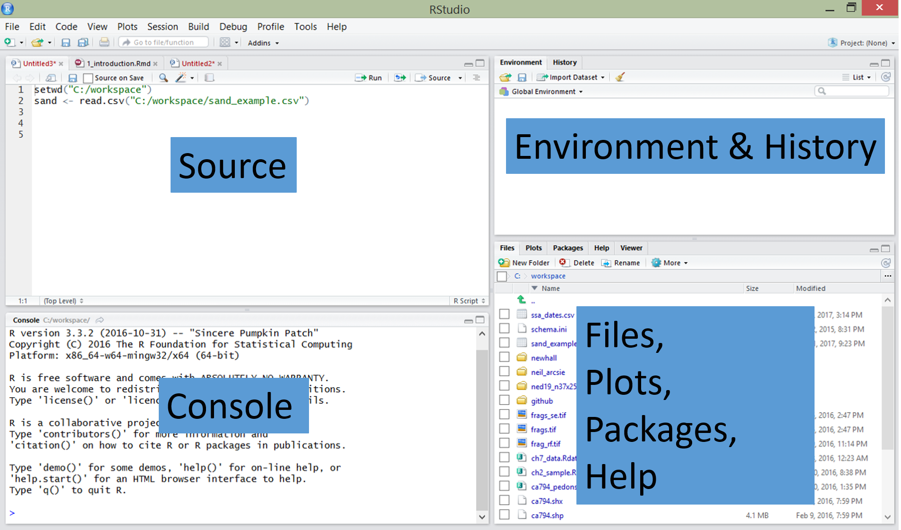

```{r setup, include=FALSE}
knitr::opts_chunk$set(echo = TRUE)
```
## Introducción a RStudio

### ¿Qué es R?

R es un software gratuito y un lenguaje de programación de código abierto desarrollado en 1995 en la Universidad de Auckland como un entorno para la informática estadística y los gráficos (<https://www.stat.auckland.ac.nz/~ihaka/downloads/R-paper.pdf>). Desde entonces, R se ha convertido en uno de los entornos de software dominantes para el análisis de datos y es ampliamente  utilizado por una variedad de disciplinas científicas. R es particularmente popular por sus capacidades gráficas. 

### ¿Por qué debería usar R?

Puede haber muchas razones particulares para usar uno u otro programa de computación. Aquí tratare de resumir algunas razones generales de porque usar R.

1. Es gratuito, esto implica muchas ventajas y más si eres estudiante!

2. R funciona en cualquier lugar: R esta disponible para diferentes tipos de hardware y software. Esto significa que R está disponible para Windows, sistemas Unix (como Linux), y  Mac.

3. Proporciona una plataforma muy competitiva para la programación de nuevos métodos estadísticos de una manera fácil y sencilla.

4. Contiene rutinas estadísticas avanzadas no disponibles en otros paquetes.

5. Tiene capacidades gráficas con las cuales se pueden realizar gráficos detallados y muy atractivos.

### ¿Qué puede hacer R?

Con R se pueden hacer muchas cosas relacionadas con el análisis  y visualización de datos. Puedes contruir tus propias funciones, paquetes, y hacer las graficas con un estilo propio. 

*  Gráficos descriptivos 


*  Mapas


*  Crear tus propios documentos e informes  desde Rmarkdown.


### ¿Cómo empiezo?

1. Lo primero es instalar R, a continuación esta el enlace de descarga <https://cran.r-project.org/> para usuarios de Windows, Linux o Mac.

2. Descargar e Instalar RStudio, se puede descargar en <https://www.rstudio.com/products/rstudio/download/> para usuarios de Windows, Linux o Mac.


### RStudio: Un entorno de desarrollo integrado (IDE) para R

RStudio es un entorno de desarrollo integrado (IDE) que le permite interactuar con R más fácilmente. RStudio es similar al RGui estándar, pero es considerablemente más fácil de usar. Tiene más menús desplegables, ventanas con múltiples pestañas y muchas opciones de personalización. La primera vez que abras RStudio, verás tres ventanas. Una cuarta ventana está oculta por defecto, pero se puede abrir haciendo clic en el menú desplegable Archivo, luego en Nuevo archivo y luego en R Script. Puede encontrar información detallada sobre cómo usar RStudio en el sitio web  <https://support.rstudio.com/hc/en-us/sections/200107586-Using-RStudio>



### Tips básicos para usar R adecuadamente


* R es ejecutado mediante una o más lineas de comandos. Esto requiere que escriba o copie y pegue comandos después de un símbolo del sistema (>) que aparece cuando abre R. Después de escribir un comando en la consola R y presionar Enter en su teclado, se ejecutará el comando. Si su comando no está completo, R emite una solicitud de continuación (significada por un signo más: +). Alternativamente, puede escribir un script en la ventana del script, seleccionar un comando y hacer clic en el botón Run.

* R es sensible a las mayúsculas. Asegúrese de que la ortografía y el uso de mayúsculas y minúsculas sean correctos.

* Los comandos en R también se llaman funciones. El formato básico de una función en R es: nombre.función (argumento, opciones).

* La flecha hacia arriba (^) en su teclado se puede utilizar para mostrar los comandos anteriores que ha escrito en la consola R.

* El símbolo $\$$ se usa para seleccionar una columna particular dentro de la tabla (por ejemplo, tabla$columna).

* Cualquier texto sobre el que no desee que actúe R (como comentarios, notas o instrucciones) debe ir precedido del símbolo #. 

### Operaciones y funciones básicas en R

R también funciona como una calculadora, veamos 

> Aritmetica 

```{r,comment=NA}
## suma
4+4
## multiplicación
3*10
# división
25/4
```

> Asignando objetos 

Los anteriores resultados los podemos guardar en un objeto, y a la vez hacer operaciones con esos objetos. 

```{r,comment=NA}
## suma
a <- 4+4 ## Guarda en a el resultado de 4+4
a # pido que me muestre el valor de a
## multiplicación
b <- 3*10  ## Guarda en b el resultado de 3*10
b
# división
c <- 25/5  ## Guarda en c el resultado de 25/5
c

d <- a + b + c ## Guarda en d las suma de a,b,c.
d
```

> La función `print()`

Esta función se utiliza para visualizar el contenido de un objeto, veamos 


```{r,comment=NA}
## Imprimiendo un mensaje 
print("Hola a todos")
## Imprimiendo el objeto x
x <- 25
print(x)
```

> Funcion `paste()`

La función `paste()`  se usa para concatenar dos o mas objetos en R, veamos unejemplo en conjunto con la función `print()`.

```{r,comment=NA}
## Imprimiendo un mensaje 
est <- 31
print(paste("Hola a todos los",est,"estudiantes de mi clase ESMA3101"))
```

> Vectores numéricos

En R un vector numérico  es un objeto que contiene valores numéricos. Siempre se contruye con la `c()` y dentro del parentesis van los valores del vector separados por comas. 

Ejemplo: Suponga que conoce el GPA de 20 estudiantes del colegio, 12 mujeres y 8 hombres:

Mujeres: 3.25 3.78 3.78 2.47 3.24 2.89 2.41 3.61 2.59 2.99 2.56 2.44.

Hombres: 3.22 2.75 3.17 3.38 3.85 2.18 3.68 2.10.

Vamos a construir un vector numérico para el GPA

```{r,comment=NA}
GPA <- c(3.25, 3.78, 3.78, 2.47, 3.24, 2.89, 2.41, 3.61, 2.59, 2.99, 2.56, 2.44,3.22, 2.75, 3.17, 3.38, 3.85, 2.18, 3.68, 2.10)
print(GPA)
```

> Vectores de caracteres

A diferencia de los vectores numéricos, los vectores de caracteres contienen categorias. Ejemplos:

```{r,comment=NA}
## Grado de satisfacción sobre algun tema
Grado_satisfaccion <- c("Bueno", "Regular", "Malo")
print(Grado_satisfaccion)
## Estatus marital
Estatus <- c("Soltero","Casado", "Viudo", "Separado")
print(Estatus)
```


> Función `rep()`

La función `rep()` sirve para repetir un objeto una cantidad determinado numero de veces. Esta función crea un vector automaticamente sin la necesidad de usar el comando `c()`.

Ejemplo: Repita el número 5 diez veces. Asigne el resultado a un objeto `x`

```{r,comment=NA}
x <- rep(5,10)
print(x)
```


Ejemplo: Repetir el mensaje "Soy Colegial" 10 veces y asignelo a un objeto llamado Colegio, luego imprima usando ` `print`.


```{r,comment=NA}
## Repetir 10 veces "Soy Colegial"
Colegio <- rep("Soy Colegial",10)
print(Colegio)
```
Ejemplo: Crear un objeto llamado `Genero` con los datos de los 20 estudiantes (12 mujeres y 8 hombres). Usar la función  `rep()`, luego use `print()` para imprimir el vector de caracteres.


```{r,comment=NA}
Genero <- c(rep("Mujer",12),rep("Hombre",8))
print(Genero)
```

Supongamos que la concentración de los 20 estudiantes esta distribuida de la siguiente manera: Los cinco primeros son de QUIM, los tres siguientes son de BIOL, los siguientes ocho son de ECON, y los cuatro restantes son de PSIC. Crear un vector de caracteres con la concentración de los estudiantes.

```{r,comment=NA}
Concentracion <- c(rep("QUIM",5),rep("BIOL",3),rep("ECON",8),rep("PSIC",4))
print(Concentracion)
```

> Data frames en R

Un data frame en R se usa para almacenar tablas de datos. Es una lista de vectores de igual longitud. Por ejemplo, vamos a contruir un data frame  con los vectores que construimos anteriormente: `GPA`, `Genero` y `Concentracion`, y le asignaremos el nombre `Etudiantes`. La función para crear un data frame es `data.frame`

```{r,comment=NA}
Students <- data.frame(GPA,Genero,Concentracion)
print(Students)
```

Ahora como vemos, tenemos un tabla de datos con la información de los 20 estudiantes. 

Puede usar el comando `View(Students)` para mostrar la tabla de datos en una nueva pestaña de R. 