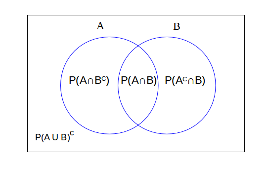
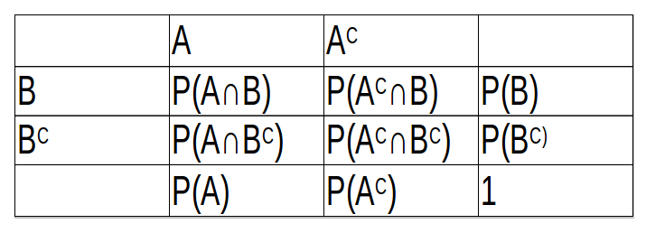
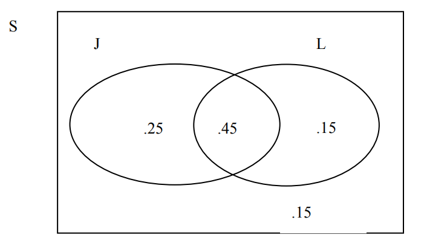
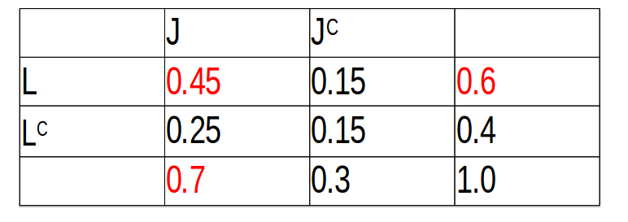
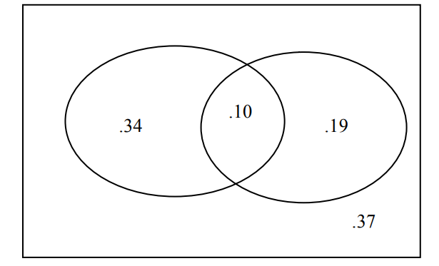
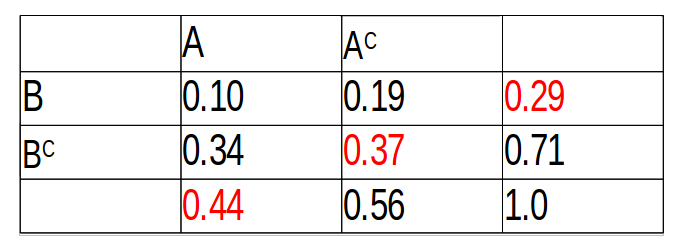

```{r setup, include=FALSE}
knitr::opts_chunk$set(echo = TRUE)
```

## Motivación: Algunas preguntas de investigación


Pensemos en lo siguiente:


1.  ¿Qué porcentaje de estudiantes universitarios tiene problemas para conciliar el sueño? 

2.  ¿Cuál es la posibilidad de que un estudiante del Colegio seleccionado al azar duerma más de siete horas cada noche? 

3.  ¿Cuál es el número típico de tarjetas de crédito propiedad de los estudiantes de ESMA3101? 


Si intentamos responder a nuestras preguntas de investigación, notamos que no podríamos preguntar a todas las personas de la población. Por ejemplo, respecto a los problemas para dormir, cuantas horas  duerme un estudiante o cuántas tarjetas de crédito tienen por persona en cierta población.


Entonces la forma correcta es nuevamente a través de una muestra aleatoria tomada de la población. 


### Poblaciones y muestras aleatorias


En general tratar de responder a cada una de nuestras preguntas de investigación, lamentablemente no podemos preguntar a todas las personas de la población. En cambio, tomamos una muestra aleatoria y la usamos para aprender algo, o conocer una o más características de la población.

Para la pregunta de investigación:

"¿Qué porcentaje de estudiantes universitarios tiene problemas para dormir?".

La población de interés son todos los estudiantes universitarios. Por lo tanto, suponiendo que estamos restringiendo  la población a ser estudiantes universitarios de Puerto Rico. Una muestra aleatoria podría consistir en 1300 estudiantes seleccionados al azar de todas las universidades posibles en la isla. 

Para la pregunta de investigación 

"¿Cuál es la posibilidad de que un estudiante del Colegio  seleccionado al azar duerma más de 7 horas cada noche?". 

La población de interés es un poco más estrecha, es decir, solo estudiantes del RUM. En este caso, una muestra aleatoria podría consistir en, por ejemplo, 300 estudiantes del Colegio seleccionados al azar.

Ahora para la pregunta de investigación 


"¿Cuál es el número típico de tarjetas de crédito propiedad de los estudiantes de ESMA3101?".


La población de interés es aún más limitada, es decir, solo los estudiantes matriculados en ESMA3101. 


Las respuestas (o datos) que tenemos a nuestras preguntas de investigación dependen, por supuesto, de quién conforma nuestra muestra aleatoria. No podemos predecir los posibles resultados con exactitud, pero al menos podemos crear un listado de posibles resultados.


Notemos que para cada pregunta vamos a obtener un listado de posibles respuestas.


Por ejemplo, para responder a la primera pregunta de investigación, 


¿Qué porcentaje de estudiantes universitarios tiene problemas para conciliar el sueño? 


entonces, primero tendríamos que tomar una muestra aleatoria de estudiantes universitarios de puerto Rico. Y preguntarles a cada uno: 


"¿Actualmente tiene problemas para conciliar el sueño?" 


Cada estudiante debe responder "Sí" o "No". Por lo tanto, tenemos un listado con las posibles respuestas

$$\{Sí, No\}$$

Para responder a mi segunda pregunta de investigación, necesitamos saber cuántas horas de sueño duermen los estudiantes universitarios, según una muestra aleatoria. Una forma de obtener esta información es pedirle a cada estudiante seleccionado que registre la cantidad de horas durmieron la noche anterior. En este caso, digamos que $h$ denota el número de horas dormidas, entonces el listado de posibles resultados es:


$$\{h: h ≥ 0,\quad horas\}$$

Finalmente, si estábamos interesados en aprender sobre los estudiantes que tomaron ESMA3101 en la última década, podríamos preguntarles a todos los estudiantes actuales de ESMA3101 

"¿Cuántas tarjetas de crédito tienen?" 

En ese caso, escribiríamos nuestro listado de posibles respuestas como:


$$\{0, 1, 2, 3,...\}$$

No siempre hay una sola forma de obtener una respuesta a una pregunta de investigación. Para la segunda pregunta de investigación, ¿cómo definiríamos el listado de posibles respuestas, si en cambio le preguntamos a una muestra aleatoria de estudiantes universitarios "¿Durmió más de siete horas anoche?".


## Experimentos Aleatorios

Es muy común encontrarnos con situaciones cotidianas imprevisibles; como por ejemplo, saber si nuestro equipo de fútbol favorito ganará el próximo partido, saber cómo será el clima del día en que tenemos planeado un paseo, saber cuál cara de un dado quedará arriba después de lanzarlo. Este tipo de experiencias son llamadas experimentos aleatorios, en ellas está presente el azar, y su resultado es incierto, es decir no lo conoceremos sino después de realizar dicha experiencia. Lanzar una moneda corriente, escoger el número ganador en una lotería, sacar una bola de una urna que tiene bolas de distintos colores sin ver su interior, todos estos son experimentos aleatorios.


**Experimento aleatorio:** Es aquel que realizándose bajo las mismas condiciones iniciales, puede tener diferentes resultados. Este resultado sólo se conoce después de realizar el experimento.

**Experimento Determinista:** Es aquel para el que realizándose bajo las mismas condiciones iniciales, siempre se obtiene el mismo resultado.


##Espacios Muestrales y eventos


A pesar de que en los experimentos aleatorios no podemos saber qué resultado obtendremos, si tenemos una serie de posibles resultados tal como vimos en las preguntas de investigación. Por ejemplo cuando lanzamos un dado tenemos seis posibles resultados, cuando lanzamos una moneda tenemos dos. Todos los posibles resultados de un experimento aleatorio conforman lo que llamaremos espacio muestral. Entonces el espacio muestral se define como

$$\text{El conjunto de todos los posibles resultados al realizar un experimento aleatorio.}$$


> Ejemplos: Espacios muestrales:


1. Consideremos el experimento de lanzar un dado, ¿Cuál es el espacio muestral para este experimento?

$$S=\{1,2,3,4,5,6 \}$$

2.  Consideremos el experimento de lanzar una moneda, ¿Cuál es el espacio muestral para este experimento?

$$S=\{Cara, Cruz\}$$

3.  Consideremos el experimento de lanzar una moneda y un dado al tiempo, ¿Cuál es el espacio muestral para este experimento?

$$S=\{(Cara,1),(Cara,2),(Cara,3),(Cara,4),(Cara,5),(Cara,6),(Cruz,1),(Cruz,2),(Cruz,3),(Cruz,4),(Cruz,5),(Cruz,6)\}$$


### Eventos


Un Evento es un resultado particular de un experimento aleatorio. En términos de conjuntos, un evento es un subconjunto del espacio muestral. Por lo general se le representa por las primeras letras del alfabeto. Y se usan letras mayúsculas. Ejemplos:


**A**: Obtener un número par al lanzar un dado.

**E**: Esperar más de 10 minutos para ser atendidos en la cafetería de estudiantes.

**H**: Que los estudiantes de ESMA3101 tengan más de dos tarjetas de crédito.

> Ejemplos: 

1. Consideremos el experimento de lanzar un dado una vez, ¿Enunciar algunos eventos posibles en este experimento?

$$S=\{1,2,3,4,5,6 \}$$

**A**: Obtener un número par.

**B**: Obtener un número impar.

**C**: Obtener un número mayor que tres.

Son algunos eventos del anterior experimento. 


2.  Consideremos el experimento de lanzar una moneda, ¿Enunciar algunos eventos posibles en este experimento?

$$S=\{Cara, Cruz\}$$

**A**: Obtener una cara.

**B**: Obtener una cruz.


3.  Consideremos el experimento de lanzar una moneda y un dado al tiempo, ¿Enunciar algunos eventos posibles?

$$S=\{(Cara,1),(Cara,2),(Cara,3),(Cara,4),(Cara,5),(Cara,6),(Cruz,1),(Cruz,2),(Cruz,3),(Cruz,4),(Cruz,5),(Cruz,6)\}$$
**A**: Obtener una cara y un número impar 

**B**: Obtener una cruz y un número mayor que cinco. 

**C**: Obtener cara.


#### **Si lanzamos un dado tres veces. ¿Qué posibles eventos pueden ocurrir?**


**Evento Nulo**: Es aquél que no tiene elementos. Se representa  por $\emptyset$.

### Relaciones entre eventos

**Unión de eventos:** Dados dos eventos $A$ y $B$ de un mismo espacio muestral su unión se representa por $A \cup B$ y es el evento que contiene los elementos que están en $A$ o $B$ o en ambos. El evento ocurre si al menos uno de los dos eventos ocurre.

**Intersección de eventos**: Dados dos eventos $A$ y $B$ de un mismo espacio muestral su intersección se representa por $A \cap B$, y es el evento que contiene los elementos que están en $A$ y en $B$ al mismo tiempo. El evento ocurre cuando los eventos ocurren simultáneamente. 

**Evento Complemento**: El complemento de un evento $A$ se representa representa por $A^c$ y es el evento que contiene contiene todos los elementos que no están en $A$. El evento ocurre si $A$ no ocurre.

**Propiedades de relaciones entre eventos**: Sean $A$, $B$ y $C$ eventos de un mismo espacio muestral $S$ entonces se cumplen las siguientes propiedades:

**1.  Propiedad Conmutativa**: $A \cup B = B \cup A$ y $A \cap B = B \cap A$

**2.  Propiedad Asociativa**: $A \cup (B \cup C) = (A \cup B) \cup C$ y $A \cap (B \cap C) = (A \cap B) \cap C$

**Propiedad Distributiva**: $A \cup (B \cap C) = (A \cup B) \cap (A \cup C)$  y   $A \cap (B \cup C) = (A \cap B) \cup (A \cap C)$.

**Leyes de Morgan**: $(A \cup B)^c = A^c \cap B^c$  y  $(A \cap B)^c = A^c \cup B^c$

## ¿Qué es probabilidad?

Pensemos en la probabilidad de manera informal por un momento.

**Definición**. La probabilidad es un número entre 0 y 1, donde:

1.  Un número cercano a 0 significa "no probable".
2.  Un número cercano a 1 significa "bastante probable".

Si la probabilidad de un evento es exactamente 0, entonces el evento no puede ocurrir. Si la probabilidad de un evento es exactamente 1, entonces el evento definitivamente ocurrirá.

Ahora pensemos en algunos eventos según lo aprendido:

**Un evento o eventos que de seguro ocurrirán**: Que llueva hoy en Mayagüez, que finalice el día, sacar cara al lanzar una moneda, que finalice el semestre, sacar un número par al lanzar un dado... etc.

¿Qué probabilidad le asignaría a cada uno de estos eventos?


**Un evento o eventos que son imposibles que ocurran**: Que no hayan huracanes en el caribe, obtener un número 8 al lanzar un dado.

¿Qué probabilidad le asignaría a cada uno de estos eventos?


**Un evento o eventos que posiblemente ocurran**: Ganar el Power Ball, Que un estudiante de ESMA3101 tenga más de 25 años, Que un estudiante del Colegio tenga más de dos carros.

¿Qué probabilidad le asignaría a cada uno de estos eventos?

## Métodos  para  asignar  probabilidades 

### I.  Método axiomático

La  Probabilidad es  considerada como una función de valor real definida sobre una colección de eventos de un espacio muestral $S$ que satisface los siguientes axiomas:

Ax1.  $P(S)=1$

Ax2.  $P(A) \geq 0$

AX3.  $P(\bigcup_{i=1}^{n}A_i)=\sum_{i=1}^{n}(P(A_i))$

si A1, A2, ... son mutuamente excluyentes.

<center>**Tenga presente: Dos eventos son mutuamente excluyentes si su intersección es vacía, es decir $A \cap B = \emptyset$**</center>


>  Propiedades de la probabilidad.


1.  $P(\emptyset)=0$

2.  $P(A^c)= 1-P(A)$

3.  $P(A \cup B)= P(A) + P(B) - P(A \cap B)$

En la propiedad número uno tenemos que la probabilidad de un evento sin elementos, es decir vacío es igual a cero. Respecto a la probabilidad del complemento es en realidad la probabilidad de que no ocurra el evento. Por último tenemos la probabilidad de la suma de dos eventos, que se define como la suma de las probabilidades menos el valor de la probabilidad de la intersección.

Una forma de mostrar las relaciones entre eventos es  mediante los famosos diagramas de Venn. Por ejemplo, sean los eventos $A$ y $B$ del mismo espacio muestral, con probabilidades $P(A)$ y $P(B)$ respectivamente. Para este caso con dos eventos, el diagra de Venn es el siguiente:



Las relaciones entre las probabilidades de dos eventos $A$ y $B$ también pueden resumirse mediante la siguiente tabla de filas y columnas:




> **Ejemplos**:


1.  Juan y Luis están solicitando ser admitidos en una universidad. La probabilidad de que Juan sea admitido es  es $0.7$ y la probabilidad de que Luis  sea admitido es $0.6$. La probabilidad de que ambos sean admitidos es $0.45$.

Este tipo de problemas los podemos resolver usando diagramas de Venn:

Por información que nos da el problema sabemos que: **$P(J)=0.7$** y **$P(L)=0.6$**, también sabemos que 
**$P(J \cap L)=0.45$**



a) ¿Cuál es la probabilidad de que solamente uno de ellos sea admitido?

Para responder esta pregunta debemos fijarnos solo en las probabilidades que les corresponden a cada evento sin la probabilidad que tienen en común, esto es:

$$P(A \cap B^c) + P(A^c \cap B)= 0.25 + 0.15 = 0.40$$
Por tanto, la probabilidad de que solo uno de los dos sea admitido es **$0.40$**

b)  Cuál es la probabilidad de que al menos uno de ellos sea admitido?

Para este caso podemos usar la regla aditiva, es decir 

$$P(J \cup L)= P(J) + P(L) - P(J\cap L)=$$
$$0.7 + 0.6 - 0.45=0.85$$

c) ¿Cuál es la probabilidad de que ninguno de los dos sea admitido?

Debemos darnos cuenta que el ejercicio nos está preguntando por una probabilidad del complemento, esto es: $P(J^c \cap L^c)$, si usamos las leyes de Morgan, el problema es resuelto, veamos:

$$P(J^c \cap L^c)=P(J \cup L)^c=1-P(J \cup L)=1-0.85=0.15$$
Entonces tenemos que la probabilidad de que ninguno de los dos sea admitido es de $0.85$

La otra forma de resolver el problema es usando la tabla de doble entrada, 



Los datos de color rojo son los que provee el problema, los demás son calculados usando complementos. 

2.  Una empresa tiene dos maneras $A$ y $B$ de presentar un nuevo producto al mercado. Si presenta el producto de la manera $A$  la probabilidad de que el producto sea exitoso es $0.44$ y si lo presenta de la manera $B$ la probabilidad de éxito se reduce a $0.29$. La probabilidad de que el producto fracase con ambas maneras de presentación es $0.37$. ¿Cuál es la probabilidad de que el producto sea exitoso con ambas formas de presentación?

Definamos los siguientes eventos:

**A: "Método uno"**. Sabemos que $P(A)=0.44$

**B: "Método dos"**. Sabemos que $P(B)=0.29$

También sabemos que **$P(A^c \cap B^c)=P(A \cup B)^c=0.37$** mediante la ley de Morgan. Entonces:

$$P(A \cup B)^c= 1-P(A\cup B)$$
Resolviendo para $P(A\cup B)$, tenemos:

$$P(A\cup B)= 1-P(A \cup B)^c= 1- 0.37=0.63$$

Finalmente, 

$P(A \cup B)= P(A) + P(B) - P(A \cap B)$

resolviendo para $P(A \cap B)$ tenemos:


$$P(A \cap B)= P(A) + P(B) - P(A \cup B)=0.44 + 0.29 - 0.63 = 0.10$$
El procedimiento anterior es la forma analitica de resolver el problema. Mediante un diagrama de Venn se puede resolver el problema de una manera más sencilla, veamos 



La otra forma es mediante la tabla de doble entrada, como vemos a continuación.



### II. Método clásico

> **Definición**

Un espacio muestral finito  $S =\{A_1, A_2,…,A_n\}$ se dice que es **equiprobable** si cada uno de sus elementos tiene la misma probabilidad de ocurrencia, es decir  $P(A_i)=\frac{1}{n}$ para todo $i=1,..., n$.

> **Ejemplos**

1. Se lanza un dado de seis caras, entonces su espacio muestral esta dado por $S=\{1,2,3,4,5,6\}$, vemos que hay seis posibles resultados, entonces la probabilidad de cada uno de ellos es 1/6.

2.  Se lanza un par de dados legales y distinguibles, entonces su espacio muestral dado por: $S=\{(i,j);i,j=1,2,3,4,5,6\}$ tiene 36 resultados, cada uno de ellos con probabilidad de ocurrencia 1/36.  


> **Definición**

Si un experimento aleatorio tiene un espacio muestral equiprobable $S$ que contiene $N$ elementos y $A$ es un evento de $S$ que ocurre de $\#(A)$ maneras distintas entonces la probabilidad de ocurrencia de $A$ está dada por:

$$P(A)=\frac{\# A}{N}$$

> **Ejemplos**

1.   ¿Cuál es la probabilidad de obtener una suma mayor que 7 al lanzar un par de dados?

Es decir la suma de los resultados debe dar 8, 9, 10, 11 o 12.

El evento de obtener una suma mayor que 7 al lanzar un par de dados esta dado de la siguiente manera

$$A=\{(6,6),(6,5),(6,4),(6,3),(6,2),(5,6),(5,5),(5,4),(5,3),(4,6),(4,5),(4,4),(3,6),(3,5),(2,6)\}$$

Vemos que $\#(A)=15$ de un total de $N=36$ posibilidades.


Entonces,

$$P(A)=\dfrac{\#A}{N}=\dfrac{15}{36}$$

### III.  Método frecuentista


Si un experimento se repite $n$ veces y $n(A)$ de esa veces ocurre el evento $A$, entonces la frecuencia relativa de $A$ se define como:

$$\frac{n(A)}{n} \to P(A)$$

La probabilidad es el valor en el cual se estabiliza la frecuencia relativa del evento después de haber repetido el experimento un número grande de veces. La existencia de este valor está garantizando por un resultado llamado La Ley de los Grandes números. Desde el punto de vista práctico se puede considerar que la frecuencia relativa de un evento es un estimado de la probabilidad de ocurrencia del evento.

El problema principal de la definición frecuencial de probabilidad es que, el cálculo de la probabilidad de un evento sería un proceso demasiado lento. El otro problema es que algunas veces es imposible tener un número grande de repeticiones del experimento, por ejemplo, si se desea calcular la probabilidad de que una persona en particular sobreviva una operación quirúrgica, tendríamos que tener información acerca de todas las operaciones de dicha persona, la cual por lo general es muy baja.

> Estimando la probabilidad de ocurrencia de un evento

Con la ayuda de la computadora se puede simular la ejecución de un experimento un gran número de veces y haciendo uso de la definición frecuencial se puede estimar la probabilidad de ocurrencia de un evento. 

**Ejemplo**. Supongamos que lanzamos un par de dados legales y tratamos de estimar la probabilidad de obtener  que la suma de los resultados sea 7.

Solución: Esta probabilidad puede ser determinada exactamente a través del espacio muestral del experimento y es igual a 6/36. Sin embargo, nosotros la podemos estimar a través de simulaciones.

La siguiente función en R realiza la simulación de un par de números como resultado de lanzar dos dados legales.

```{r,comment=NA}
sum_dados <- function(n){
sum_d <- rep(0,n)
for(i in 1:n){
sum_d[i] <- sum(sample(1:6,2,T))
}
table(sum_d)/n
}
```

A continuación usamos la función `sum_dados` y repetimos la simulación 10000 mil veces.

```{r,comment=NA}
sum_dados(10000)
```

Como resultado encontramos una tabla con las probabilidades para todos los posibles resultados en el experimento.


