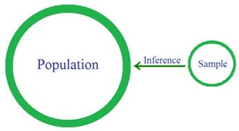

```{r setup, include=FALSE}
knitr::opts_chunk$set(echo = TRUE)
```

## Algunas preguntas de investigación


Los estudios de investigación se llevan a cabo para responder algún tipo de pregunta (s) de investigación. Por ejemplo, los investigadores del Vegan Health Study definen al menos ocho preguntas principales qué les gustaría responder sobre la salud de las personas que consumen una dieta totalmente libre de animales (sin carne, sin lácteos, sin huevos). Recientemente se realizó otro estudio de investigación para determinar si las personas que toman los analgésicos Vioxx o Celebrex corren un mayor riesgo de ataques cardíacos que las personas que no los toman. La lista continúa. Los investigadores trabajan todos los días para responder sus preguntas de investigación.


¿Qué piensas sobre estas preguntas de investigación?


¿Qué porcentaje de estudiantes universitarios se siente privado de sueño? ¿Cuál es la probabilidad de que un estudiante del Colegio seleccionado al azar tenga más de siete horas de sueño cada noche? Por lo general, las mujeres compran más ropa que los hombres? ¿Cuál es el número típico de tarjetas de crédito propiedad de los estudiantes de ESMA3101? Suponiendo que las preguntas anteriores no nos interesan mucho, ¿Podemos formular algunas preguntas de investigación que realmente nos interesen?
Si intentamos responder a nuestras preguntas de investigación, pronto nos daríamos cuenta de que no podríamos preguntar a todas las personas de la población por ejemplo si se sienten privadas de sueño, con qué frecuencia van a cine o cuántas tarjetas de crédito tienen.


¿Cómo podemos responder nuestras preguntas de investigación si no podemos preguntarle a cada persona de la población?


### Poblaciones y muestras aleatorias

Al tratar de responder a cada una de nuestras preguntas de investigación, lamentablemente no podemos preguntar a todas las personas de la población. En cambio, tomamos una muestra aleatoria de la población y usamos la muestra resultante para aprender algo, o hacer una inferencia, sobre la población:





Para la pregunta de investigación "¿Qué porcentaje de estudiantes universitarios se siente privado de sueño?", La población de interés son todos los estudiantes universitarios. Por lo tanto, suponiendo que estamos restringiendo  la población a ser estudiantes universitarios de Puerto Rico. Una muestra aleatoria podría consistir en 1300 estudiantes seleccionados al azar de todas las universidades posibles en la isla. Para la pregunta de investigación "¿cuál es la probabilidad de que un estudiante del Colegio  seleccionado al azar duerma más de 7 horas cada noche?", La población de interés es un poco más estrecha, es decir, solo estudiantes del RUM. En este caso, una muestra aleatoria podría consistir en, por ejemplo, 300 estudiantes del Colegio seleccionados al azar. Para la pregunta de investigación "¿cuál es el número típico de tarjetas de crédito propiedad de los estudiantes de ESMA3101?", La población de interés es aún más limitada, es decir, solo los estudiantes matriculados en ESMA3101. ¡Ahhhh! Si solo estamos interesados en estudiantes actualmente inscritos en ESMA3101, no tenemos necesidad de tomar una muestra al azar. En cambio, podemos realizar un censo o encuesta, en el que se encuesta a todos los estudiantes.

**Ejercicio: Identifique la población y describa una posible muestra aleatoria para la pregunta de investigación "¿las mujeres suelen comprar más ropa que los hombres?"**


Las respuestas (o datos) que tenemos a nuestras preguntas de investigación dependen, por supuesto, de quién termina en nuestra muestra aleatoria, es decir los datos que seleccionamos. No podemos predecir los posibles resultados con certeza, pero al menos podemos crear una lista de posibles resultados.

## Espacio Muestral 

**Definición.** El espacio muestral (o espacio de resultados), denotado por $S$, es la colección o el conjunto de todos los posibles  resultados de un estudio aleatorio.

Para responder a mi primera pregunta de investigación, tendríamos que tomar una muestra aleatoria de estudiantes universitarios de puerto Rico. Y preguntarles a cada uno: "¿Se siente privado de sueño?" Cada alumno debe responder "sí" o "no". Por lo tanto, escribiríamos el espacio muestral como:

$S = \{sí, no\}$

Para responder a mi segunda pregunta de investigación, necesitaríamos saber cuántas horas de sueño recibe una muestra aleatoria de estudiantes universitarios cada noche. Una forma de obtener esta información es pedirle a cada alumno seleccionado que registre la cantidad de horas de sueño que tuvieron anoche. En este caso, si permitimos que h denote el número de horas dormidas, escribiríamos el espacio de muestra como:


$S = \{h: h ≥ 0 \quad horas\}$

Hmmm, si realizamos un estudio aleatorio para responder a mi tercera pregunta de investigación, ¿cómo definiríamos nuestro espacio de muestra? Bueno, por supuesto, depende de cómo tratamos de intentar responder la pregunta. Si le preguntamos a una muestra aleatoria de hombres y mujeres "¿cuántos días compraste ropa el mes pasado?", Escribiríamos el espacio de muestra como:

$S = \{0, 1, 2, ..., 30\}$

Finalmente, si estábamos interesados en aprender sobre los estudiantes que tomaron ESMA3101 en la última década, cuando intente responder mi cuarta pregunta de investigación, podríamos preguntarles a todos los estudiantes actuales de ESMA3101 "¿Cuántas tarjetas de crédito tienen?" En ese caso, escribiríamos nuestro espacio de muestra como:

$S = \{0, 1, 2, ...\}$

No siempre hay una sola forma de obtener una respuesta a una pregunta de investigación. Para la segunda pregunta de investigación, ¿cómo definiríamos el espacio muestral si en cambio le preguntamos a una muestra aleatoria de estudiantes universitarios "¿durmió más de siete horas anoche?"

###  Tipos de datos

Ejemplo:

Se realizó la pregunta a una muestra aleatoria de 20 estudiantes universitarios "¿se considera privado de sueño?" Sus respuestas fueron:

    `sí sí sí no no no sí sí sí sí sí no no sí sí no sí sí sí sí`


Por supuesto, sería bueno resumir las respuestas de los estudiantes. Sin embargo, lo que hacemos con los datos depende del tipo de datos recopilados. Para nuestros propósitos, nos ocuparemos principalmente de tres tipos de datos:

* Discreto.
* Continuo.
* Categórico.

Ahora, para sus definiciones!

**Definición.** Los datos cuantitativos se denominan discretos si el espacio muestral contiene un número finito o contable infinito de valores.
Recuerde que un conjunto de elementos es contablemente infinito si los elementos del conjunto se pueden poner en correspondencia uno a uno con los enteros positivos. La tercera pregunta de investigación arroja datos discretos, porque su espacio de muestra:

$S= \{0, 1, 2, ..., 31\}$

contiene un número finito de valores. Y, la cuarta pregunta de investigación arroja datos discretos, porque su espacio muestral es:

$S = \{0, 1, 2, ...\}$

contiene un número infinitamente contable de valores.

**Definición.** Los datos cuantitativos se llaman continuos si el espacio muestral contiene un intervalo o un intervalo continuo de números reales.
Mi segunda pregunta de investigación arroja datos continuos, porque su espacio de muestra:

$S = \{h: h ≥ 0 \quad horas\}$

es toda la línea real positiva. 

Para datos continuos, teóricamente hay un número infinito de posibles resultados; la herramienta de medición es el factor restrictivo. Por ejemplo, si tuviera que preguntar cuánto pesaba cada estudiante de la clase (en libras), lo más probable es que obtuviera respuestas como 126, 172 y 210. Las respuestas son aparentemente discretas. Pero, ¿en realidad son discretos? Si informo que peso 118 libras, ¿tengo exactamente 118 libras? Probablemente no; Tal vez tengo 118.0120980335927 ... libras. Es solo que la escala que obtengo  me dice que peso 118 libras. Una vez más, la herramienta de medición es el factor restrictivo, algo en lo que siempre debes pensar al tratar de distinguir entre datos discretos y continuos.

**Definición.**  Los datos cualitativos se denominan categóricos si el espacio de muestra contiene objetos que están agrupados o categorizados en función de algún rasgo cualitativo. Cuando solo hay dos grupos o categorías, los datos se consideran binarios.

La primera pregunta de investigación arroja datos binarios, porque su espacio muestral es:

$S = \{sí, no\}$

Otros dos ejemplos de datos categóricos son el color de los ojos (marrón, azul, verdes, etc.) y la posición semestral (estudiante de primer año, segundo, tercer y último año).


##Espacios Muestrales y eventos

**Experimentos Aleatorios**:


Un experimento es una observación de un fenómeno que ocurre en la naturaleza. Tipos de experimentos:

**Experimentos Determinísticos**: Son aquellos en donde no hay incertidumbre acerca del resultado que ocurrirá cuando éstos son repetidos varias veces.

**Experimentos Aleatorios**: Son aquellos en donde no se puede anticipar el resultado que ocurrirá, pero si se tiene una completa idea acerca de todos los resultados posibles del experimento cuando éste es ejecutado.


Según lo anterior, podemos clasificar los espacios muestrales de dos maneras:

**Espacio muestral Discreto:**  Son espacios muestrales cuyos elementos  resultan de hacer conteos, y por lo general son subconjuntos  de los números  enteros. Es decir los elementos del espacio muestral son datos discretos.

**Espacio Muestral Continuo:** Son espacios muestrales cuyos elementos resultan de hacer mediciones y por lo general son intervalos en la recta real. Los elementos del espacio muestral son datos continuos.

Ejemplos Espacios muestrales:

1. Consideremos el experimento de lanzar un dado, ¿Cuál es el espacio muestral para este experimento?

$$S=\{1,2,3,4,5,6 \}$$

2.  Consideremos el experimento de lanzar una moneda, ¿Cuál es el espacio muestral para este experimento?

$$S=\{Cara, Cruz\}$$

3.  Consideremos el experimento de lanzar una moneda y un dado al tiempo, ¿Cuál es el espacio muestral para este experimento?

$$S=\{(Cara,1),(Cara,2),(Cara,3),(Cara,4),(Cara,5),(Cara,6),(Cruz,1),(Cruz,2),(Cruz,3),(Cruz,4),(Cruz,5),(Cruz,6)\}$$


### Eventos

Un Evento es un resultado particular de un experimento aleatorio. En términos de conjuntos, un evento es un subconjunto del espacio muestral. Por lo general se le representa por las primeras letras del alfabeto. Y se usan letras mayúsculas. Ejemplos:


**A**: Que salga un número par al lanzar un dado.

**E**: Que haya que esperar más de 10 minutos para ser atendidos en la cafetería de estudiantes.

**F**: Sacar A en la nota final del curso ESMA3101.

**H**: Que los estudiantes de ESMA3101 tengan más de dos tarjetas de crédito.

Ejemplos: 

1. Consideremos el experimento de lanzar un dado, ¿Enunciar algunos eventos posibles en este experimento?

$$S=\{1,2,3,4,5,6 \}$$

**A**: Obtener un número par.

**B**: Obtener un número impar

**C**: Obtener un número mayor que tres

Son algunos eventos del anterior experimento. 


2.  Consideremos el experimento de lanzar una moneda, ¿Enunciar algunos eventos posibles en este experimento?

$$S=\{Cara, Cruz\}$$

**A**: Obtener una cara.

**B**: Obtener una cruz.


3.  Consideremos el experimento de lanzar una moneda y un dado al tiempo, ¿Enunciar algunos eventos posibles?

$$S=\{(Cara,1),(Cara,2),(Cara,3),(Cara,4),(Cara,5),(Cara,6),(Cruz,1),(Cruz,2),(Cruz,3),(Cruz,4),(Cruz,5),(Cruz,6)\}$$
**A**: Obtener una cara y un número impar 

**B**: Obtener una cruz y un número mayor que cinco. 

**C**: Obtener cara.


**Evento Nulo**: Es aquél que no tiene elementos. Se representa  por $\emptyset$.

### Relaciones entre eventos

**Unión de eventos:** Dados dos eventos $A$ y $B$ de un mismo espacio muestral su unión se representa por 
$A \cup B$ y es el evento que contiene los elementos que están en $A$ o $B$ o en ambos. El evento ocurre si al menos uno de los dos eventos ocurre.

**Intersección de eventos**: Dados dos eventos $A$ y $B$ de un mismo espacio muestral su intersección se representa por $A \cap B$, y es el evento que contiene los elementos que están en $A$ y en $B$ al mismo tiempo. El evento ocurre cuando los eventos ocurren simultáneamente. 

**Evento Complemento**: El complemento de un evento $A$ se representa representa por $A^c$ y es el evento que contiene contiene todos los elementos que no están en $A$. El evento ocurre si $A$ no ocurre.

**Propiedades de relaciones entre eventos**: Sean $A$, $B$ y $C$ eventos de un mismo espacio muestral $S$ entonces se cumplen las siguientes propiedades:

**1.  Propiedad Conmutativa**: $A \cup B = B \cup A$ y $A \cap B = B \cap A$

**2.  Propiedad Asociativa**: $A \cup (B \cup C) = (A \cup B) \cup C$ y $A \cap (B \cap C) = (A \cap B) \cup C$

**Propiedad Distributiva**: $A \cup (B \cap C) = (A \cup B) \cap (A \cup C)$  y   $A \cap (B \cup C) = (A \cap B) \cup (A \cap C)$.

**Leyes de Morgan**: $(A \cup B)^c = A^c \cap B^c$  y  $(A \cap B)^c = A^c \cup B^c$


## ¿Qué es probabilidad?

Pensemos en la probabilidad de manera informal por un momento.

**Definición**. La probabilidad es un número entre 0 y 1, donde:

1.  Un número cercano a 0 significa "no probable".
2.  Un número cercano a 1 significa "bastante probable".

Si la probabilidad de un evento es exactamente 0, entonces el evento no puede ocurrir. Si la probabilidad de un evento es exactamente 1, entonces el evento definitivamente ocurrirá.

Ahora pensemos en algunos eventos según lo aprendido:

**Un evento o eventos que de seguro ocurrirán**: Que llueva hoy en Mayagüez, que finalice el día, sacar cara al lanzar una moneda, que finalice el semestre, sacar un número par al lanzar un dado... etc.

¿Qué probabilidad le asignaría a cada uno de estos eventos?


**Un evento o eventos que son imposibles que ocurran**: Que no hayan huracanes en el caribe, obtener un número 8 al lanzar un dado.

¿Qué probabilidad le asignaría a cada uno de estos eventos?


**Un evento o eventos que posiblemente ocurran**: Ganar el Power Ball, Qué un estudiante de ESMA3101 tenga más de 25 años, Que un estudiante del Colegio tenga más de dos carros.

¿Qué probabilidad le asignaría a cada uno de estos eventos?

## Métodos  para  asignar  probabilidades 

### Método axiomático

La  Probabilidad es  considerada como una función de valor real definida sobre una colección de eventos de un espacio muestral $S$ que satisface los siguientes axiomas:

Ax1.  $P(S)=1$

Ax2.  $P(A) \geq 0$

AX3.  $P(\bigcup_{i=1}^{n}A_i)=\sum_{i=1}^{n}(P(A_i))$

si A1, A2, ... son mutuamente excluyentes.

<center>**Tenga presente: Dos eventos son mutuamente excluyentes si su intersección es vacía, es decir $A \cap B = \emptyset$**</center>


>  Propiedades de la probabilidad.

1.  $P(\emptyset)=0$

2.  $P(A^c)= 1-P(A)$

3.  $P(A \cup B)= P(A) + P(B) - P(A \cap B)$

En la propiedad número uno tenemos que la probabilidad de un evento sin elementos, es decir vacío es igual a cero. Respecto a la probabilidad del complemento es en realidad la probabilidad de que no ocurra el evento. Por último tenemos la probabilidad de la suma de dos eventos, que se define como la suma de las probabilidades menos el valor de la probabilidad de la intersección.

Una forma de mostrar las relaciones entre eventos es  mediante los famosos diagramas de Venn. Por ejemplo, sean los eventos $A$ y $B$ del mismo espacio muestral, con probabilidades $P(A)$ y $P(B)$ respectivamente. Para este caso con dos eventos, el diagra de Venn es el siguiente:


Las relaciones entre las probabilidades de dos eventos $A$ y $B$ también pueden resumirse mediante la siguiente tabla de filas y columnas:


> **Ejemplos**:


1.  Juan y Luis están solicitando ser admitidos en una universidad. La probabilidad de que Juan sea admitido es  es $0.7$ y la probabilidad de que Luis  sea admitido es $0.6$. La probabilidad de que ambos sean admitidos es $0.45$.

Este tipo de problemas los podemos resolver usando diagramas de Venn:

Por información que nos da el problema sabemos que: **$P(J)=0.7$** y **$P(L)=0.6$**, también sabemos que 
**$P(J \cap L)=0.45$**


a) ¿Cuál es la probabilidad de que solamente uno de ellos sea admitido?

Para responder esta pregunta debemos fijarnos solo en las probabilidades que les corresponden a cada evento sin la probabilidad que tienen en común, esto es:

$$P(A \cap B^c) + P(A^c \cap B)= 0.25 + 0.15 = 0.40$$
Por tanto, la probabilidad de que solo uno de los dos sea admitido es **$0.40$**

b)  Cuál es la probabilidad de que al menos uno de ellos sea admitido?

Para este caso podemos usar la regla aditiva, es decir 

$$P(J \cup L)= P(J) + P(L) - P(J\cap L)=$$
$$0.7 + 0.6 - 0.45=0.85$$

c) ¿Cuál es la probabilidad de que ninguno de los dos sea admitido?

Debemos darnos cuenta que el ejercicio nos está preguntando por una probabilidad del complemento, esto es: $P(J^c \cap L^c)$, si usamos las leyes de Morgan, el problema es resuelto, veamos:

$$P(J^c \cap L^c)=P(J \cup L)^c=1-P(J \cup L)=1-0.85=0.15$$
Entonces tenemos que la probabilidad de que ninguno de los dos sea admitido es de $0.85$

La otra forma de resolver el problema es usando la tabla de doble entrada, 


Los datos de color rojo son los que provee el problema, los demás son calculados usando complementos. 

2.  Una empresa tiene dos maneras $A$ y $B$ de presentar un nuevo producto al mercado. Si presenta el producto de la manera $A$  la probabilidad de que el producto sea exitoso es $0.44$ y si lo presenta de la manera $B$ la probabilidad de éxito se reduce a $0.29$. La probabilidad de que el producto fracase con ambas maneras de presentación es $0.37$. ¿Cuál es la probabilidad de que el producto sea exitoso con ambas formas de presentación?

Definamos los siguientes eventos:

**A: "Método uno"**. Sabemos que $P(A)=0.44$

**B: "Método dos"**. Sabemos que $P(B)=0.29$

También sabemos que **$P(A^c \cap B^c)=P(A \cup B)^c=0.37$** mediante la ley de Morgan. Entonces:

$$P(A \cup B)^c= 1-P(A\cup B)$$
Resolviendo para $P(A\cup B)$, tenemos:

$$P(A\cup B)= 1-P(A \cup B)^c= 1- 0.37=0.63$$

Finalmente, 

$P(A \cup B)= P(A) + P(B) - P(A \cap B)$

resolviendo para $P(A \cap B)$ tenemos:


$$P(A \cap B)= P(A) + P(B) - P(A \cup B)=0.44 + 0.29 - 0.63 = 0.10$$
El procedimiento anterior es la forma analitica de resolver el problema. Mediante un diagrama de Venn se puede resolver el problema de una manera más sencilla, veamos 


La otra forma es mediante la tabla de doble entrada, como vemos a continuación.


### Método clásico

> **Definición**

Un espacio muestral finito  $S =\{A_1, A_2,…,A_n\}$ se dice que es **equiprobable** si cada uno de sus elementos tiene la misma probabilidad de ocurrencia, es decir  $P(A_i)=\frac{1}{n}$ para todo $i=1,..., n$.

> **Ejemplos**

1. Se lanza un dado de seis caras, entonces su espacio muestral esta dado por $S=\{1,2,3,4,5,6\}$, vemos que hay seis posibles resultados, entonces la probabilidad de cada uno de ellos es 1/6.

2.  Se lanza un par de dados legales y distinguibles, entonces su espacio muestral dado por: $S=\{(i,j);i,j=1,2,3,4,5,6\}$ tiene 36 resultados, cada uno de ellos con probabilidad de ocurrencia 1/36.  


> **Definición**

Si un experimento aleatorio tiene un espacio muestral equiprobable $S$ que contiene $N$ elementos y $A$ es un evento de $S$ que ocurre de $\#(A)$ maneras distintas entonces la probabilidad de ocurrencia de $A$ está dada por:

$$P(A)=\frac{\# A}{N}$$

> **Ejemplos**

1.   ¿Cuál es la probabilidad de obtener una suma mayor que 7 al lanzar un par de dados?

Es decir la suma de los resultados debe dar 8, 9, 10, 11 o 12.

El evento de obtener una suma mayor que 7 al lanzar un par de dados esta dado de la siguiente manera

$$A=\{(6,6),(6,5),(6,4),(6,3),(6,2),(5,6),(5,5),(5,4),(5,3),(4,6),(4,5),(4,4),(3,6),(3,5),(2,6)\}$$

Vemos que $\#(A)=15$ de un total de $N=36$ posibilidades.


Entonces,

$$P(A)=\dfrac{\#A}{N}=\dfrac{15}{36}$$

### Método frecuentista


Si un experimento se repite $n$ veces y $n(A)$ de esa veces ocurre el evento $A$, entonces la frecuencia relativa de $A$ se define como:

$$\frac{n(A)}{n} \to P(A)$$

La probabilidad es el valor en el cual se estabiliza la frecuencia relativa del evento después de haber repetido el experimento un número grande de veces. La existencia de este valor está garantizando por un resultado llamado La Ley de los Grandes números. Desde el punto de vista práctico se puede considerar que la frecuencia relativa de un evento es un estimado de la probabilidad de ocurrencia del evento.

El problema principal de la definición frecuencial de probabilidad es que, el cálculo de la probabilidad de un evento sería un proceso demasiado lento. El otro problema es que algunas veces es imposible tener un número grande de repeticiones del experimento, por ejemplo, si se desea calcular la probabilidad de que una persona en particular sobreviva una operación quirúrgica, tendríamos que tener información acerca de todas las operaciones de dicha persona, la cual por lo general es muy baja.

> Estimando la probabilidad de ocurrencia de un evento

Con la ayuda de la computadora se puede simular la ejecución de un experimento un gran número de veces y haciendo uso de la definición frecuencial se puede estimar la probabilidad de ocurrencia de un evento. 

**Ejemplo**. Supongamos que lanzamos un par de dados legales y tratamos de estimar la probabilidad de obtener  que la suma de los resultados sea 7.

Solución: Esta probabilidad puede ser determinada exactamente a través del espacio muestral del experimento y es igual a 6/36. Sin embargo, nosotros la podemos estimar a través de simulaciones.

La siguiente función en R realiza la simulación de un par de números como resultado de lanzar dos dados legales.

```{r,comment=NA}
sum_dados <- function(n){
sum_d <- rep(0,n)
for(i in 1:n){
sum_d[i] <- sum(sample(1:6,2,T))
}
table(sum_d)/n
}
```

A continuación usamos la función `sum_dados` y repetimos la simulación 10000 mil veces.

```{r,comment=NA}
sum_dados(10000)
```

Como resultado encontramos una tabla con las probabilidades para todos los posibles resultados en el experimento.


