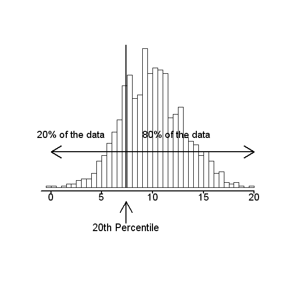
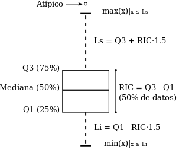

```{r setup, include=FALSE}
knitr::opts_chunk$set(echo = TRUE)
```

## Cálculo de Medidas Estadisticas

Hay dos tipos principales de medidas Estadísticas: Medidas de Tendencia Central y medidas de Variabilidad. 

**Las medidas de tendencia central** dan una idea del centro de la distribución de los datos. Las principales medidas de este tipo son la media o promedio aritmético, la mediana, la moda y la media podada.

**Las medidas de variabilidad** expresan el grado de concentración o dispersión de los datos con respecto al centro de la distribución. Entre las principales medidas de este tipo están la varianza, la desviación estándar, el rango intercuartílico. Aparte también hay medidas de posición, como son los cuartiles, deciles y percentiles. Además, una medida de asimetría (“skewness”) y una medida de aplanamiento (“kurtosis”).

## Medidas de Centralidad
 
*   **La media o promedio** se obtiene sumando todos los datos y dividiendo entre el número de datos. Es decir, si $x_1, x_2 ,…,x_n$, representan las observaciones de una variable X en una muestra de tamaño n, entonces la media de la variable X está dada por:

$$\bar{X}=\frac{\sum_{i=1}^{n}x_i}{n}$$ 
Cuando el conjunto de datos es una **muestra aleatoria** recibe el nombre de media muestral siendo uno de los principales estadísticos muestrales. Se espera que la **media** este ralacionada con el valor que más posibilidades tiene de ocurrir en una variable, por tanto si es así, la media es el centro de la distribución.


**Ejemplo.** Supongamos que los siguientes datos representan el precio de 9 carros de alta gama en miles.

74, 82, 107, 92, 125, 130, 118, 140, 153.

Hallar el precio promedio de los autos.

Para encontrar la media o promedio entonces tenemos que sumar todos los datos y luego dividir el resultado por el número de observaciones en la muestra. 

$$\bar{X}=\frac{74 + 82 + 107 + 92 + 125 + 130 + 118 + 140 + 153}{9}=\frac{1021}{9}=113.44$$ 


El resultado de la media para este caso se interpreta como que el **valor promedio** de los carros de gama alta es de $113.44$.

En RStudio la función para calcular la media o promedio a una muestra de datos es `mean()`. Usamos esta función para encontrar la media de los datos de los carros de gama alta. 

```{r,comment=NA}
carros <- c(74, 82, 107, 92, 125, 130, 118, 140, 153)
mean(carros)
```

La media es afectada por la asimetría de la distribución de los datos y por la presencia de “outliers” como se muestra en el siguiente ejemplo.

**Ejemplo.** Supongamos que en el ejemplo anterior se elige adicionalmente un carro cuyo precio es de 500 mil dolares.

Luego el promedio será:

$$\bar{X}=\frac{74 + 82 + 107 + 92 + 125 + 130 + 118 + 140 + 153 + 500}{10}=\frac{1521}{10}=152.1$$ 

En este caso la media da una idea errónea del centro de la distribución, la presencia del “outlier” ha afectado la media y ya no es el centro de la distribución. Sólo dos datos de las 10 observaciones tienen precio promedio mayor a $\$152,100$

```{r,comment=NA}
carros_outlier <- c(74, 82, 107, 92, 125, 130, 118, 140, 153, 500)
mean(carros_outlier)
```

### Propiedades de la media.

1.  La media está influenciada por los valores de cada uno de los datos.
2.  La media no tiene por qué ser igual a uno de los valores de los datos, ni siquiera de su misma naturaleza: datos enteros pueden tener una media decimal.
3.  El valor de la media debe estar entre el mayor dato y el menor dato. 

*   **La Mediana:**  es un valor que divide a la muestra en **dos partes aproximadamente iguales**. Es decir, como un 50 por ciento de los datos de la muestra serán menores o iguales que la mediana y el restante 50 por ciento son mayores o iguales que ella.

Para calcular la mediana primero se deben ordenar los datos de **menor a mayor**. Si el número de datos es **impar**, entonces la mediana será el valor central. Si el número de datos es **par** entonces, la mediana se obtiene promediando los dos valores centrales.

**Ejemplo con datos impares:** Calcular la mediana para los datos de el precio de los 9 carros.

74, 82, 107, 92, 125, 130, 118, 140, 153.

Debemos ordenar los datos de menor a mayor: 74,  82,  92, 107, **118**, 125, 130, 140, 153. Vemos que el valor central esta en 118, es decir la mediana del precio de los carros es $\$118,000$.

**Ejemplo con datos pares:** Calcular la mediana para los datos de el precio de los 10 carros donde hay un "outlier".

74, 82, 107, 92, 125, 130, 118, 140, 153, 500.

Debemos ordenar los datos de menor a mayor: 74,  82,  92, 107, **118, 125**, 130, 140, 153, 500. Vemos que hay dos valores centrales que son 118 y 125, por lo tanto se deben promediar estos dos valores, es decir 

$$Mediana = \frac{118 + 125}{2}=121.5$$

Es decir la mediana del precio de los carros es $\$121,500$.

A diferencia de la media, la **mediana no es afectada** por la presencia de valores anormales o "outliers". Asi, la mediana para los datos del ejemplo anterior, donde hay un número par de datos, la mediana resulta ser el promedio de los dos valores centrales y el dato anormal 500 no afecta el valor de la mediana.

En RStudio la función para calcular la **Mediana** es `median()`, vamos a calcular la mediana para los datos del precio de los carros:

Sin presencia de outliers

```{r,comment=NA}
carros <- c(74, 82, 107, 92, 125, 130, 118, 140, 153)
median(carros)
```

Con presencia de outliers

```{r,comment=NA}
carros_outlier <- c(74, 82, 107, 92, 125, 130, 118, 140, 153, 500)
median(carros_outlier)
```

**Cuando la distribución es asimétrica hacia la derecha, la mediana es menor que la media. Si hay asimetría hacia la izquierda entonces la mediana es mayor que la media y cuando hay simetría, ambas son iguales.**

*   **La moda** es el valor (o valores) que se repite con mayor frecuencia en la muestra. La Moda puede aplicarse tanto a datos cuantitativos como cualitativos.

En RStudio la moda se puede calcular ejecutando la siguiente función (Se debe copiar y pegar en R, luego ejecutarla.)

```{r,comment=NA}
getmode <- function(v) {
   uniqv <- unique(v)
   uniqv[which.max(tabulate(match(v, uniqv)))]
}
```


**Ejemplo**. Los siguientes datos representan el número de veces que 11 personas van al cine mensualmente:
3, 4, 4, 5, 0, 2, 1, 5, 4, 5 y 4.

Hallar la moda.

La Moda es 4. Es decir,  que predominan más las personas que asisten 4 veces al mes al cine.

Usemos la función anterior `getmode` en R


```{r,comment=NA}
cine <- c(3, 4, 4, 5, 0, 2, 1, 5, 4, 5, 4)
getmode(cine)
```


**Ejemplo**. Los siguientes datos representan tipos de sangre de 9 personas A, O, B, O, AB, O, B, O, A

Hallar la Moda.

La Moda es el tipo de sangre O. Se repite cuatro veces. 

Verificamos en RStudio con la función `getmode`


```{r,comment=NA}
sangre <- c("A","O","B","O","AB", "O", "B", "O", "A")
getmode(sangre)
```


En resumen, las medidas de tendencia central son tres: La Media, la Mediana y la Moda.

## Medidas de Variabilidad

Las medidas de variabilidad o dispersión nos indican si losdatos están próximos entre sí o si por el contrario están muy dispersos. 

**El rango o amplitud** se obtiene restando el valor más bajo de un conjunto de observaciones del valor más alto. Mientras mayor sea el rango existe mayor variabilidad. 

Para calcular en RSudio el rango se debe restar el máximo de los datos menos en mínimo. La función para calcular el máximo es `max()` y el mínimo es `min()`

**La varianza** es una medida que da una idea del grado de concentración de los datos con respecto a la media. Matematicamente se define de la siguiente manera 

$$S^2=\frac{\sum_{i=1}^{n}(x_i - \bar{x})^2}{n-1}$$

En RStudio la función para la varianza es `var()`

**La desviación estándar** es la raíz cuadrada positiva de la varianza y tiene la ventaja que está en las mismas unidades de medida que los datos. Se representa por $S$.

La función para la desviación estandar es `sd`

De por si sola la desviación estándar no permite concluir si la muestra es muy variable o poco variable. Al igual que la varianza es usada principalmente para comparar la variabilidad entre grupos.

**Ejemplo.** Estudiar la variabilidada de las suguientes dos muestras:

muestra1: 16 18 25 28 23 42 24 47 38 19 22 34.

muestra2: 116 118 125 128 123 142 124 147 138 119 120 132

Vamos a calcular las el rango, la varianza y la desviación para las dos muestras, en la muestra uno tenemos:

```{r,comment=NA}
n1 <- c(16, 18, 25, 28, 23, 42, 24, 47, 38, 19, 22, 34)
mean_n1 <- mean(n1)
print(mean_n1)
rango1 <- max(n1) - min(n1)
print(rango1)
var_n1 <- var(n1)
print(var_n1)
sd_n1 <- sd(n1)
print(sd_n1)
```

En la muestra dos tenemos:

```{r,comment=NA}
n2 <- c(116, 118, 125, 128, 123, 142, 124, 147, 138, 119, 120, 132)
mean_n2 <- mean(n2)
print(mean_n2)
rango2 <- max(n2) - min(n2)
print(rango2)
var_n2 <- var(n2)
print(var_n2)
sd_n2 <- sd(n2)
print(sd_n2)
```

Las muestras tienen practicamente las mismas varianzas, es decir en términos absolutos tienen la misma variabilidad, pero se debe tener encuenta que en la muestra uno, la varianza esta mucho más alejada de la media, lo que significa que la muestra uno es bastante variable, mientras que la muestra dos es poco variable.  

Otra medida de variabilidad es el coeficiente devariación (CV)

**El Coeficiente de Variación CV** que se define como $CV=\frac{s}{|\bar{x}|}*100 \%$. Si el CV es mayor que 30 % la muestra es bastante variable y si CV es menor del 10 % entonces existe poca variabilidad. Para el ejemplo el CV para la muestra uno es 35.77 y para la muestra 2 es 7.87. Hagamos los calculos en RStudio


```{r,comment=NA}
## CV para n1
CV_n1 <- (sd_n1/mean_n1)*100
print(CV_n1)
## CV para n2
CV_n2 <- (sd_n2/mean_n2)*100
print(CV_n2)
```

Según los resultados para el CV, los datos de la muestra uno son mucho más variables con un CV=35.77, mientras que los de la muestra dos tienen poca variabilidad con un CV=7.87. 

## Medidas de Posición

### Los cuartiles

**Los Cuartiles:** Son valores que dividen a la muestra en 4 partes aproximadamente iguales. El 25% de los datos son menores o iguales que el cuartil inferior o primer cuartil, representado por $Q_1$. El siguiente 25 % de datos cae entre el cuartil inferior y la mediana, la cual es equivalente al segundo cuartil $Q_2$ ($Q_2$ coincide con la mediana de los datos.). El 75 % de los datos son menores o iguales que el cuartil superior o tercer cuartil, representado por $Q_3$, y el restante 25% de datos son mayores o iguales que Q3.


Existen varios métodos para calcular los cuartiles pero la manera mas simple es ordenar los datos y considerar Q1
como la mediana de la primera mitad, o sea aquella que va desde el menor valor hasta la mediana. Similarmente
Q3 es la mediana de la segunda mitad, o sea aquella que va desde la mediana hasta el mayor valor.

**Ejemplo.** Calcular los cuartiles de las siguientes muestras:

a) 6, 8, 4, 12, 15, 17, 23, 18, 25, 11.

Los datos ordenados serán: 4, 6, 8, 11, 12, 15, 17, 18, 23, 25.

La primera mitad es: 4, 6, 8, 11, 12, luego Q1 = 8.

La segunda mitad es: 15, 17, 18, 23, 25, luego Q3 = 18

En RStudio se pueden calcular los cuartiles con la función `summary()` la cual me arroja un resumen de los datos. 


```{r,comment=NA}
data <- c(6, 8, 4, 12, 15, 17, 23, 18, 25, 11)
summary(data)
```

b)  10, 22, 17, 13, 28, 40, 29, 18, 23, 39, 44.

Los datos ordenados serán: 10, 13, 17, 18, 22, 23, 28, 29, 39, 40, 44.

La primera mitad es: 10, 13, 17, 18, 22, 23, luego Q1 =  17.5

La segunda mitad es: 23, 28, 29,39, 40, 44, luego Q3 =  34

```{r,comment=NA}
data2 <- c(10, 22, 17, 13, 28, 40, 29, 18, 23, 39, 44)
summary(data2)
```

### Rango Intercuartílico

A la diferencia de $Q_3$ y $Q_1$ se le llama **Rango Intercuartílico**, ésta es una medida de variabilidad que puede ser usada en lugar de la desviación estándar, cuando hay “outliers”.

$$RIC=Q_3-Q_1$$

### Los Deciles

Los deciles son los nueve valores que dividen la muestra en diez partes iguales. Los deciles dan los valores correspondientes al 10 %, 20 %,..., 90% de los datos. Los deciles se denotan como $D$, ese decir $D_1,D_2, D_3,...,D_9$ El decil número 5 (D5) coincide con la mediana.

### Percentiles

Los percentiles, es otra de las Medidas de Posición más comunes y empleadas. Técnicamente, son definidos como ciertos valores que dividen en cien partes idénticas porcentualmente hablando los datos que han sido ordenados de forma sucesiva de menor a mayor.  En cuanto a su notación, ésta corresponde a la forma $P_1, P_2,...,P_100$, y se son leen como Percentil 10, Percentil 90, etc.



En la gráfica observamos que el percentil 20 divide la distribución en dos partes, 20 % al lado izquierdo y otro 80 % al lado derecho. Entonces  una definición más formal para percentil es:

El percentil $p$ de un conjunto de datos ordenados es el valor que tiene a lo sumo $P\%$ de los datos debajo de él y como máximo $(100-P)\%$ por encima.

Paso para encontrar el $P^{th}$ percentil

1.  Ordenar el conunto de datos de menor a mayor.

2.  Encuentre la ubicación del percentil $P^{th}$: $np/100$, redondear hacia adelante. 

3.  Encuentra el percentil $P^{th}$ en esa ubicación.

Ejemplo: Encuentre el percentil 67 de los siguientes datos: 46 25 34 35 41 41 46 46  22 47 49 54 54 59 60.

Solución:

1.  Ordenar los datos. 

22 25 34 35 41 41 46 46 46 47 49 54 54 59 60.

2.  Encuentrar la ubicación del percentil,

$$\frac{nP}{100}=\frac{(15)(67)}{100}=10.05$$
Redondeando al siguiente número, por tanto la ubicación es $11$.

3.  El valor de los datos en la ubicación 11 es $49$, por tanto el percentil 67 es $49$.

Un error muy popular en los estudiantes es pensar que el número encontrado en el paso 2 ya es el percentil. Es la ubicación del percentil en el conjunto de datos ordenado. De nuevo, si cometes ese error la mayor parte del tiempo, ¡tu respuesta no tendrá niungún sentido! En el ejemplo anterior encontramos 11, pero ¿cómo podría ser el percentil 67? Es más pequeño que cualquiera de las observaciones. Eso no puede suceder!

```{r,comment=NA}
example1 <- c(46, 25, 34, 35, 41, 41, 46, 46,  22, 47, 49, 54, 54, 59, 60)
quantile(example1,0.67) 
```

Tenga en cuenta que las respuestas no son exactamente las mismas, R usa una fórmula algo más complicada. La diferencia realmente no importa, sin embargo.

**Ejemplo** Encuenre el percentil $P_{75}$ del siguiente conjunto de datos:

1.2 , 2.2 , 2.4 , 2.4 , 2.8 , 2.9 , 3 , 3.2 , 3.4 , 4 , 4.1 , 4.5 , 4.6


1.  Ordenar los datos: 

1.2 , 2.2 , 2.4 , 2.4 , 2.8 , 2.9 , 3 , 3.2 , 3.4 , 4 , 4.1 , 4.5 , 4.6

2.  Encontrar la ubicación del percentil

$$\frac{nP}{100}=\frac{(13)(75)}{100}=9.75$$
Redondeado a $10$.

3.  En la ubicación 10 el percentil es $4$. Por tanto el percentil 75 es $P_{75}=4$.

```{r,comment=NA}
example2 <- c(1.2 , 2.2 , 2.4 , 2.4 , 2.8 , 2.9 , 3 , 3.2 , 3.4 , 4 , 4.1 , 4.5 , 4.6)
quantile(example2,0.75) 
```

## Diagrama de caja y bigotes (“Boxplot”).

El “Boxplot” , al igual que el histograma y el “stem-and-leaf”, permite tener una idea visual de la distribución de los datos. O sea, determinar si hay simetría, ver el grado de variabilidad existente y finalmente detectar “outliers”. Pero además, el “Boxplot” es bien útil para comparar grupos, es una alternativa gráfica a la prueba estadística t de Student, si se comparan dos grupos o la prueba F del análisis de varianza si se comparan más de dos grupos. Todo lo anterior es posible debido a que se puede hacer múltiples boxplots en una misma gráfica.




**Interpretación:** La línea central de la caja representa la **Mediana** y los lados de la caja representan los cuartiles $Q_1$ y $Q_3$ respectivamente. Si la Mediana está bien al centro de la caja, entonces hay simetria. Si la Mediana está más cerca a Q3 que a Q1 entonces la **asimetría es hacia la izquierda**, de lo contrario la **asimetría es hacia la derecha**. Si la caja no es muy alargada entonces se dice que no hay mucha variabilidad, es decir entre más larga la caja es mayor la variabilidad en los datos.


Si no hay “outliers” entonces las líneas laterales de la caja llegan hasta el valor mínimo por abajo, y hasta el valor máximo por arriba. Cuando hay “outliers” entonces éstos aparecen identificados en la figura y las lineas laterales llegan hasta los valores adyacentes a las fronteras interiores.

Para dibujar un Boxplot en RStudio se puede usar la función `boxplot`. Veamos algunos ejemplos con los datos de la clase.

```{r,comment=NA}
# Leer los datos
Estudiantes <- read.table("/datos/DirectorioR/figure_out/estudiantes.txt",header = T)
# Boxplot para estatura
boxplot(Estudiantes$estatura,data=Estudiantes,main="Box plot de estatura por estudiantes",xlab="", ylab="Estatura")
```


```{r,comment=NA}
# Boxplot para GPE
boxplot(Estudiantes$gpa,data=Estudiantes,main="GPA por estudiantes",xlab="", ylab="GPA")
```

### Boxplot para grupos 

El boxplot es una herramienta interesante para visualizar graficamente la distribución de los datos por grupos, por ejemplo en los datos podemos visualizar la distribución de la estatura para mujeres y hombres por separado. Veamos 

```{r,comment=NA}
# Boxplot para GPE
boxplot(Estudiantes$estatura~Estudiantes$sexo,data=Estudiantes,main="Estatura de estudiantes por género",xlab="", ylab="GPA")
```

**Observamos que la distribución de la estatura para los hombres es asimetrica a la izquierda**

Usando `ggplot2` para dibujar un boxplot para la variable `GPA` y el grupo sexo.


```{r,comment=NA}
library(ggplot2)
# Boxplot para GPA
ggplot(Estudiantes, aes(x=Estudiantes$sexo, y=Estudiantes$gpa, fill=Estudiantes$sexo)) + geom_boxplot() +
  ggtitle("Boxplot para GPA por grupo sexo") + xlab("Grupo sexo") + ylab("GPA")
```

¿Tendran mejores notas los estudiantes que trabajan comparado con los que no trabajan?. Veamos

```{r,comment=NA}
library(ggplot2)
# Boxplot para GPA por trabaja
ggplot(Estudiantes, aes(x=Estudiantes$trabaja, y=Estudiantes$gpa, fill=Estudiantes$trabaja)) + geom_boxplot() +
  ggtitle("Boxplot para GPA por grupo trabaja") + xlab("Grupo trabaja") + ylab("GPA")
```

De la gráfica podemos concluir que hay mayor variabilidad en el grupo de estudiantes que trabajan, es decir la caja es más larga. 

## El resumen de los cinco números.

El resumen de los cinco números es un conjunto de estadísticas descriptivas que proporcionan información sobre un conjunto de datos. Consiste en los siguientes valores:

1.  El valor o dato mínimo (observación más pequeña)
2.  El primer cuartil ($Q_1$)
3.  La mediana
4.  El tercer cuartil ($Q_3$)
5.  El valor o dato máximo (observación más grande)

**Ejemplo: Resultados de examenes**

Un maestro quiere examinar los puntajes de los exámenes de sus estudiantes. Los puntajes son: 


74, 88, 78, 90, 94, 90, 84, 90, 98 y 80.

Encuentre el resumen de los cinco números para esta muestra de datos. 

1.  El mínimo es $74$
2.  El primer cuartil es $Q_1=80$
3.  La Mediana es $Md=89$
4.  El tercer cuartil es $Q_3=90$
5.  El máximo es $98$

Luego el resumen de los cinco números es: 74, 80, 89, 90, 98.

En RStudio el resumen de los cinco números se puede calcular mediante la función `fivenum()`. Veamos con los datos del ejemplo. 

```{r,comment=NA}
test <- c(74, 88, 78, 90, 94, 90, 84, 90, 98, 80)
fivenum(test)
```


## Detección de datos atípicos ("Outliers")

### Método del RIC

Podemos usar el método RIC para identificar valores atípicos  y establecer  un tipo de frontera fuera de Q1 y Q3. Cualquier valor que quede fuera de esta frontera se considera atípico. En resumen se debe encontrar un intervalo de la siguiente manera:

$$(Q_1-1.5RIC, Q_3+1.5RIC)$$
Calquier dato que quede fuera de este intervalo sera considerado como un dato atipico. 

**Ejemplo: Resultados de examenes**

Los  puntajes son: 74, 88, 78, 90, 94, 90, 84, 90, 98 y 80.

El resumen de los cinco números es: 74, 80, 89, 90, 98. como lo encontramos anteriormente.

Necesitamos calcular el RIC,

$RIC=Q_3-Q_1=90-80=10$

Luego,

LI=$Q1-1.5RIC=80-1.5(10)=65$.

LS=$Q3+1.5RIC=90+1.5(10)=105$.

Finalmente el intervalo queda de la siguiente manera: $(65,105)$. Esto quiere decir que no hay presencia de outliers en los datos del ejemplo. 

**Ejemplo: libros**

Se realizó una encuesta a una muestra aleatoria de 20 estudiantes universitarios de segundo año. Se les preguntó "¿Cuántos libros de texto tienen?" Sus respuestas fueron: 0, 0, 2, 5, 8, 8, 8, 9, 9, 10, 10, 10, 11, 12, 12, 12, 14 , 15, 20 y 25.

Verificar si hay presencia de outliers en los datos de la muestra. 


Necesitamos calcular el RIC, tenemos que $Q_1=8$, $Q_3=12$, entonces

$RIC=Q_3-Q_1=12-8=4$

Luego los límites inferior y superior son:

LI=$Q1-1.5RIC=8-1.5(4)=2$.

LS=$Q3+1.5RIC=12+1.5(4)=18$.

Finalmente tenemos $(2,18)$, es decir que hay cuatro outliers: 0, 0, 20 y 24.


