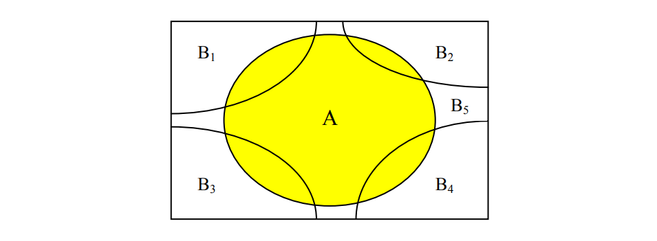

```{r setup, include=FALSE}
knitr::opts_chunk$set(echo = TRUE)
```

## Probabilidad condicional

#### Sean $A$ y $B$ dos eventos de un mismo espacio muestral $S$. La probabilidad condicional de que ocurra $A$ dado que el evento $B$ ha ocurrido  esta dado por:

#### $$P(A|B)=\dfrac{P(A\cap B)}{P(B)}=\dfrac{\#(A\cap B)}{\#(B)}$$

> **Ejemplos**:

#### **Ejemplo 1**. se lanza un par de dados legales y distinguibles. ¿Cuál es la probabilidad de que solamente uno de los dos dados sea par si se sabe que la suma de los dos es mayor que 8?

#### Solucion:

#### Sean los eventos $A$: "Solamente uno de los dos dados sea par"" y el evento condicionante $B$: "La suma sea mayor que 8".

#### Podemos notar que:

#### $$\#(A\cap B)=6$$

#### y que, 

#### $$\#(B)=10$$

#### Finalmente,

#### $$P(A|B)=\dfrac{P(A\cap B)}{P(B)}=\dfrac{6}{10}$$

#### Ejemplo 2:  En una ciudad se hizo una encuesta acerca de la opinión de las personas adultas con respecto a una ley del gobierno. La siguiente tabla muestra los resultados de la encuesta clasificados según el sexo del entrevistado.


#### Se elige al azar  una persona:

#### a) ¿Cuál es la probabilidad de que favorezca la ley si resulta ser mujer?
#### b) ¿Cuál es la probabilidad de que sea mujer si resulta estar en contra de la ley?
#### c) ¿Cuál es la probabilidad de que sea hombre si la persona elegida no se abstuvo de opinar?

#### Solución: Considerando que las frecuencias relativas estiman a las probabilidades de los eventos, se tiene que: 

#### a) De las 37 mujeres hay 10 que están a favor de la ley, luego 

#### $$P(F|M)=\dfrac{10}{37}$$

#### b) De los 43 entrevistados que están en contra de la ley 15 son mujeres, luego


#### $$P(M|C)=\dfrac{15}{43}$$

#### c) De los 65 que no se abstuvieron de opinar 40 fueron hombres, luego

#### $$P(H|F\cup C)=\dfrac{40}{65}$$

### Regla del producto

#### Dados los eventos A y B de un mismo espacio muestral, la probabilidad de que ambos ocurran conjuntamente está dado por


#### $$P(A \cap B)=P(A)P(B|A)$$


#### Esta expresión se obtiene despejando de la fórmula de probabilidad condicional. Se usa para calcular la probabilidad de que dos eventos ocurran al mismo tiempo.

> **Ejemplos**

#### Ejemplo 1. Una urna contiene 3 bolas rojas y 4 bolas blancas. Se extraen al azar dos bolas de la urna, una por una y sin reposición. ¿Cuál es la probabilidad de que:

#### a) ambas bolas sean rojas?
#### b) la segunda bola sea roja?
#### c) sólo una de las dos bolas sea roja?

#### Solución:

#### La forma más fácil de resolver el problema es haciendo un diagrama de árbol. Luego,


#### a)ambas bolas sean rojas? 

#### $$P(R_1\cap R_2)=P(R_1)P(R_2|R_1)=3/7*2/6=1/7$$

#### b) la segunda bola sea roja?

#### $$P(R_2)=P(R_1\cap R_2) + P(B_1\cap R_2)=3/7*2/6 + 4/7*3/6=18/42=3/7$$

#### c) sólo una de las dos bolas sea roja?

####$$P(R_1\cap B_2) + P(B_1\cap R_2)=P(R_1)P(B_2|R1)+P(B_1)P(R_2|B_1)=$$

#### $$3/7*4/6+4/7*3/6=24/42=4/7$$

#### Ejemplo 2. Según la Comisión Electoral de un país, el 90 por ciento de las esposas votan si sus esposos lo hacen, y el 20 por ciento vota si su esposo no lo hace. Además el 70 por ciento de los hombres casados votan. Se elige al azar un matrimonio. ¿Cuál es la probabilidad de que:

#### a) ambos esposos voten?
#### b) sólo uno de los esposos vote?
#### c) vote la esposa?
#### d) al menos uno de los esposos vote?

#### Solución:

#### Sean los eventos $H$: "Que vote el esposo" y $W$: "Que vote la esposa". El problema puede ser representado por un diagrama de árbol. Las probabilidades de color rojo  indican que es información que aporta el problema.


#### a) ¿Ambos esposos voten?

#### $$P(H\cap W)=P(H)P(W|H)=0.7*0.9=0.63$$

#### b) ¿Sólo uno de los esposos vote?

#### $$P(H\cap W^c) + P(H^c \cap W)=$$
#### $$P(H)P(W^c|H) + P(H^c)P(W|H^c)=$$
#### $$0.7*0.1 + 0.30*0.20=0.13$$

#### c) ¿Vote la esposa?

#### $$P(W)=P(H)P(W|H) + P(H^c)P(W|H^c)=$$
#### $$0.7*0.9 + 0.3*0.2=0.69$$

#### d) ¿Al menos uno de los esposos vote?

#### $$P(H \cup W)=P(H) + P(W) - P(H \cap W)=0.70 + 0.69 - 0.63 = 0.76$$


## Probabilidad Total y Regla de Bayes

### Regla de la Probabilidad Total

#### Sean $B_1,...,B_n$ una colección de eventos que forman una partición sobre el espacio muestral $S$, es decir $\bigcup_{i=1}^{n}(B_i)$ y $B_i \cap B_j=\emptyset$ para $i\neq j$. Sea $A$ otro evento del espacio muestral $S$, entonces:

#### $$P(A)=\sum_{i=1}^{n}P(B_i)P(A | B_i)$$ es llamada la fórmula de la probabilidad total.

#### La siguiente imagen representa un espacio muestral $S$ particionado en 5 partes. 




> Ejemplos

#### **Ejemplo 1**: El 70 % de los pacientes con cáncer de pulmón de un hospital son mujeres y el 20 % de ellas son fumadoras. Por otro lado el 40 % de los pacientes con cancer de pulmon hombres son fumadores. Se elige al azar un paciente del hospital. ¿Cuál es la probabilidad de que sea fumador?

#### Definamos los eventos:

#### **H**: El paciente es hombre.

#### **M**: El paciente es mujer.

#### **F**: El paciente es fumador.

#### Sabemos que, $P(H)=0.30$, $P(M)=0.70$, $P(F|H)=0.40$ y que $P(F|M)=0.20$. Por tanto, aplicando la regla de probabilidad total tenemos:

#### $$P(F)=P(H)P(F|H) + P(M)P(F|M)=0.30*0.40 + 0.70*0.20 = 0.26$$

#### Por tanto la probabilidad de seleccionar un paciente al azar y que resulte ser fumador es de 0.26.


#### **Ejemplo 2**:Una empresa tiene 3 plantas: A, B y C. La planta A produce el 50% de la producción total, B produce el 30% y C el 20%. El 3% de la producción de A es defectuosa, mientras que el 2% de B y el 5% de C también lo son. Se elige al azar un artículo producido por la empresa:


#### a) ¿Cuál es la probabilidad de que el artículo elegido sea defectuoso? 

#### Definamos los siguientes eventos:

#### **A**: "Producción en la planta A", sabemos que $P(A)=0.50$
#### **B**: "Producción en la planta B", sabemos que $P(B)=0.30$
#### **C**: "Producción en la planta C", sabemos que $P(C)=0.20$
#### **D**: "La producción es defectuosa"

#### Según la información que nos da el problema, tenemos $P(D|A)=0.03$,  $P(D|B)=0.02$ y $P(D|C)=0.05$

#### Vemos que los eventos A, B y C hacen parte de la partición al espacio muestral. Aplicando la regla de probabilidad total tenemos:

#### $$P(D)=P(A)P(D|A) + P(B)P(D|B) + P(C)P(D|C)=$$

#### $$P(D)=0.5*0.03 + 0.3*0.02 + 0.20*0.05=0.031$$


#### b) Si el artículo elegido resulta ser defectuoso, ¿Cuál es la probabilidad de que provenga de la planta C?

#### Tenemos que encontrar $P(C \cap D)$

#### Por definición de probabilidad condicional tenemos,

#### $$P(C|D)=\dfrac{P(C \cap D)}{P(D)}=\dfrac{0.20*0.05}{0.031}=0.32$$


### Teorema de Bayes

#### En la teoría de la probabilidad y las estadísticas, el teorema de Bayes (alternativamente, la ley de Bayes o la regla de Bayes) describe la probabilidad de un evento, sobre la base del conocimiento previo de las condiciones que podrían estar relacionadas con el evento. Por ejemplo, si el cáncer está relacionado con la edad, usando el teorema de Bayes, se puede usar la edad de una persona para evaluar con mayor precisión la probabilidad de tener cáncer, en comparación con la evaluación de la probabilidad de cáncer sin conocer su edad. El teorema de Bayes lleva el nombre en honor al  matemático Inglés Thomas Bayes (1701-1761). 

#### El Teorema de Bayes nos dice con qué probabilidad  sucede el evento $A$ dado que el evento $B$ ha sucedido, y se escribe como  $P(A | B)$. Cuando sabemos con qué frecuencia ocurre $B$ dado que $A$ sucede, se escribe  $P(B | A)$, y cuán probable que los eventos $A$ y $B$ ocurran por separado.


* #### $P(A | B)$ es la "Probabilidad de A dado B", la probabilidad de $A$ dado que el evento $B$ ocurre.
* ####    $P(A)$ es la probabilidad del evento $A$
* ####    $P(B | A)$ es la "Probabilidad de B dado A", la probabilidad de B dado que ocurre el evento $A$.
* ####    $P(B)$ es la probabilidad total del evento  $B$

#### $$P(B)=\sum_{i=1}^{n}P(A_i)P(B | A_i)$$


#### Analicemos el siguiente ejemplo:

#### Cuando **P(Fuego)** significa con qué frecuencia hay fuego, y **P(Humo)** significa la frecuencia con que vemos humo, entonces:

#### **P(Fuego | Humo)** significa con qué frecuencia hay fuego cuando vemos humo. **P(Humo | Fuego)** significa la frecuencia con la que vemos humo cuando hay un incendio.

#### Entonces, la fórmula nos dice "como ir hacia adelante" cuando sabemos lo que ha ocurrido (o viceversa)


> Ejemplos


#### Si los incendios peligrosos son poco frecuentes (1%) pero el humo es bastante común (10%) debido a las fábricas, y el 90% de los incendios peligrosos producen humo, entonces:

#### $$P(Fuego | Humo) = \dfrac{P(Fuego)*P(Humo | Fuego)}{P(Humo)}=\dfrac{0.01*0.9}{0.10}=0.09$$

#### Entonces encontramos que el 9 % de las veces que vemos humo, este proviene de un incendio peligroso. En otras palabras el 9% de las veces se espera que el humo signifique un incendio peligroso


> Ejemplos

#### **Ejemplo 1**: Suponga que los chips de un circuito integrado son probados con cierto instrumento y la probabilidad de que se detecten los defectuosos es .99. Por otro lado hay una probabilidad de .05 de que un chip sea declarado como defectuoso cuando en realidad es bueno. Si el 1 % de todos los chips son defectuosos. ¿Cuál es la probabilidad de que un chip que es declarado como defectuoso sea en realidad bueno? 

#### Resolver este tipo de problemas puede ser confuso, pero la estrategia debe ser declarar adecuadamente los eventos que intervienen en el problema, veamos:

#### **D: "El chip es defectuoso"**, con **P(D)=0.01** (un 1 %).

#### **B: "El chip es bueno"**, con **P(B)=1-P(D)=1-0.01=0.99** (El complemento de que sea defectuoso)

#### **M: "El chip es declarado como defectuoso"** (P(M), Esta probabilidad es desconocida)

#### Del problema tenemos que **P(M|D)=0.99** y que **P(M|B)=0.05**

#### ¿Que nos está pidiendo el problema?, es simple, debemos calcular **P(B|M)**.

#### Aplicando el Teorema de Bayes, 

#### $$P(B|M)=\dfrac{P(B)P(M|B)}{P(M)}$$

#### La probabilidad total para **P(M)** es 

#### $$P(M)=P(B)P(M|B) + P(D)P(M|D)=0.99*0.05 + 0.01*0.99=0.0495 + 0.0099 =  0.0594$$

#### Finalmente,


#### $$P(B|M)=\dfrac{P(B)P(M|B)}{P(M)}=\dfrac{0.99*0.05}{0.0594}=0.8333$$

#### Es decir, la probabilidad de encontrar un chip que en realidad es bueno y declararlo como defectuoso es de 0.8333. (MUY ALTA!)

#### **Ejemplo 2.**  Una Agencia de tránsito y transporte estudió la probabilidad de que diferentes tipos de conductores estuvieran involucrados en al menos una colisión durante un período de un año. Los resultados del estudio son:


```{r,eval=TRUE,echo=FALSE}
Tipo <- c("Adolescente","Adulto joven","Adulto de mediana edad","Mayor (Senior)")
percent <- c("8%","16%","45%","31%")
proba <- c(0.15,0.08,0.04,0.05)
problem <- data.frame(Tipo,percent,proba)
names(problem) <- c("Tipo de conductor","Porcentaje de todos los conductores",
                    "Probabilidad de al menos un choque")
library(knitr)
library(kableExtra)
kable(problem) %>%
  kable_styling(bootstrap_options = c("striped", "bordered","hover"), full_width = F, 
                position = "left")
```


#### Dado que un conductor ha estado involucrado en al menos una colisión en el último año, calcule la probabilidad de que el conductor sea un conductor adulto joven.

#### Podemos definir  los siguientes eventos:

#### C = Evento de que ocurra un choque.

#### T = Evento de un conductor adolescente.

#### Y = Evento de un conductor adulto joven.

#### M = Evento de un conductor de mediana edad.

#### S = Evento de un conductor senior.

#### Según la información en la tabla, tenemos que:

#### $P(C|T)=0.15$, 

#### $P(C|Y)=0.08$,

#### $P(C|M)=0.04$ 

#### $P(C|S)=0.05$

#### y la probabilidad solicitada en el problema es $P(Y|C)$.

#### Usando el Teorema de Bayes, tenemos:

#### $$P(Y|C) = \dfrac{P(Y)P(C|Y)}{P(T)P(C|T) + P(Y)P(C|Y) + P(M)P(C|M) + P(S)P(C|S) }$$

#### $$P(Y|C) = \dfrac{0.16*0.08}{0.08*0.15 + 0.16*0.08 + 0.45*0.04 + 0.31*0.05 } = 0.2195 \simeq 0.22$$

## Eventos Independientes

#### Dos eventos A y B del mismo espacio muestral S son independientes, si la probabilidad de que ocurra uno no afecta la probabilidad de que el otro ocurra. Lo anterior matemáticamente significa que


#### A y B son independientes si:

#### $$P(A|B)=P(A)$$
o $$P(B|A)=P(B)$$

#### Una definición equivalente para eventos independientes es:

#### Los eventos A y B son independientes si,

#### $$P(A \cap B)= P(A)P(B)$$

### Propiedades de eventos independientes. 

####  Si $A$ y $B$ son eventos independientes y estan en un mismo espacio muestral $S$, se cumple que:

####  1. $A$ y  $B^c$ son independientes. 

####  2. $A^c$ y  $B^c$ también son independientes. 

> Ejemplos

#### **Ejemplo 1**:Se lanzan un par de dados legales y distinguibles y se definen los siguientes eventos: 

#### **A: “Que el primer dado sea par.”**

#### **B: “Que el segundo dado sea mayor que 4.”**

#### ¿Son los eventos A y B independientes?

#### Tenemos que,

#### $$P(A)=18/36 \quad P(B)=12/36$$

#### también tenemos que 

#### $$P(A \cap B)=6/36$$

#### ¿Cómo verificamos que A y B son independientes?, solo debemos ver que el producto de sus probabilidades es igual a la probabilidad de la intersección. Veamos

#### $$P(A)P(B)=18/36*12/36=6/36.$$

#### Finalmente podemos decir que $A$ y $B$ son eventos independientes!


#### **Nota**: Un error muy común es considerar que los eventos son independientes si son mutuamente excluyentes: observe que esto no es cierto. 

#### Por ejemplo, si se lanza una moneda legal una vez y se consideran los eventos.

#### **A: "El resultado obtenido es cara"**.

#### **B: "El resultado obtenido es cruz"**

#### Entonces es evidente que los eventos **A** y **B** son mutuamente excluyentes. Sin embargo NO son independientes, pues 

#### $$P(A \cap B)=0$$

#### y 

#### $$P(A)(B)=1/2*1/2=1/4$$

#### Así vemos que $0 \neq 1/4$, por tanto A y B no son independientes.

#### **Ejemplo 2**: Un aprendiz para francotirador está practicando en un polígono de tiro y debe presentar una prueba que consta en hacer dos disparos. Según su entrenamiento y basado en resultados anteriores él ha encontrado que la probabilidad de que acierte en el blanco es 0.8, independientemente del disparo que haga. ¿Cuál es la probabilidad de que el aprendiz: 

#### a) Acierte ambos disparos? 

#### Definimos los eventos para cada disparo como:

#### A: "Acertar en el disparo uno"

#### B: "Acertar en el disparo dos"

#### Aquí simplemente, como cada disparo es independiente del anterior, tenemos

#### $$P(A \cap B)=P(A)P(B)=0.8*0.8=0.64$$

#### La probabilidad de acertar en ambos intentos es 0.64.

#### b) Acierte sólo uno de los dos disparos? 

#### Debemos tener en cuenta los complementos,

#### $$P(A \cap B^c) + P(A^c \cap B)=P(A)P(B^c) + P(A^c)P(B)=0.8*0.2 + 0.2*0.8=0.16 + 0.16 = 0.32$$

#### c) Acierte por lo menos un disparo? 

#### $$P(A \cup B)=P(A)+P(B)-P(A \cap B)=0.8 + 0.8 - 0.64= 0.96$$

#### d) No acierte ninguno de los dos disparos?

#### Como $A^c$ y $B^c$ son independientes, tenemos que,

#### $$P(A^c \cap B^c)=P(A^c)P(B^c)=0.2*0.2=0.04$$

#### La probabilidad de que no de en el blanco en ningún disparo es bien baja, 0.04.


