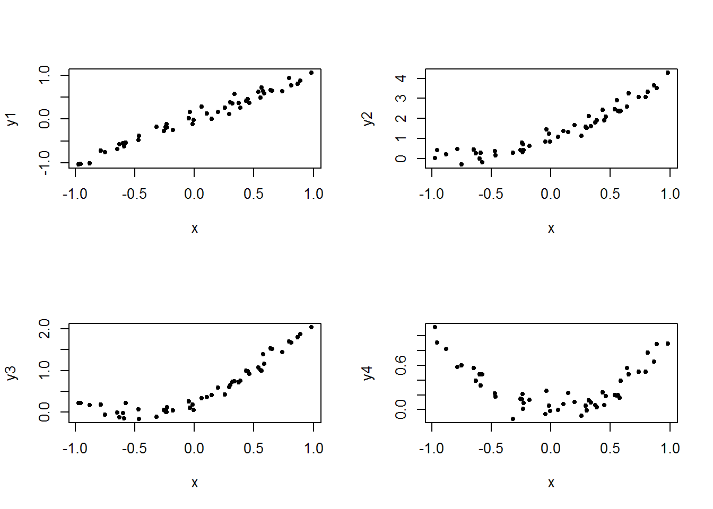
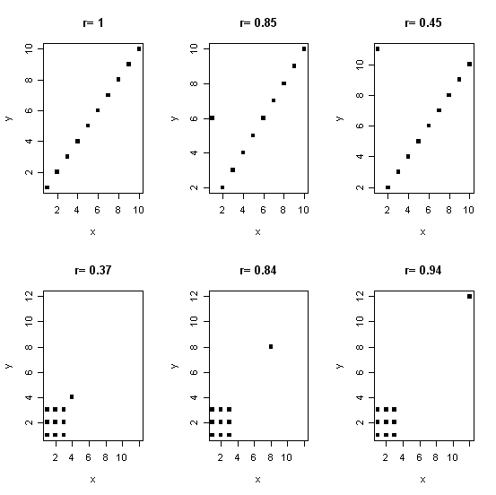

```{r setup, include=FALSE}
knitr::opts_chunk$set(echo = TRUE)
```

##  Dos variables cuantitativas: correlación

Nuestro interés en esta sección se ubica en situaciones en las que podemos asociar a cada elemento de una población o muestrear dos mediciones x e y, particularmente en el caso de que sea de interés utilizar el valor de x para predecir el valor de y. Por ejemplo, `x` podría ser el peso en libras de una mujer antes de quedar en embarazo, `y`  el peso en libras del recién nacido. Aprenderemos métodos estadísticos para analizar la relación entre dos variables cuantitativas `x` e `y` en este contexto.

En general, si hay más de dos variables, estamos interesados en sus relaciones. Estamos interesados en contestar:

¿Hay una relación?

Si hay una relación, ¿podemos describirla?

Si ambas variables son cuantitativas, para la primera pregunta podemos encontrar la correlación y para la segunda podemos hacer una regresión.


### Estudio de caso: El árbol de china


```{r}
data("Orange")
head(Orange,15)
```

Tanto `circumference` en mm y `age` en días son variables cuantitativas. Ninguna de las dos son muy interesantes en sí mismas, el verdadero interés está en su relación. ¿Qué nos dice la edad del árbol sobre la circunferencia de la planta?

Para tratar este problema  usualmente comenzamos dibujando un diagrama de dispersión.

```{r}
plot(Orange$age, Orange$circumference , main="Scatterplot Orange tree", 
  	xlab="Time in Days", ylab="Circumfence in mm",pch=19)
```

La gráfica muestra la relación que existe entre la edad del árbol de china y la circunferencia del tronco. Si los puntos están totalmente dispersos se dice que no hay relación entre las variables, a diferencia, si hay algún patrón como en el caso de el árbol de china. 

> **¿Cómo podemos  caracterizar numéricamente la relación entre las variables?**

La elección más popular para ese número es el coeficiente de correlación `r` de Pearson, que podemos encontrar en `RStudio` con el comando `cor()`

```{r}
cor(Orange$age, Orange$circumference )
```

Vemos que el resultado de la correlación entre la edad de la planta y la circunferencia del tronco es $0.91$.

```{r}
x <- rnorm(500,2,5)
y <- rnorm(500,5,2)
plot(x,y,pch=18)
```

¿Cuánto es la correlación entre `x` e `y`?

```{r}
cor(x,y)
```

El coeficiente de correlación es una medida estadística similar a la media, mediana, desviación estándar, Q1, etc .: viene en dos versiones:

* Es una estadístico cuando se encuentra a partir de una muestra

* Es un parámetro cuando pertenece a una población.

En el primer caso usamos el símbolo $r$, en el segundo caso usamos $\rho$.

### Propiedades del coeficiente de correlación:

1.	Siempre esta entre  -1 < r <1
2.	$r$ cercano a 0 significa muy poca o incluso ninguna correlación (relación)
3.	$r$ cercano a ± 1 significa una correlación muy fuerte $r = -1$ o $r = 1$ significa una correlación lineal perfecta (es decir, en el diagrama de dispersión los puntos forman una línea recta)
4.	$r < 0$ significa una relación negativa (a medida que x se hace más grande y se hace más pequeño)
5.	$r > 0$ significa una relación positiva (a medida que x aumenta, y aumenta)

6.	$r$ trata simétricamente x e y, es decir $cor(x, y) = cor(y, x)$


El coeficiente de correlación de Pearson solo mide las relaciones lineales, no funciona si una relación no es lineal y si se lesuma la presencia de outliers.

Aquí hay un ejemplo:



$cor(x, y1) = 0.986$

$cor(x, y2) = 0.937$

$cor(x, y3) = 0.88$

$cor(x, y4) = -0.111$


Todos para estos tienen aproximadamente la misma "fuerza" de una relación.

PERO

El coeficiente de correlación de Pearson solo es útil para el primer caso.

Otra situación en la que el coeficiente de correlación de Pearson no funciona es si hay valores atípicos en el conjunto de datos. Incluso solo un valor atípico ("Outlier") puede determinar el coeficiente de correlación:





### Correlación débil vs cero correlación

Es importante mantener dos cosas separadas: una situación con dos variables que no están correlacionadas $(\rho = 0)$ y dos variables con una correlación débil ( $\rho ≠ 0$ pero pequeña).

En cualquier caso, encontraríamos una $r$ cercana a 0 (¡pero nunca = 0!).


