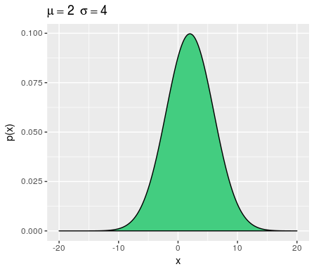
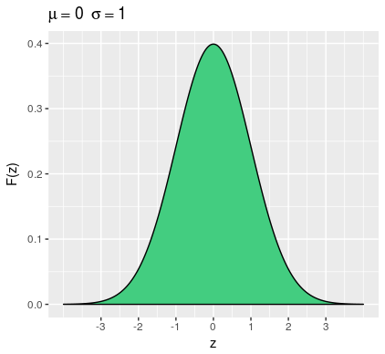

```{r setup, include=FALSE}
knitr::opts_chunk$set(echo = TRUE)
```

## Distribución Normal o Gaussiana.

En probabilidad y estadística la distribución normal es una de las más importantes.  Es llamada también distribución Gaussiana en honor al  matemático, físico y astrónomo Alemán K. Gauss. La distribución normal es de variable aleatoria continua. Su comportamiento es reflejado por la Curva Normal o campana de Gauss que representa  la gráfica de la siguiente ecuación.

\begin{equation*}
f(x)=\dfrac{1}{\sqrt{2 \pi}\sigma}e^{-\dfrac{1}{2}\dfrac{(x-\mu)^2}{\sigma^2}} \quad -\infty <x< +\infty
\end{equation*}

Si $X$ es una variable aleatoria continua y $X$ se distribuye normalmente entonces se escribe $X \sim Normal(\mu,\sigma)$, donde $\mu$ es la media y $\sigma$ es la desviación estándar.





### Distribución Normal Estándar

A la distribución Normal que tiene media $\mu=0$ y desviación estándar $\sigma=1$ se le llama normal  estándar y se representa por la letra $Z$. Las áreas debajo de la curva normal representan las probabilidades estándar y anteriormente eran consultadas en tablas, pero con el auge de las computadoras y los software estadísticos dichas tablas ahora son prácticamente obsoletas. 

El dominio de la distribución normal estándar también está entre menos infinito y más infinito, es decir $-\infty<z<\infty$, pero el $99.73$ % de la probabilidad bajo la curva se concentra entre   $-3<z<3$




Como hemos dicho anteriormente la probabilidad total bajo la curva es igual a 1, esto quiere decir que la probabilidad entre $-3$ y $0$ es aproximadamente $0.5$ y que la probabilidad entre $0$ y $3$ es también aproximadamente $0.5$, esto ocurre dado a que la distribución normal es simétrica. 

### Cálculo de probabilidades de la distribución Normal estándar 

A continuación vamos a ilustrar el uso de `RStudio` para calcular probabilidades de la distribución $Z$, también se puede usar la siguiente función para graficar la respectiva área bajo la curva. 

```{r}
plot_area <- function(a,b){
z=seq(-3,3,length=200)
F_z=dnorm(z,mean = 0,sd=1)
plot(z,F_z,type="l", lwd=2, col="black")
z=seq(a,b,length=200)
F_z=dnorm(z,mean = 0,sd=1)
polygon(c(a,z,b),c(0,F_z,0),col="blue")
axis(side = 1, at=-3:3)
}
```


 > Ejemplos 

Hallar las siguientes probabilidades, dado que $Z \sim Normal(0,1)$

a) P (Z < 2)

```{r}
pnorm(2,0,1)
plot_area(-3,2)
```
b) P ( Z > 1.54) 
```{r}
1 - pnorm(1.54,0,1)
plot_area(1.54,3)
```
c) P (-1 < Z < 1) 
```{r}
pnorm(1,0,1) - pnorm(-1,0,1)
plot_area(-1,1)
```
d) P (Z < 0) 
```{r}
pnorm(0,0,1)
plot_area(-3,0)
```
e) P (Z >-1.95) 
```{r}
1 - pnorm(-1.95,0,1)
plot_area(-1.95,3)
```
f) P (-1.33 < Z < 2.15) 

```{r}
pnorm(2.15,0,1) - pnorm(-1.33,0,1)
plot_area(-1.33,2.15)
```


### Estandarización de una Normal 

Dada una variable aleatoria $X$ distribuida Normalmente con media $\mu$  y desviación estándar $\sigma$  entonces puede ser convertida a una normal estándar mediante el proceso de estandarización, definido por 

$$Z = \dfrac{X - \mu}{\sigma}$$. 

Es decir, 

$$P(Z < \dfrac{X - \mu}{\sigma})$$

### Fórmulas para calcular área debajo de la curva normal estándar

$F_z$ representa la distribución acumulada de la distribución Normal estándar, es decir el área acumulada a la izquierda del valor dado

1.  $F_z(Z < a)= F_z(a)$.

2.  $F_z(Z > a)= 1 - F_z(a)$.

3.  $F_z(a <Z < b)= F_z(b) - F_z(a)$.

> Ejemplos

Si $X$ es una población Normal con media $\mu = 70$ y desviación estśndar $\sigma = 10$. Use el procedimiento de estandarización para hallar las siguientes probabilidades:

a) P (X < 60)

Primero debemos estandarizar 


\begin{eqnarray*}
P(X < 60) & = & P(Z<\dfrac{60-70}{10}) \nonumber \\
&=& P(Z< -1)\\
&=& 0.1586553
\end{eqnarray*}

El resultado anterior resulta de encontrar  $P(Z<-1)$  usando `RStudio` , veamos:


```{r}
pnorm(-1,0,1)
plot_area(-3,-1)
```


b) P(X > 95)

Estandarizado tenemos 


\begin{eqnarray*}
P(X > 95) & = & 1 - P(X \leq 95) \nonumber \\
&=& 1 - P(Z<\dfrac{95-70}{10})\\
&=& 1 - P(Z< 2.5)\\
&=& 1 - 0.9937903\\
&=& 0.0062097
\end{eqnarray*}

Usando `RStudio`
 
```{r}
1 - pnorm(2.5,mean = 0,sd=1)
```


c) P (50 < X < 80)

Aplicando la fórmula para el caso en que $F(a < X < b)= F(b) - F(a)$


\begin{eqnarray*}
P(50 < X < 80) & = & P(X <80) - P(X < 50) \nonumber \\
&=& P\big(Z < \dfrac{80-70}{10}\big) - P\big(Z < \dfrac{50-70}{10}\big)\\
&=& P(Z < 1) - P(Z < -2)\\
&=& 0.841344 - 0.0227501 \\
&=& 0.8185939
\end{eqnarray*}


 Usando `RStudio`
 
```{r}
pnorm(1,0,1) - pnorm(-2,0,1)
```


###  Simulando datos de una distribución Normal


> Ejemplos 

Supongamos que deseamos simular 30 notas de una población normal que tiene media $75$ y desviación estándar $10$.

```{r}
# Simular 30 datos con media 75 y desviación 10
Notas <- rnorm(30,75,10)
# Redondeando los resultados
Notas <- round(Notas,digits = 0)
print(Notas)
```


**¿Cuál es la probabilidad que un estudiante  tenga más 73 en la nota?**


