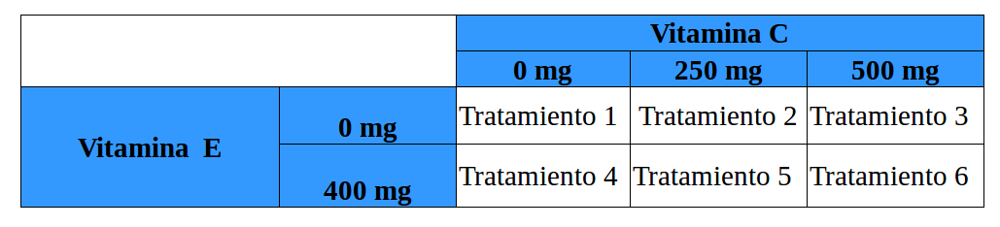
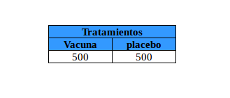
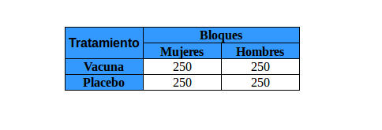

```{r setup, include=FALSE}
knitr::opts_chunk$set(echo = TRUE)
```
## Definición de experimento

¿Qué es un experimento?

Hay dos métodos básicos para diseñar experimentos con personas o individuos.

Un estudio observacional observa individuos y mide variables de interés, pero no intenta influir en las respuestas

Un experimento diseñado deliberadamente impone algún tratamiento a los individuos para observar sus respuestas.

En un experimento, un investigador manipula una o más variables, mientras mantiene constantes todas las otras variables. Al observar cómo las variables manipuladas afectan una variable de respuesta, el investigador puede probar si existe una relación causal entre las variables manipuladas y la variable de respuesta.


## Partes de un experimento

Todos los experimentos tienen variables independientes, variables dependientes y unidades experimentales.

#### Variable independiente. 

Una variable independiente (también llamada factor) es una variable explicativa manipulada por el experimentador.
Cada factor tiene dos o más niveles (es decir, diferentes valores del factor). Las combinaciones de niveles de los factores se llaman tratamientos. La siguiente tabla muestra variables independientes, factores, niveles y tratamientos para un experimento hipotético.





En este experimento hipotético, el investigador está estudiando los posibles efectos de la vitamina C y la vitamina E en la salud. Hay dos factores: la dosis de vitamina C y la dosis de vitamina E. El factor de vitamina C tiene tres niveles: 0 mg por día, 250 mg por día y 500 mg por día. El factor de vitamina E tiene 2 niveles: 0 mg por día y 400 mg por día. El experimento tiene seis tratamientos. El tratamiento 1 es 0 mg de E y 0 mg de C, el Tratamiento 2 es 0 mg de E y 250 mg de C, y así sucesivamente.

#### Variable dependiente. 

También conocida como variable respuesta. En el experimento hipotético anterior, el investigador está estudiando el efecto de las vitaminas en la salud. La variable dependiente o respuesta en este experimento sería alguna medida de salud (facturas anuales del médico, cantidad de resfriados o gripes en un año, días de hospitalización, etc.).

#### Unidades experimentales. 

Los individuos en los que se realiza un experimento se llaman unidades experimentales. Cuando las unidades experimentales son seres humanos, se les llama sujetos. Una condición experimental específica aplicada a una unidad se llama tratamiento. Las unidades experimentales en un experimento podrían ser cualquier cosa: personas, plantas, animales o etc.

### Características de un experimento bien diseñado

Un experimento bien diseñado incluye características de diseño que permiten a los investigadores eliminar variables extrañas como una explicación de la relación observada entre las variables independientes y la variable dependiente. Algunas de estas características se enumeran a continuación.

#### Control

Control se refiere a los pasos tomados para reducir los efectos de variables extrañas (es decir, variables distintas de la variable independiente y la variable dependiente). Estas variables extrañas se llaman variables ruidosas.
El control implica hacer que el experimento sea lo más similar posible en cada una de las unidades experimentales bajo cada tipo de tratamiento. Dos estrategias para controlar ese tipo de variables son: Un grupo control y placebos.

*  Grupo Control. 

Un grupo de control es un grupo de referencia que no recibe tratamiento o que solo recibe un tratamiento neutral. Para evaluar los efectos del tratamiento, el experimentador compara los resultados en el grupo de tratamiento con los resultados en el grupo de control.

*   Placebo. 

A menudo, los participantes en un experimento responden de manera diferente después de recibir un tratamiento, incluso si el tratamiento es neutral. Un tratamiento neutral que no tiene un efecto "real" en la variable dependiente se llama placebo, y la respuesta positiva de un participante a un placebo se llama efecto placebo. El ejemplo clásico es usar una pastilla de almidón en la investigación de medicamentos. El nuevo fármaco se considera efectivo solo si los participantes que reciben el medicamento tienen mejores resultados que los sujetos que reciben el placebo.

**Por supuesto, si los participantes en el grupo control saben que están recibiendo un placebo, el efecto placebo se reducirá o se eliminará; y el placebo no cumplirá su propósito de control previsto. Por regla general los participantes que están recibiendo un placebo no lo saben.**

#### Aleatorización. 

La aleatorización se refiere a la práctica de usar métodos aleatorios (tablas de números aleatorios, lanzar una moneda, etc.) para asignar unidades experimentales a los tratamientos. De esta forma, los efectos potenciales de las variables ruidosas se distribuyen en niveles de probabilidad (con suerte aproximadamente iguales) en todos los tratamientos.

####  Replicación. 

La replicación se refiere a la práctica de asignar cada tratamiento a muchas unidades experimentales. En general, cuanto más unidades experimentales en cada condición de tratamiento, menor es la variabilidad de la medida dependiente

## Un ejemplo de diseño experimental

Considera el siguiente experimento hipotético. Acme Medicine está realizando un experimento para probar una nueva vacuna, desarrollada para inmunizar a las personas contra el resfriado común o gripe. Para probar la vacuna, Acme tiene 1000 voluntarios, 500 hombres y 500 mujeres. Los participantes tienen edades comprendidas entre 21 y 70 años.
En esta lección, describimos dos tipos de diseños experimentales: un diseño completamente aleatorizado y un diseño de bloques al azar. Y mostramos cómo Acme Medicine podría aplicar cada diseño para comprender el efecto de la vacuna, a la vez que descarta los efectos confusos de otros factores.

### Diseño completamente aleatorizado

El diseño completamente aleatorizado es probablemente el diseño experimental más simple, en términos de análisis de datos y conveniencia. Con este diseño, los participantes se asignan aleatoriamente a los tratamientos. Un diseño completamente aleatorizado para el experimento Acme se muestra en la tabla a continuación.



En este diseño, el experimentador asignó aleatoriamente a los participantes a uno de dos tratamientos. Por lo tanto, recibieron un placebo o recibieron la vacuna. Se asignó el mismo número de participantes (500) a cada tratamiento (aunque esto no es obligatorio). La variable dependiente es la cantidad de resfriados informados en cada tratamiento. Si la vacuna es efectiva, los participantes en la condición de "vacuna" deben informar significativamente menos casos de gripe comparado con  los sujetos en el tratamiento "placebo".

### Diseño de bloques aleatorizados

Con un diseño de bloques al azar, el experimentador divide a los participantes en subgrupos llamados bloques, de modo que la variabilidad dentro de los bloques es menor que la variabilidad entre los bloques. Luego, los participantes dentro de cada bloque se asignan aleatoriamente a los tratamientos. Debido a que este diseño reduce la variabilidad y la posible confusión, produce una mejor estimación de los efectos del tratamiento. La siguiente tabla muestra un diseño de bloques aleatorizados para el experimento Acme.



Los sujetos se asignan a bloques, en función del género, es decir cada género es un Bloque. Luego, dentro de cada bloque, los participantes se asignan aleatoriamente a los tratamientos. Para este diseño, 250 hombres reciben el placebo, 250 hombres reciben la vacuna, 250 mujeres reciben el placebo y 250 mujeres reciben la vacuna.

Se sabe que los hombres y las mujeres son fisiológicamente diferentes y reaccionan de manera diferente a los medicamentos. Este diseño garantiza que cada tratamiento tenga una proporción igual de hombres y mujeres. Como resultado, las diferencias entre los tipos de tratamiento no pueden atribuirse al género. Este diseño de bloques aleatorizados elimina el género como una fuente potencial de variabilidad.

En este ejemplo de Acme, el diseño de bloques aleatorizados es una mejora sobre el diseño completamente aleatorizado. Ambos diseños usan aleatorización para evitar implícitamente la confusión. Pero solo el diseño de bloques aleatorizados controla explícitamente el género.


