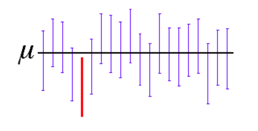

```{r setup, include=FALSE}
knitr::opts_chunk$set(echo = TRUE)
```


##  Estimación puntual y por intervalos

>  ¿Qué es un estimador?


Cuando queremos realizar un estudio de una población cualquiera de la que desconocemos sus parámetros, debemos tomar una muestra aleatoria de dicha población a través de la cual  se pueda calcular una aproximación a dichos parámetros que desconocemos y queremos estimar. Bien, pues esa aproximación se llama estimación. Además, junto a esa estimación, y dado que muy probablemente no coincida con el valor real del parámetro, acompañaremos el error aproximado que se comete al realizarla. 

### Estimación puntual

Una estimación puntual del valor de un parámetro poblacional desconocido (como puede ser la media $\mu$ , o la desviación estándar $\sigma$ ), es un número que se utiliza para aproximar el verdadero valor de dicho parámetro poblacional. A fin de realizar tal estimación, tomaremos una muestra aleatoria de la población y calcularemos el parámetro muestral asociado ( $\bar{X}$ para la media, $s$ para la desviación estándar, etc.). El valor de este parámetro muestral será la estimación puntual del parámetro poblacional. 

Por ejemplo, supongamos que estamos interesados en estimar la edad media de los estudiantes subgraduados en el Colegio. Seleccionan una muestra de 100 estudiantes y calcula la media de esta muestra, este valor será un estimador puntual de la media de la población. 

>  ¿Qué propiedades debe cumplir todo buen estimador? 


**Insesgado**: Un estimador es insesgado cuando la media de su distribución muestral asociada coincide con la media de la población. Esto ocurre, por ejemplo, tomando el estadístico $\bar{X}$ como el estimador , ya que $\mu_{\bar{x}}=\mu$.

> Ejemplos estimación puntual

1.  Queremos saber el porcentaje $\pi$ de los estudiantes en el Colegio a quienes les gusta la comida en la cafetería. Vamos a considerar a $\pi$ como  el porcentaje para todos los estudiantes, es decir para toda la población, entonces $\pi$ es un parámetro desconocido.

Para cada estudiante hay dos posibilidades: A él o ella le gusta la comida o no le gusta la comida. Entonces, si seleccionamos al azar a un estudiante, él / ella es un ensayo de Bernoulli. Si seleccionamos aleatoriamente n estudiantes, tenemos una muestra de n ensayos de Bernoulli. Sabemos que para un ensayo de Bernoulli con el parámetro $\pi$ la media poblacional $\mu=\pi$.

Si hicimos un buen trabajo al seleccionar a los estudiantes para la muestra, entonces esperamos que la muestra signifique que  $\bar{X}$ está cerca de la media poblacional $\mu$, que es

$$\bar{X} \sim \mu = \pi  (aproximadamente)$$


2.  Ejemplo 

Todo lo que acabo de decir en el ejemplo anterior es esto: si le pregunta a 500 personas si les gusta Coca-Cola y 300 dicen que sí, ¡su mejor estimación para la proporción de personas que les gusta Coca-Cola es 300/500! Aquí $\bar{X}= 300/500$. El punto es que esta simple idea es útil en casos mucho más complicados.

Cada parámetro de la población tiene un estadístico correspondiente y viceversa. Veamos:


Media de la muestra: media de la población

Porcentaje de muestra - porcentaje de población

Muestra mediana - mediana poblacional

Desviación estándar muestral - desviación estándar de la población

Muestra 1er cuartil - población 1er cuartil

etc ....

Cada uno de estos números de muestra se denomina estimación puntual.


##Estimación por intervalos

En la vida real, una estimación puntual rara vez es suficiente, por lo general también necesitamos una estimación del error en nuestra estimación.

Por ejemplo, suponga que  hicimos una encuesta a los estudiantes subgraduados en el Colegio. Para eso entrevistamos a 150 estudiantes seleccionados al azar, y encontramos un GPA promedio (muestra) de 2.85. Realmente queremos saber la (población) promedio de GPA de todos los estudiantes de pregrado en el Colegio.

Ahora, el "2.85" es el GPA promedio específico para la muestra que recolectamos, si repetimos todo el proceso y encontramos una muestra diferente, también obtendremos un promedio de muestra diferente. Digamos que la media (población) del GPA para todos los estudiantes de pregrado es $\mu_{gpa}$. Está bastante claro que $\mu_{gpa} \neq 2.53$, pero con suerte $\mu_{gpa}$ está cerca de 2.85. Pero, qué tan cerca?

Una forma de responder a estas preguntas es encontrar una estimación de intervalo en lugar de una estimación puntual. Específicamente, consideraremos un tipo de estimación de intervalo llamado intervalo de confianza.

> ¿Qué es un intervalo de confianza?

Un intervalo de confianza es un rango de valores, derivado de los estadísticos de la muestra, que posiblemente incluya el valor de un parámetro de población desconocido. Debido a su naturaleza aleatoria, es poco probable que dos muestras de una población en particular produzcan intervalos de confianza idénticos. Sin embargo, si usted repitiera muchas veces su muestra, un determinado porcentaje de los intervalos de confianza resultantes incluiría el parámetro de población desconocido.





En este caso, la línea negra horizontal representa el valor fijo de la media desconocida de la población, µ. Los intervalos de confianza azules verticales que se sobreponen a la línea horizontal contienen el valor de la media de la población. El intervalo de confianza rojo que está completamente por debajo de la línea horizontal no lo contiene. Un intervalo de confianza de 95% indica que 19 de 20 muestras (95%) de la misma población producirán intervalos de confianza que contendrán el parámetro de población.


Por ejemplo, un fabricante desea saber si la longitud media de los lápices que produce es diferente de la longitud objetivo. El fabricante toma una muestra aleatoria de lápices y determina que la longitud media de la muestra es 52 milímetros y el intervalo de confianza de 95% es (50,54). Por lo tanto, usted puede estar 95% seguro de que la longitud media de todos los lápices se encuentra entre 50 y 54 milímetros.

El intervalo de confianza se determina calculando una estimación de punto y luego determinando su margen de error.

**Estimación de punto**

Este valor individual estima un parámetro de la población usando los datos de la muestra. Por ejemplo, la estimación puntual mas usual es con base en la media muestral, es decir $\bar{X}$.


**Margen de error**


Cuando usted utiliza estadísticos para estimar un valor, es importante recordar que, sin importar lo bien que esté diseñado su estudio, su estimación está sujeta a error de muestreo aleatorio. El margen de error cuantifica este error e indica la precisión de la estimación.

Usted probablemente ya entiende el margen de error, porque está relacionado con los resultados de las encuestas. Por ejemplo, una encuesta política podría indicar que el nivel de popularidad de un candidato es de 55% con un margen de error de 5%. Esto significa que el nivel de popularidad real es +/- 5% y, por lo tanto, se ubica entre 50% y 60%.

Para un intervalo de confianza bilateral, el margen de error es la distancia desde el estadístico estimado hasta cada el valor del intervalo de confianza. Cuando un intervalo de confianza es simétrico, el margen de error es la mitad del ancho del intervalo de confianza. Por ejemplo, la longitud media estimada de un árbol de levas es 600 mm y el intervalo de confianza oscila entre 599 y 601. El margen de error es 1.

Mientras mayor sea el margen de error, más ancho será el intervalo y menos seguro podrá estar usted del valor de la estimación de punto.

Finalmente el intervalo de confianza tiene la siguiente estructura:


**Valor puntual $\pm$ Valor crítico x error estándar**


Si consideramos el intervalo para la media poblacional, entonces el intervalo construido tendrá una confianza especifíca de la estimación correcta del valor del parámetro poblacional $\mu$. En otras palabras, existe una confianza especificada de que $\mu$ se encuentre en algún lugar en el rango de números definidos dentro del intervalo.

En general, el **nivel de confianza** se simboliza con $(1 - \alpha).100 \%$, donde $\alpha$ es la proporción de las colas de la distribución que estan fuera del intervalo de confianza. La proporción de la cola superior e inferior de la distribución es $\alpha/2$

### Intervalos de confianza más precisos

Si el intervalo de confianza es demasiado ancho, usted no puede estar muy seguro del valor real de un parámetro, como por ejemplo la media. Sin embargo, puede utilizar varias estrategias para reducir el ancho de un intervalo de confianza y hacer que la estimación sea más precisa. Las siguientes características afectan el ancho del intervalo de confianza.

* Tamaño de la muestra
* Variación en los datos
* Tipo de intervalo
* Nivel de confianza

**Aumentar el tamaño de la muestra**

Con frecuencia, la manera más práctica de reducir el margen de error es aumentar el tamaño de la muestra. Por lo general, mientras más observaciones haya, más estrecho será el intervalo alrededor del estadístico de la muestra. Por lo tanto, se recomienda recolectar más datos para obtener una estimación más precisa de un parámetro de población.

Debe sopesar los beneficios de una mayor precisión con respecto al tiempo y los recursos adicionales necesarios para recopilar una muestra más grande. Por ejemplo, un intervalo de confianza que sea lo suficientemente estrecho como para contener solamente el parámetro de población requiere que se midan todos los sujetos de la población. Obviamente, esta estrategia por lo general resultaría muy poco práctica.

**Reducir la variabilidad**

Mientras menos varíen los datos, más precisa será la estimación de un parámetro de población. Eso se debe a que al reducirse la variabilidad de los datos, disminuye la desviación estándar y, por ende, el margen de error de la estimación. Aunque puede ser difícil reducir la variabilidad de los datos, a veces se puede lograr ajustando la forma en que se recolectan los datos. Por ejemplo, puede utilizar un diseño pareado para comparar dos grupos. También podría reducir la variabilidad mejorando el proceso, de manera que el proceso sea más consistente, o midiendo con mayor precisión.

**Utilizar un intervalo de confianza unilateral**

Un intervalo de confianza unilateral tiene un margen de error más pequeño que un intervalo de confianza bilateral. Sin embargo, un intervalo unilateral indica solo si un parámetro es menor que o mayor que un valor de corte. Un intervalo unilateral no proporciona información acerca del parámetro en la dirección opuesta. Por lo tanto, utilice un intervalo de confianza unilateral para aumentar la precisión de una estimación solo cuando le preocupe que la estimación sea mayor o menor que un valor de corte, pero no ambos.

Por ejemplo, una empresa de bebidas desea determinar la cantidad de sólidos disueltos en su agua potable. Mientras menos sólidos disueltos tenga el agua, mejor será. Cuando calculan un intervalo de confianza bilateral, el lado superior del intervalo es 18.4. Sin embargo, puesto que a la empresa solo le preocupa el límite superior, pueden calcular más bien un intervalo de confianza unilateral. El intervalo de confianza unilateral muestra que el límite superior de la cantidad de sólidos disueltos es incluso menor, 17.8 mg/L.

**Reducir el nivel de confianza**


La ventaja de un nivel de confianza más bajo es que se obtiene un intervalo de confianza más estrecho y más preciso. La desventaja es que se está menos seguro de que el intervalo de confianza contiene el parámetro de población de interés.

Entonces, reduzca el nivel de confianza solo si, en su situación, la ventaja de una mayor precisión supera a la desventaja de un menor grado de certeza. Por ejemplo, si es demasiado costoso aumentar el tamaño de la muestra en su estudio, disminuir el nivel de confianza reducirá la longitud del intervalo a expensas de perder algo de confianza.


### Intervalo de confianza para la media de una población


De una población de media $\mu$ y desviación estándar $\sigma$ se pueden tomar muestras de tamaño $n$. Como vimos anteriormente cada una de estas muestras tiene a su vez una media y que la media de todas las medias muestrales coincide con la media poblacional: $\mu_{\bar{x}}=\mu$.

Pero además, si el tamaño de las muestras es lo suficientemente grande, (n >30) o la distribución poblacional es normal, la distribución de medias muestrales es, prácticamente, una distribución normal (o gaussiana) con media $\mu$ y una desviación típica dada por la siguiente expresión:

$$\sigma_{\bar{x}}=\dfrac{\sigma}{\sqrt{n}}$$

Entonces tenemos que la media muestral $\bar{X}$ se comporta aproximadamente como una variable aleatoria normal con media igual a la media poblacional $\mu$ y con desviación estándar  $\sigma$ igual a la desviación poblacional dividida por la raíz cuadrada del tamaño de la muestra, siempre que sea grande. Esto es:

$$\bar{X} \sim Normal(\mu,\frac{\sigma}{\sqrt{n}})$$

Estandarizando, donde  $$Z = \dfrac{\bar{X}-\mu}{\dfrac{\sigma}{\sqrt{n}}}$$

tenemos:

$$Z \sim Normal(0,1)$$

En esta distribución normal de medias se puede calcular el intervalo de confianza donde se encontrará la media poblacional si solo se conoce una media muestral $\bar{X}$, con un nivel de confianza determinado. Habitualmente se manejan valores de confianza del 95 % y del 99 %. A estos valores de confianza se les nota por  $1-\alpha$ (debido a que $\alpha$  es la probabilidad de que la media muestral no este en el intervalo. Tener presente:

1. *$(1-\alpha)*100 \%$* es el nivel de confianza o confiabilidad.

2. *$\alpha$* es el nivel de significancia. 


Para construir el intervalo de confianza se necesita encontrar en valor crítico $Z_{\alpha/2}$ que equivale a un percentil de la distribución normal estándar.


> ¿Cómo encontrar el valor crítico $Z_{\alpha/2}$?

Supongamos un nivel de confianza del 95 %, por tanto $\alpha=0.5$, entonces ¿Cuanto es $Z_{\alpha/2}$?, para responder esto se pueden usar tablas estadisticas de la distribución nnormal estándar, pero esto no es muy atractivo  en esta época. Podemos usar `RStudio`, veamos 

Si, $\alpha=0.5$, entonces $\alpha/2=0.025$, esto quiere decir que:

$$P(Z< z_{\alpha/2})=0.025$$
Para saber el valor del percentil $z_{\alpha/2}$ usamos la función `qnorm()`, como sigue para un 95 % de confianza

```{r}
qnorm(0.025,0,1)
```
 
Y si $\alpha=0.1$, entonces $Z_{\alpha/2}$ es decir con un 90 % de confianza
 
```{r}
qnorm(0.05,0,1)
```

También, si $\alpha=0.01$, entonces $Z_{\alpha/2}$ es decir con un 99 % de confianza

```{r}
qnorm(0.005,0,1)
```
 

En resumen,

Nivel de confianza | Nivel de significancia $\alpha$ | Punto crítico $Z_{\alpha/2}$
------------- | --------| -------------
99 %          | 0.01 | 2.575
95 %          | 0.05 | 1.960
90 %          | 0.1  | 1.645

### Intervalo para $\mu$ con $\sigma^2$ conocida

Si conocemos la desviación estándar poblacional el intervalo de confianza para $\mu$ esta definido de la siguiente 
manera:

$$\bar{X} \pm Z_{\alpha/2}\dfrac{\sigma}{\sqrt{n}}$$

Donde, 

**Límite Inferior**: $\bar{X} - Z_{\alpha/2}\dfrac{\sigma}{\sqrt{n}}$

**Límite Superior**: $\bar{X} + Z_{\alpha/2}\dfrac{\sigma}{\sqrt{n}}$

Por tanto, el intervalo para la media $\mu$ es

$$\Big(\bar{X} - Z_{\alpha/2}\dfrac{\sigma}{\sqrt{n}} , \bar{X} + Z_{\alpha/2}\dfrac{\sigma}{\sqrt{n}}\Big)$$

> Ejemplos

1.  Los siguientes datos corresponden a una muestra de la estatura de los estudiantes (en centímetros) en cierta universidad.  Se sabe que la población es  normal con varianza $\sigma^2=7$. 

159, 179, 164, 165, 165, 168, 171, 162, 169, 168, 179, 162, 174, 168, 168, 168, 167, 157, 171, 176, 179, 163, 170, 163, 171, 161, 177, 156, 158, 171, 162, 168, 170, 168, 172, 170, 171, 169, 165, 164, 156, 170, 163, 164, 179, 165, 149, 162, 167, 172


a)  Estimar la media poblacional de la estatura en los estudiantes mediante estimación puntual

La estimación puntual mediante la media es:

```{r}
estatura <- c(159, 179, 164, 165, 165, 168, 171, 162, 169, 168, 179, 162, 174, 168, 168, 168, 167, 157, 171, 176, 179, 163, 170, 163, 171, 161, 177, 156, 158, 171, 162, 168, 170, 168, 172, 170, 171, 169, 165, 164, 156, 170, 163, 164, 179, 165, 149, 162, 167, 172)
mean(estatura)
```

Es decir que $\bar{X}=167.1 cm$ es la estimación de la media poblacional.


b)  Construya un intervalo de confianza para estimar la media poblacional de la estatura de los estudiantes. Con un nivel de confianza del 95 %.


Para este caso tenemos los siguientes datos:

$n=50$

$\bar{X}=167.1$

$\sigma=\sqrt{7}=2.645$

Necesitamos el valor crítico de la distribución normal estándar en $Z_{\alpha/2}$


```{r}
qnorm(0.025,0,1)
```

Es decir $Z_{0.005}=1.960$, tomando el valor positivo. 

Luego:


**Límite Inferior**: $\bar{X} - Z_{\alpha/2}\dfrac{\sigma}{\sqrt{n}}=167.1 - 1.960*\dfrac{2.645}{\sqrt{50}}=166.36$

**Límite Superior**: $\bar{X} + Z_{\alpha/2}\dfrac{\sigma}{\sqrt{n}}=167.1 + 1.960*\dfrac{9000}{\sqrt{50}}=167.83$

Por lo tanto el intervalo de confianza del 95 % esta dado por 

$$\Big(166.36, 167.83 \Big)cm $$

Conclusión: Podemos afirmar con una confiabilidad del 95 % que el promedio de la estatura en los estudiantes esta dentro del intervalo de confianza. Es decir entre $166.36$  y $167.83$.


2.  Una prestigiosa cadena de restaurantes  está pensando en abrir una nueva franquicia. Para tomar la decisión se basan en las ventas promedio mensuales de 12 restaurantes activos en cierta ciudad que son de su propiedad. Ellos  piensan que si dichas ventas en promedio son mayores a $30,000$ al mes, entonces  la decisión será viable.  Se conoce que la desviación estándar poblacional es $\sigma=\$9000$. Los datos son los siguientes:

28959, 33000, 29383, 20203, 15145, 31767, 27342, 12476, 24720, 25308,  1933, 27284


a)	Use estimación puntual para estimar la media poblacional de las ventas. ¿Que le recomienda al dueño del restaurante?


```{r}
ventas <- c(28959, 33000, 29383, 20203, 15145, 31767, 27342, 12476, 24720, 25308,  1933, 27284)
mean(ventas)
```

Tenemos que $\bar{X}=\$23126.67$ es la estimación puntual del promedio mensual de ventas. Por lo tanto según la meta del dueño del restaurante no es recomendable que abra uno nuevo. 


b)	Construya un intervalo de confianza para estimar el promedio de ventas mensuales.  ¿Es viable abrir un nuevo restaurante en la ciudad?. Use un nivel de confianza del 99 %.

Para este caso tenemos los siguientes datos:

$n=12$

$\bar{X}=\$23126.67$

$\sigma=9000$

Necesitamos el valor crítico de la distribución normal estándar en $Z_{\alpha/2}$


```{r}
qnorm(0.005,0,1)
```

Es decir $Z_{0.005}=2.575$, tomando el valor positivo. 

Luego:


**Límite Inferior**: $\bar{X} - Z_{\alpha/2}\dfrac{\sigma}{\sqrt{n}}=23126.67 - 2.575*\dfrac{9000}{\sqrt{12}}=16436.62$

**Límite Superior**: $\bar{X} + Z_{\alpha/2}\dfrac{\sigma}{\sqrt{n}}=23126.67 + 2.575*\dfrac{9000}{\sqrt{12}}=29816.71$

Por lo tanto el intervalo de confianza del 99 % esta dado por 

$$\Big(16436.62, 29816.71 \Big)\$ $$

Conclusión: Podemos afirmar con una confiabilidad del 99 % que el promedio de ventas mensuales esta dentro del intervalo de confianza. Es decir entre $\$16436.62$  y $\$29816.71$.

**También la apertura de un nuevo restaurante NO puede ser viable, dado a que la meta de $ 30000 mil propuesta por el dueño del restaurante NO esta dentro del intervalo**. 


### Intervalo para $\mu$ con $\sigma^2$ desconocida

$$\bar{X} \pm t_{n-1,\alpha/2}\dfrac{S}{\sqrt{n}}$$

Donde, 

**Límite Inferior**: $\bar{X} - t_{n-1,\alpha/2}\dfrac{S}{\sqrt{n}}$

**Límite Superior**: $\bar{X} + t_{n-1,\alpha/2}\dfrac{S}{\sqrt{n}}$

Por tanto, el intervalo para la media $\mu$ es

$$\Big(\bar{X} - t_{n-1,\alpha/2}\dfrac{S}{\sqrt{n}} , \bar{X} + t_{n-1,\alpha/2}\dfrac{S}{\sqrt{n}}\Big)$$

Donde $n-1$son los grados de libertad para estimar $\mu$. Tambén $t_{n-1,\alpha/2}$ es la distribución t-student con $n-1$ grados de libertad. En `RStudio` se puede usar el comando `qt(p,n-1)` para encontrar el valor crítico de la distribución.


> Ejemplos

Supongamos que en el ejemplo de la cadena de restaurantes, desconocemos la desviació poblacional $\sigma$, por lo tanto tenemos que calcular la desviación muestral $S$. Responder las preguntas a) y b) en este nuevo escenario. 


Tenemos que calcular la desviación estándar de los datos 

```{r}
ventas <- c(28959, 33000, 29383, 20203, 15145, 31767, 27342, 12476, 24720, 25308,  1933, 27284)
mean(ventas)
sd(ventas)
```

a)  Tenemos que $\bar{X}=\$23126.67$, es la estimación puntual del promedio mensual de ventas. Por lo tanto según la meta del dueño del restaurante no es recomendable que abra un nuevo restaurante. 

b)  Para este caso tenemos los siguientes datos:

$n=12$

$\bar{X}=\$23126.67$

$S=9157.75$

Necesitamos el valor de la distribución t-studen en $t_{n-1,\alpha/2}$


```{r}
qt(0.005,11)
```

Es decir $t_{11,0.005}=3.1058$, tomando el valor positivo. 

Luego:


**Límite Inferior**: $\bar{X} - t_{n-1,\alpha/2}\dfrac{S}{\sqrt{n}}=23126.67 - 3.1058*\dfrac{9157.75}{\sqrt{12}}=14916.13$

**Límite Superior**: $\bar{X} + t_{n-1,\alpha/2}\dfrac{S}{\sqrt{n}}=23126.67 + 3.1058*\dfrac{9157.75}{\sqrt{12}}=31337.20$

Por lo anto el intervalo de confianza esta dado por 

$$\Big(14916.13,31337.20\Big)\$ $$

Conclusión: Podemos afirmar con una confiabilidad del 99 % que el promedio de ventas mensuales esta dentro del intervalo de confianza. Es decir entre $\$14916.13$  y $\$31337.20$.

**También la apertura de un nuevo restaurante puede ser viable, dado a que la meta de $ 30000 mil propuesta por el dueño del restaurante esta dentro del intervalo**. 


## Intervalo de confianza para proporciones

El intervalo de confianza para estimar una proporción $\pi$, conocida como una proporción muestral \hat{p} de una muestra de tamaño $n$, a un nivel de confianza del $(1-\alpha)100 \%$ es:


$$\hat{p}\pm Z_{\alpha/2}\sqrt{\dfrac{\hat{p}(1-\hat{p})}{n}} $$
Donde,

**Límite Inferior**: $\hat{p} - Z_{\alpha/2}\sqrt{\dfrac{\hat{p}(1-\hat{p})}{n}}$

**Límite Superior**: $\hat{p} + Z_{\alpha/2}\sqrt{\dfrac{\hat{p}(1-\hat{p})}{n}}$

Es decir el intervalo es 

$$\Big(\hat{p} - Z_{\alpha/2}\sqrt{\dfrac{\hat{p}(1-\hat{p})}{n}}, \hat{p} + Z_{\alpha/2}\sqrt{\dfrac{\hat{p}(1-\hat{p})}{n}}\Big)$$


> Ejemplos

1.  Volvamos al ejemplo de los estudiantes a los que les gusta la comida de la cafeteria colegial, suponga que fueron preguntados 300 estudiantes del Colegio y de ellos 180 contestaron que si les gusta la comida. Construir intervalos de confianza del 99 %, 95 % y 90 % para estimar la proporción de estudiantes a los que les gusta la comida de la cafeteria. 


2.  De una muestra de 180 personas que son fumadores frecuentes se econtró que el 67 % de ellos presentan problemas respiratorios. Estimar la proporción poblacional mediante intervalos de confianza de personas que son fumadoras y NO presentan dificultad al respirar. Use una confiabilidad del 95 % y 90 %.


## Ejercicios de repaso


1. Digamos que $X \sim Binom(22,0.45)$. Mediante aproximación  normal encuentre:

a)  $P(X = 4)$

b)  $P(2 < X < 5)$

c)  $P(3 \leq X \leq 6)$

2. Se tomo una muestra $n=10$ de cada una de las poblaciones Normales. Sea $X \sim Normal(5,7)$, $Y \sim Normal(2,10)$ y $W \sim Normal(10,12)$


a) Encuentre la distribución de la media muestral de $X$, $Y$ y $W$, es decir 

$$\bar{X} \sim $$
$$\bar{Y} \sim$$
$$\bar{W} \sim$$

b)  Mediante estandarizacoón encuentre $P(\bar{X} > 3)$, $P(\bar{Y} < 2)$ y $P(3 \leq \bar{W} \leq 6)$


3.  Una muestra de tamaño 49 tiene un promedio muestral de 35 y una desviación estándar muestral de  14. Construya un intervalo de confianza del 98 % de confiabilidad para la media de la población usando esta información. Interpreta su significado.

4.  Una muestra aleatoria de 120 estudiantes de una  universidad de EEUU arroja un promedio del GPA igual a 2.71. Suponga que conocemos la desviación estándar poblacional y es igual a 0.55. Construya un intervalo de confianza del 90 % para el GPA promedio de todos los estudiantes en la universidad.

5.  A cuatrocientos adultos trabajadores seleccionados al azar en un determinado estado, se les preguntó la distancia desde su hogar hasta su lugar de trabajo. La distancia promedio fue de 8.84 millas con una desviación estándar de 2.70 millas. Construya intervalos de confianza del 90 %, 94 %, 97 % para la distancia media entre el hogar y el trabajo de todos los residentes de este estado.

6.  Para estimar el número de calorías en una porción de carne de pechuga de pollo en cubos, se mide la cantidad de calorías en una muestra de 15 platos de carne separadas. La media muestral es de 211.8 calorías con una desviación estándar de muestra de 0.9 calorías. Suponiendo que el contenido calórico de todas las carnes de pollo se distribuye normalmente, construya un intervalo de confianza del 95% para la cantidad media de calorías en un plato de carne.


7.  Para estimar la proporción de estudiantes en una universidad grande que son mujeres, se selecciona una muestra aleatoria de 120 estudiantes. Hay 75 alumnas en la muestra. Construya un intervalo de confianza del 90 % y 99 % para la proporción de todos los estudiantes de la universidad que son mujeres.

8. En una muestra aleatoria de 900 adultos, 42 se definieron a sí mismos como vegetarianos.

a)   Proporcione una estimación puntual de la proporción de adultos que se definirían como vegetarianos.

b)   Construya un intervalo de confianza del 80 % de confianza  para la proporción de todos los adultos que se definirían a sí mismos como vegetarianos.


### Respuestas

1. 

a)  $P(X = 4)=0.0072$

b)  $P(2 < X < 5)=0.0095$

c)  $P(3 \leq X \leq 6)=0.0717$

2. 

a)  .


* $\bar{X} \sim Normal \Big(5, \frac{7}{\sqrt{10}}\Big)$

* $\bar{Y} \sim Normal \Big(2, \frac{10}{\sqrt{10}}\Big)$

* $\bar{W} \sim Normal \Big(10, \frac{12}{\sqrt{10}}\Big)$

b) 

* $P(\bar{X} > 3)=0.8168$ 

* $P(\bar{Y} < 2)=0.5$

* $P(3 \leq \bar{W} \leq 6)=0.1133$

3.  $(30.1868,398131)$ at 98 %

4.  $(2.6274,2.7925)$ at 90 %

5. .

*  $(8.6174,9.0625)$ at 90 %

*  $(8.5853,9.0946)$ at 94 %

*  $(8.5459,9.1340)$ at 97 %

6.  $(211.3016,212.2984)$ at 95 %

7.  

*  $(0.5523,0.6976)$ at 90 %

*  $(0.5111,0.7388)$ at 99 %


8.  

a)   $\hat{p}=\dfrac{42}{900}=0.0466$

b)   $(0.0375,0.0556)$ at 80 %


---------------------------------------------------------------------------------------------------------------

---------------------------------------------------------------------------------------------------------------

---------------------------------------------------------------------------------------------------------------

---------------------------------------------------------------------------------------------------------------

---------------------------------------------------------------------------------------------------------------

---------------------------------------------------------------------------------------------------------------

---------------------------------------------------------------------------------------------------------------

---------------------------------------------------------------------------------------------------------------

---------------------------------------------------------------------------------------------------------------

---------------------------------------------------------------------------------------------------------------

---------------------------------------------------------------------------------------------------------------

---------------------------------------------------------------------------------------------------------------

---------------------------------------------------------------------------------------------------------------

---------------------------------------------------------------------------------------------------------------

---------------------------------------------------------------------------------------------------------------


