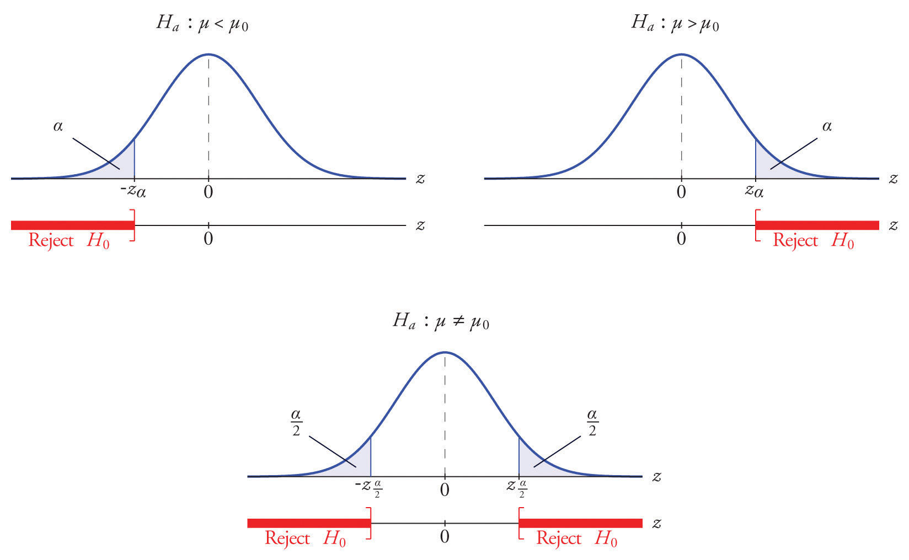
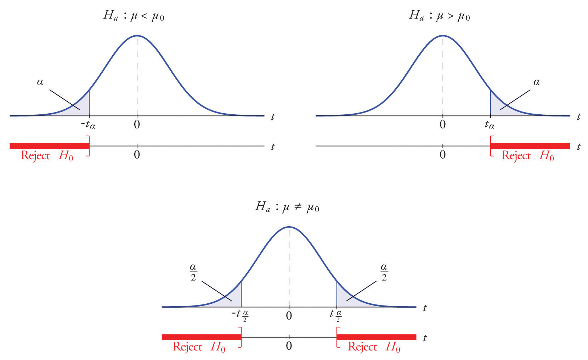

```{r setup, include=FALSE}
knitr::opts_chunk$set(echo = TRUE)
```


## Pruebas de hipótesis

### Introducción

Una prueba de hipótesis es un método estadístico que responde a una pregunta particular de forma  Sí o No.

Ejemplo: ¿El GPA promedio de estudiantes universitarios es menor a 2.8?

Ejemplo: ¿El ingreso promedio de los hombres en Puerto Rico es más alto que el ingreso promedio de las mujeres?


Una prueba de hipótesis generalmente se expresa en forma de dos enunciados, en lugar de una pregunta. Estas declaraciones se llaman la hipótesis nula ($H_0$) y la hipótesis alterna. ($H_a$)

$H_0$ y $H_a$ corresponden a dos enunciados en lugar de hacer una sola pregunta.

Ejemplos:

1.  Podemos considerar el planteamiento de las siguientes hipótesis para el GPA de los estudiantes en Puerto Rico. 

$H_0$: El GPA promedio de los estudiantes subgraduados en Puerto Rico es igual a 2.8

$H_a$: El GPA promedio de los estudiantes subgraduados en Puerto Rico es mayor a 2.8

Otra forma de escribir estas hipótesis es mediante un parámetro poblacional, que en este caso, es el promedio poblacional $\mu$.

Entonces, las correspondientes hipótesis para el ejemplo 1 son:

$H_0$: $\mu = 2.8$ 

$H_a$: $\mu > 2.8$ 

2. ¿Devengan más dinero los hombres que las mujeres en Puerto Rico?

$H_0$: El ingreso mensual promedio es igual en hombres y en mujeres.

$H_a$: El ingreso mensual promedio es mayor en hombres que en mujeres.

Para este caso el parámetro es,  el ingreso promedio de hombres y mujeres, es decir, $\mu_M$ y $\mu_F$ respectivamente. entonces 


$H_0$: $\mu_M = \mu_F$

$H_a$: $\mu_M > \mu_F$

Uno de los errores más comunes al plantear las hipótesis para la media poblacional $\mu$, es usar la media muestra $\bar{X}$.

### Formalismo en pruebas de hipótesis 

Podemos organizar la metodología para realizar pruebas de hipótesis en unos simples pasos:

1.  Definir el parámetro de interés y los datos del problema. 

2.  Plantear las hipótesis 

3.  Método de análisis y supuestos

4.  Encontrar el valor crítico de la distribución, luego especificar la región de rechazo y no rechazo.

5.  Decisión y conclusión.

### Pruebas de hipótesis para la media poblacional

Para la media poblacional, donde $\mu_0$ es un número fijo definido por el investigador, las hipótesis se pueden definir de una de las tres formas siguientes:

1.  Prueba a cola izquierda:

$H_0$: $\mu = \mu_0$

$H_a$: $\mu < \mu_0$

2.  Prueba a cola derecha:

$H_0$: $\mu = \mu_0$

$H_a$: $\mu > \mu_0$


3.  Prueba a dos colas:

$H_0$: $\mu = \mu_0$

$H_a$: $\mu \neq \mu_0$


> Caso 1: La varianza poblacional $\sigma^2$ es conocida 

En algunos casos, por algún motivo se es conocida la varianza poblacional $\sigma^2$ y un valor específico de $\mu$ como  $\mu_0$. En este caso el método de análisis, suponiendo que los datos provienen de una distribución normal  y que la varianza es conocida es mediante la distribución normal estándar $Z$. 

El estadístico de prueba es,

$$Z_0=\dfrac{\bar{X}-\mu_0}{\sigma/\sqrt{n}}$$


En general podemos plantear tres tipos de hipótesis para la media poblacional en este caso.


1. Prueba a cola izquierda

$H_0$: $\mu = \mu_0$

$H_a$: $\mu <  \mu_0$

En este caso la región de rechazo está dada por los valores de $Z$ menores que $-Z_{\alpha}$.

El criterio de decisión, es:  Se decide rechazar $H_0$ si,

$$Z_0 < -Z_{\alpha}$$

2.  Prueba a cola derecha

$H_0$: $\mu = \mu_0$

$H_a$: $\mu  >  \mu_0$


En este caso la región de rechazo está dada por los valores de $Z$ mayores que $Z_{\alpha}$.

El criterio de decisión, es:  Se decide rechazar $H_0$ si,

$$Z_0 > Z_{\alpha}$$

3.  Prueba a dos colas 

$H_0$: $\mu = \mu_0$

$H_a$: $\mu \neq  \mu_0$

En este caso la región de rechazo está dada por los valores de $Z$ mayores que $Z_{\alpha/2}$ y menores que $-Z_{\alpha/2}$.

El criterio de decisión, es: Se decide rechazar $H_0$ si tenemos:

$$|Z_0| > Z_{\alpha/2}$$


**Las regiones de rechazo para cada caso de hipótesis alterna son las siguientes:**




**¿Que es $\alpha$?**


Es la significancia estadística, representa el valores de la probabilidad de rechazar la hipótesis nula $H_0$, dado que $H_0$ es cierta y es conocido como el error tipo I. 


**¿Cómo concluir?**

Si la decisión es rechazar la hipótesis nula $H_0$, entonces se debe concluir con base en la hipótesis alterna $H_a$.

> Ejemplos

1.  En los últimos cinco años el puntaje promedio en el examen final de un curso de estadística fue 73 puntos. Este semestre una clase con 27 estudiantes utilizando un nuevo libro de texto obtuvo en promedio 78.1. Se sabe que la varianza poblacional es $\sigma^2=49$. ¿Hay evidencia para afirmar que el nuevo libro de texto hizo que el resultado del examen final fuera más alto?. Use un nivel de significancia del 5 %

**Paso 1: Los datos del problema y supuestos del problema son**

$\bar{X}=78.1$

$\mu_0 = 73$

$n = 27$

$\sigma = 7$

$\alpha = 0.05$

**Paso 2: Plantear las hipótesis**

$H_0$: $\mu = 73$

$H_a$: $\mu > 73$


**Paso 3: Estadístico de prueba**

El estadístico de prueba bajo $H_0$ es

$$Z_0=\dfrac{\bar{X}-\mu_0}{\sigma/\sqrt{n}}=\dfrac{78.1-73}{7/\sqrt{27}}=2.91$$

Entonces la región de rechazo está dada por todos los valores de $Z$ mayores que $2.91$

**Paso 4: Valor crítico y región de rechazo**
Para calcular el valor crítico de la distribución normal estándar se usa la siguiente función en `RStudio`

```{r}
qnorm(0.05,0,1)
```

Omitiendo el signo negativo dado que la prueba es a cola derecha. Entonces tenemos que 

$$Z_0 > Z_{0.05}$$

es decir,

$$2.914 > 1.644$$

**Paso 5: Decisión y conclusión**

**Decisión**: Se decide rechazar la hipótesis nula $H_0$, dado a que $Z_0 > Z_{0.05}$.

**Conclusión**: Se encontró evidencia significativa de que la nota final aumentó con el uso del nuevo libro de texto en la clase. 

### p - values

Es frecuente que en artículos científicos lo que se reporte es el “p-value” de la prueba de hipótesis de manera que el lector pueda llegar a sus propias conclusiones. **El p-value es una probabilidad, y es la probabilidad de observar un valor igual o mayor al estadístico de prueba bajo el supuesto de que la hipótesis nula $H_0$ es cierta**. 

Un p-value pequeño es evidencia en contra de la hipótesis nula y a favor de la hipótesis alterna. Cuando el nivel de significancia $\alpha$ ha sido seleccionado, la hipótesis nula se rechaza si el p-value es menor que $\alpha$.

Fórmulas para calcular “p-value”: Pero depende de la forma de la hipótesis alterna

Si $H_a: \mu < \mu_0$, entonces el p-value = $P(Z < Z_0)$.


Si $H_a: \mu > \mu_0$, entonces el p-value = $P(Z > Z_0)$.


Si $H_a: \mu \neq \mu_0$, entonces p-value = $2P(Z > |Z_0|)$.

Ejemplo 2. En estudios previos se ha determinado que el nivel de colesterol promedio de pacientes con problemas cardíacos es 220. Un cardiólogo piensa que en realidad el nivel es más alto y para probar su afirmación usa una muestra del colesterol en 20 pacientes. ¿Habrá suficiente evidencia estadística para apoyar la afirmación del cardiólogo? Justificar su contestación basándose en el “p-value”. Asuma $\sigma=13$

Los datos del problema son:

217, 223, 225, 245, 238, 216, 217, 226, 202, 233, 235, 242, 219, 221, 234, 199, 236, 248, 218, 224

Debemos ingresar los datos a RStudio.

```{r,comment=NA}
colesterol <- c(217, 223, 225, 245, 238, 216, 217, 226, 202, 233, 235, 242, 219, 221, 234, 199, 236, 248, 218, 224)
mean(colesterol)
```

**Paso 1: Los datos del problema y supuestos del problema son**

$\bar{X}=225.9$

$\mu_0 = 220$

$n = 20$

$\sigma = 13$

$\alpha = 0.05$

**Paso 2: Plantear las hipótesis**

$H_0$: $\mu = 220$

$H_a$: $\mu > 220$


**Paso 3: Estadístico de prueba**

El estadístico de prueba bajo $H_0$ es

$$Z_0=\dfrac{\bar{X}-\mu_0}{\sigma/\sqrt{n}}=\dfrac{225.9 - 220}{13/\sqrt{22}}=\dfrac{5.9}{2.906888}=2.029$$

Entonces la región de rechazo está dada por todos los valores de $Z$ mayores que $2.029$

**Paso 4: Valor crítico y región de rechazo**

Para calcular el valor crítico de la distribución normal estándar se usa la siguiente función en `RStudio`

```{r}
qnorm(0.05, lower.tail = FALSE)
```

Omitiendo el signo negativo dado que la prueba es a cola derecha. Entonces tenemos que 

$$Z_0 > Z_{0.05}$$

es decir,

$$2.029 > 1.644$$

**Paso 5: Decisión y conclusión**

**Decisión**: Se decide rechazar la hipótesis nula $H_0$, dado a que $Z_0 > Z_{0.05}$, es decir $2.914 > 1.644$

**Conclusión**: Se encontró evidencia significativa de que la nota final aumentó con el uso del nuevo libro de texto en la clase. 

Todo el procedimiento anterior es correcto, pero la otra forma de tomar la decisión de rechazo o no rechazo, suele hacerse basándose en el "p-value". ¿Cómo calculamos el "p-value"?

Para encontrar el "p-value", debemos calcular la siguiente probabilidad: $P(Z > Z_0)$, es decir $P(Z > 2.029)$. Para esto usamos RStudio.

```{r}
1 - pnorm(2.029)
```

**Decisión y conclusión usando el "p-value".**

El valor del “p-value” es .021 menor que el nivel de significación $\alpha =.05$, por lo tanto; se rechaza la hipótesis nula y se concluye de que sí hay evidencia estadística de que el nivel de colesterol promedio de los pacientes con problemas cardíacos es mayor de 220. O sea los resultados apoyan lo que afirma el cardiólogo.


¿Cómo hacer pruebas de hipótesis usando directamente RStudio?

Si tenemos un conjunto de datos, y estamos en el caso en que $\sigma$ es conocida, podemos usar la función `z.test()`, pero se debe instalar antes el paquete `BSDA`.

El siguiente código ilustra cómo hacer la prueba de hipótesis usando RStudio. Las posibilidades para la hipótesis alterna son: "greater", "less" or "two.sided".

```{r,comment=NA,warning=FALSE,message=FALSE}
library(BSDA)
z.test(colesterol, alternative = "greater", mu = 220, sigma.x = 13, conf.level = 0.95)
```


De la anterior salida podemos identificar la siguiente información:

$Z_0 = 2.0297$


p-value $= 0.0212$


$\alpha = 0.05$


$\bar{X}=225.9$


Es importante aprender a identificar la información anterior en la salida de la función  `z.test`


> **Caso 2: Varianza poblacional $\sigma^2$ es desconocida**


En este caso no es posible usar la distribución normal estándar, por tanto se usa la distribución t-student.

El estadístico de prueba bajo $H_0$ es

$$t_0=\dfrac{\bar{X}-\mu_0}{s/\sqrt{n}}$$

y el valor crítico de la distribución t-student será $t_{\alpha,n-1}$, donde $n-1$ son los grados de libertad. 


Si la prueba es a cola izquierda la región de rechazo son los valores de $t < -t_{\alpha}$, y se decide rechazar $H_0$ si $t_0 < -t_{\alpha}$.


Si la prueba es a cola derecha la región de rechazo son los valores de $t > t_{\alpha}$, y se decide rechazar $H_0$ si $t_0 > t_{\alpha}$.


Si la prueba es a dos colas la región de rechazo son los valores de $t < -t_{\alpha}$ y los valores de $t > t_{\alpha}$, y se decide rechazar $H_0$ si $|t_0| > t_{\alpha}$.




> Ejemplos


1. En el pasado, la compra promedio de un cliente en una tienda determinada de ropa era de $\$ 55$. La tienda acaba de publicar un anuncio en el periódico ofreciendo una promoción y quiere saber si aumentaron las ventas después de publicar las ofertas. En la semana posterior al anuncio  43 de los clientes gastaron un promedio de $\$63$ con una desviación estándar de $\$18$. Pruebe al nivel del 10% si la promoción fue un éxito.


**Paso 1: Los datos del problema y supuestos del problema son**

Se asume que los datos provienen de una distribución normal. 

$\bar{X}=55$

$\mu = 63$

$n = 43$

$S = 18$

$\alpha = 0.1$

**Paso 2: Plantear las hipótesis**

$H_0$: $\mu = 55$

$H_a$: $\mu > 55$


**Paso 3: Estadístico de prueba**

El estadístico de prueba bajo $H_0$ es

$$t_0=\dfrac{\bar{X}-\mu_0}{S/\sqrt{n}}=\dfrac{63-55}{18/\sqrt{43}}=2.914$$

Entonces la región de rechazo está dada por todos los valores de $t_{\alpha}$ mayores que $2.91$

**Paso 4: Valor crítico**

Para calcular el valor crítico de la distribución t-student con $n-1$ grados de libertad, es decir con 43-1=42 se usa la siguiente función en `RStudio`


```{r}
qt(0.1,42)
```

Omitiendo el signo negativo dado que la prueba es a cola derecha. Entonces tenemos que 

$$t_0 < t_{0.1,43}$$

es decir,

$$2.914 > 1.302$$


**Paso 4: Decisión y conclusión**


**Decisión**: Se decide rechazar la hipótesis nula $H_0$, dado a que $t_0 > t_{0.1,42}$.


**Conclusión**: Se encontró evidencia significativa de que las ventas aumentaron y que por tanto la promoción fue exitosa. 


### Prueba de hipótesis para una proporción

Para la proporción poblacional, donde $\p_0$ es un número fijo definido por el investigador, las hipótesis se pueden definir de una de las tres formas siguientes:

1.  Prueba a cola izquierda:

$H_0$: $p = p_0$

$H_a$: $p < p_0$

2.  Prueba a cola derecha:

$H_0$: $p = _0$

$H_a$: $p > p_0$


3.  Prueba a dos colas:

$H_0$: $p = p_0$

$H_a$: $p \neq p_0$


La distribución del estadístico de prueba  bajo la hipótesis nula $H_0 : p= p_0$ es:


$$Z_0=\dfrac{\hat{p}-p_0}{\sqrt{\dfrac{p_0(1-p_0)}{n}}}$$


> Ejemplos

1. Un fabricante de refrescos afirma que la mayoría de los adultos prefieren su bebida líder en comparación con la de su principal competidor. Para probar esta afirmación, 500 personas seleccionadas aleatoriamente recibieron las dos bebidas en orden aleatorio para degustar. Entre ellos, 270 preferían la marca del fabricante de refrescos, 211 preferían la marca del competidor y 19 no podían decidirse. Determine si hay evidencia suficiente, al nivel de significancia del 5%, para respaldar el reclamo del fabricante de refrescos de que la población está dividida en partes iguales en su preferencia.


**Paso 1: Los datos del problema y supuestos del problema son**

No tiene supuestos

$\hat{p}=270/500=0.54$

$p_0 = 0.5$

$n = 500$

$\alpha = 0.05$

**Paso 2: Plantear las hipótesis**

$H_0$: $p = 0.5$

$H_a$: $p > 0.5$


**Paso 3: Estadístico de prueba**

El estadístico de prueba bajo $H_0$ es

$$Z_0=\dfrac{\hat{p}-p_0}{\sqrt{\dfrac{p_0(1-p_0)}{n}}}=\dfrac{0.54-0.5}{\sqrt{\dfrac{0.5(1-0.5)}{500}}}=1.789$$

Entonces la región de rechazo está dada por todos los valores de $Z_{\alpha}$ mayores que $1.789$

**Paso 4: Valor crítico**

Para calcular el valor crítico de la distribución normal estándar usamos la siguiente función en `RStudio`


```{r}
qnorm(0.05,0,1)
```

Omitiendo el signo negativo dado que la prueba es a cola derecha. Entonces tenemos que 

$$Z_0 > {Z_0.05}$$

es decir,

$$1.789 > 1.644$$


**Paso 5: Decisión y conclusión**


**Decisión**: Se decide rechazar la hipótesis nula $H_0$, dado a que $Z_0 > {Z_0.05}$.


**Conclusión**: Se encontró evidencia significativa de que los adultos prefieren el refresco del fabricante uno. 


2. Los bebés recién nacidos son más propensos a ser niños que niñas. Una muestra aleatoria encontró 13173 niños nacidos entre 25468  recién nacidos.  ¿Hay evidencia de que el nacimiento de niños es más común que el nacimiento de niñas en toda la población? Use $\alpha=0.1$.


## Ejercicios de repaso


1.  Los investigadores desean probar la eficacia de un programa destinado a reducir la duración del parto en el parto. El tiempo de trabajo promedio aceptado en el nacimiento de un primer hijo es de 15.3 horas. La duración media de los trabajos de 13 madres primerizas en un programa piloto fue de 8,8 horas. Suponga que la desviación estándar poblacional es conocida e igual a 3.1 horas. Suponiendo una distribución normal de los tiempos de trabajo de parto, evalúe al nivel de 10 % de la prueba de significancia si el tiempo de parto promedio para todas las mujeres que siguen este programa es menos de 15.3 horas.

2.  El precio de una raqueta de tenis popular en una cadena de tiendas nacional es de $ 179. Juan compró cinco de la misma raqueta en un sitio de subastas en línea por los siguientes precios:

155, 179, 175, 175, 161

Suponiendo que los precios de subasta de las raquetas se distribuyen normalmente, determine si hay suficiente evidencia en la muestra, al nivel de significancia del 5%, para concluir que el precio promedio de la raqueta es menor a $ 179 si se compra en una subasta en línea.


3.  En el pasado, la duración promedio de una llamada telefónica saliente desde una oficina comercial ha sido de 143 segundos. Un gerente desea verificar si ese promedio ha disminuido después de la introducción de los cambios de política. Una muestra de 100 llamadas telefónicas produjo una media de 133 segundos, con una desviación estándar de 35 segundos. Realice la prueba pertinente al nivel de significancia del 1%.

4.  El tamaño promedio del hogar en una región determinada hace varios años era 3.14 personas. Un sociólogo desea probar, con un nivel de significación del 5%, si ahora es diferente. Realice la prueba con la información recopilada por el sociólogo: en una muestra aleatoria de 75 hogares, el tamaño promedio fue de 2.98 personas, con una desviación estándar de muestra de 0.82 personas.

5.  Hace dos años, el 72 % de los hogares de un determinado condado participaban regularmente en el reciclaje de los desechos domésticos. El gobierno del condado desea investigar si esa proporción ha aumentado después de una campaña intensiva para promover el reciclaje. En una encuesta de 900 hogares, 674 dijeron participar regularmente en el reciclaje. Realice la prueba pertinente al nivel de significancia del 10 %.

6.  El gobierno de un país en particular informa que su tasa de alfabetización es del 52 %. Una organización no gubernamental cree que es menos. La organización toma una muestra aleatoria de 600 habitantes y obtiene una tasa de alfabetización del 42 %. Realice la prueba pertinente al 0.05 de significancia.  


