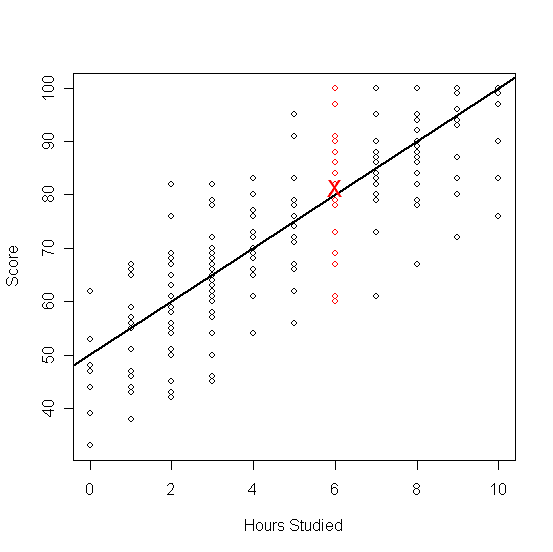
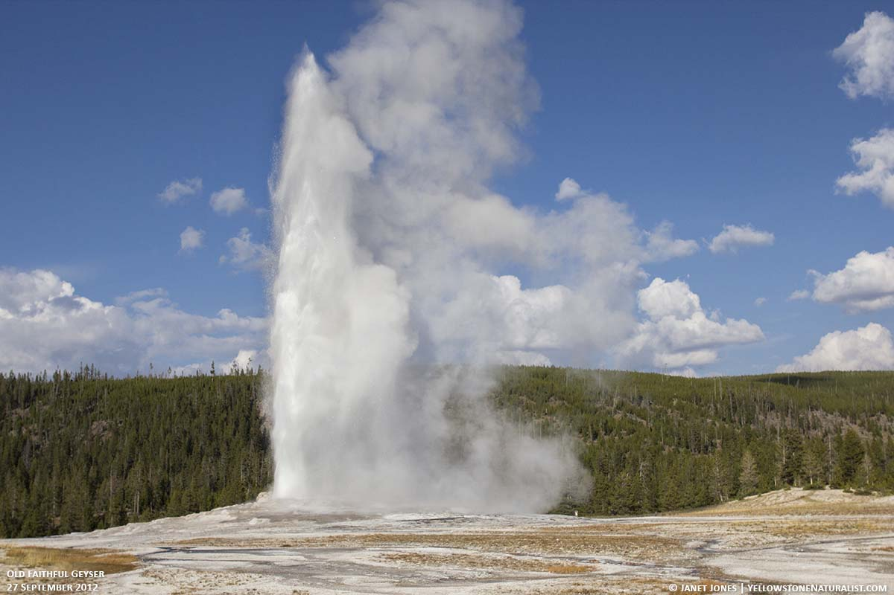

```{r setup, include=FALSE}
knitr::opts_chunk$set(echo = TRUE)
```

```{r,eval=T,echo=F}
load("/datos/DirectorioR/Resma3.RData")
```


Si existe una relación entre las variables "x" e "y", Entonces podemos describirlo mediante un modelo o una ecuación  $y = f (x)$.
 
Aquí $y$ se considera solo para relaciones lineales, es decir, ecuaciones de la forma:

 
$$y=mx+b$$
En Estadística, aunque utilizamos una notación ligeramente diferente:
 
$$y = \alpha + \beta x$$
Donde:

1.  $y$ es la variable respuesta. (variable dependiente)

2.  $x$ es la variable predictora. (variable independiente)

3.  $\alpha$ es el $y-$ intercepto.

4.  $\beta$ es la pendiente de la recta.
 
La lógica aquí es esta: si sabemos el valor de $x$, podemos calcular el correspondiente valor de $y$. Lamentablemente, siempre hay "errores" en este cálculo, por lo que la respuesta $y$ varía incluso para la misma $x$. Sí el error es considerado, entonces el modelo se escribe de la siguiente manera:

$$y = \alpha + \beta x + \epsilon$$
 

Donde $\epsilon$ denota los errores. Para estos errores se supone son independientes idénticamente distribuidos Normal con media $0$ y varianza $\sigma^2$. Es decir 

$$\epsilon_i \sim Normal(0,\sigma^2)$$
 
 
Consideremos el siguiente ejemplo para poner en contexto la teoría:


Sea $x$ la cantidad de horas que un estudiante estudia para un examen y  $y$ la puntuación del examen. Digamos que sabemos por experiencia que $y = 50 + 5x$. Entonces, incluso si el estudiante no estudia  $(x = 0)$, él o ella obtendría alrededor de $50$ ($y-$intercepto) puntos, y por cada hora estudiada, el puntaje aumenta alrededor de $5$  puntos (pendiente).
Pero, por supuesto, hay muchos otros factores que influyen en el puntaje del examen, como la capacidad general, la experiencia previa, estar saludable el día del examen, la ansiedad del examen, etc., por lo que para un alumno específico el puntaje no será exactamente lo que predice la ecuación. Entonces, si tres estudiantes estudian 6 horas, la ecuación predice un puntaje  de $50 + 5 * 6 = 80$ para todos, pero uno podría obtener un $70$, el siguiente un $78$ y el tercero un $92$. Por lo tanto lo que la ecuación predice es en realidad su puntuación media (puntuación promedio).
 
Esto se ilustra en el siguiente gráfico:




Donde las puntuaciones de las personas que estudiaron $6$ horas están en rojo, y su puntaje promedio está marcado por una $X$ (dese cuenta que $\bar{X}$ es una coordenada de la recta). El significado de la línea se explica como la respuesta media o promedio.
 
Por tanto $\alpha$ y $\beta$ son números que dependen de la población de la cual se extraen los datos $(X,Y)$. Por lo tanto, son parámetros (Valores desconocidos) como la media o la mediana.
 
**Un problema estándar es este**: Tenemos un conjunto de datos y creemos que hay una relación lineal entre $x$ e $y$. Nos gustaría saber la ecuación que describe el modelo matemáticamente.
 
 $$y = \alpha + \beta x$$
 
Es decir, ¿tenemos que "adivinar" los valores de  $\alpha$ y $\beta$?. La respuesta es No, Los estimaremos mediante un método llamado regresión por mínimos cuadrados. Esto se hace en RStudio con el comando `lm()`.
 
## Ejemplo: Tiempo de espera para la erupción de un géiser. 

El parque nacional de Yellowstone tiene muchas atracciones naturales, entre ellas el Old Faithful Geyser. 



El Old Faithful es un famoso géiser en el Parque Nacional de Yellowstone en los Estados Unidos. Sus erupciones se caracterizan por tener una cierta regularidad; De acuerdo con los datos históricos, cada 43 a 96 minutos entra en erupción, con una duración de 1,5 a 5 minutos y puede erupcionar unas 20 veces en un día. En este fenómeno natural, existe una relación entre la duración y la duración de los tiempos de espera, en general, una gran erupción es seguida por un largo tiempo de espera y de manera similar, una erupción más corta es seguida por un largo tiempo de espera. Pero el Old Faithful no es tan fiel como el nombre sugiere, porque el tiempo entre las erupciones y la duración de cada erupción es bastante variable.

Tenemos 272 datos de  erupciones de este géiser, esta data tiene dos variables: Una es la duración de la erupción `eruptions` y la otra es el tiempo de espera hasta la próxima erupción `waiting`.

```{r}
head(faithful,20)
```
 
Para revisar la relación entre el tiempo de espera y el tiempo de la duración podemos dibujar un diagrama de dispersión (Scatterplot).

```{r}
library(ggplot2)
p <- ggplot(faithful) +
       geom_point(aes(x=faithful$Eruptions, y=faithful$Waiting.Time)) +
       scale_x_continuous("Waiting time until next eruption (min)") +
       scale_y_continuous("Eruption duration (min)")
p
```

Por lo que vemos, hay una clara correlación positiva, cuanto mayor es el tiempo de espera, mayor es la duración de la erupción.


Entonces, podemos escribir un modelo para modelar matemáticamente el tiempo de espera promedio para que haga erupción, mediante un modelo de regresión simple de la forma:

$$Waiting.Time = \alpha + \beta*Eruptions$$

```{r}
lm(faithful$Waiting.Time ~ faithful$Eruptions , data = faithful)
``` 
 
Entonces, según los resultados estimados para $\alpha$ y $\beta$ el modelo es el siguiente:

$$\text{Waiting.Time} = 33.47 + 10.73 *\text{Eruptions}$$
Hay un buen gráfico llamado diagrama de línea ajustado, que es el diagrama de dispersión con la línea de regresión de mínimos cuadrados añadida:

```{r}
library(ggplot2)
ggplot(faithful, aes(x=faithful$Waiting.Time, y=faithful$Eruptions)) +    geom_point() +  geom_smooth(method=lm , color="red", se=FALSE)
``` 
 
 
### Coeficiente de determinación

El coeficiente de determinación de un modelo de regresión lineal es el cociente de las varianzas de los valores ajustados y los valores observados de la variable dependiente. Si denotamos $y_i$ como los valores observados de la variable dependiente, $\bar{y}$ como su media, y $\hat{y}_i$ como el valor ajustado, entonces el coeficiente de determinación es:
 
$$R^2=\dfrac{(\hat{y_i}-\bar{y})^2}{(y_i-\bar{y})^2}$$

> Problema
 
Encuentre el coeficiente de determinación para el modelo de regresión lineal simple del conjunto de datos `faithfiul`.
 
> Solución
 
Aplicamos la función lm a una fórmula que describe las erupciones variables por la variable que espera, y guardamos el modelo de regresión lineal en una nueva variable `eruption.lm`.

```{r}
eruption.lm <- lm(faithful$Waiting.Time ~ faithful$Eruptions, data = faithful)
``` 
 
Luego extraemos el coeficiente de determinación del atributo r.squared de su resumen.


```{r}
summary(eruption.lm)$r.squared
``` 
 
 
El coeficiente de determinación del modelo de regresión lineal simple para el conjunto de datos  es 0.81146.

**Interpretación**: Este valor significa que la variabilidad en la respuesta (eruptions) es explicada en un 0.8114 (81 %) por la variable predictora `waiting`.


> **Dos cosas importantes**

1.  Digamos que  $\bar{X}$ es la media del vector x, y que y $\bar{Y}$  es la media del vector y, entonces  $(\bar{X}, \bar{Y})$  es siempre un punto en la línea. Es decir la línea de regresión siempre pasa por el punto 
 
2.  Hemos visto anteriormente que para el coeficiente de correlación no importa qué variable elijamos como X y que como Y, es decir, tenemos
 
$$cor(x, y) = cor(y, x)$$

Por ejemplo,la correlación entre las variables es

```{r}
cor(faithful$Waiting.Time,faithful$Eruptions)
``` 
 


