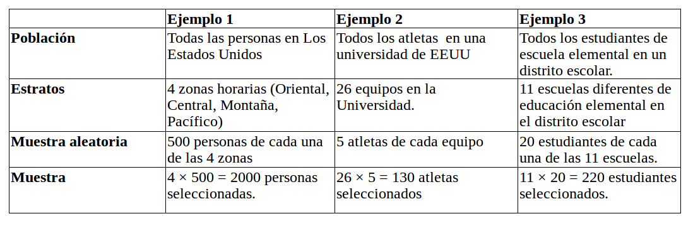
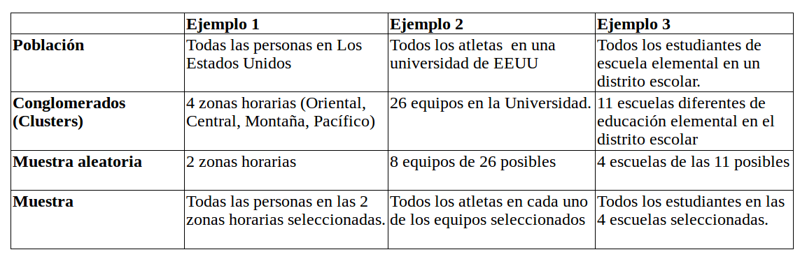

```{r setup, include=FALSE}
knitr::opts_chunk$set(echo = TRUE)
```

### Técnicas de Muestreo

#### Definición de Muestreo

Muestreo se define como el proceso de pasos y técnicas para llevar a cabo la extracción de la muestra. El muestreo se debe realizar garantizando que la muestra seleccionada sea aleatoria. Existen varias técnicas para hacer muestreo, a continuación se enumeran las cuatro principales.


#### Muestreo Aleatorio simple

Se usa cuando a cada elemento de la población se le quiere dar la misma oportunidad de ser elegido en la muestra.

* La población consiste en N objetos.

* La muestra consta de n objetos.

* Si todas las muestras posibles de $n$ objetos tienen la misma probabilidad de ocurrir, el método de muestreo se llama muestreo aleatorio simple.

Después de fijar el tamaño de la muestra $n$,  los elementos que la compongan se deben elegir aleatoriamente entre los $N$ de la población. Para hacer que el proceso sea aleatorio los individuos se deben etiquetar (números por ejemplo), y luego serán seleccionados usando computadora u otro método adecuado. Hay muchas formas de obtener una muestra aleatoria simple. Una forma sería el método de lotería. A cada uno de los N miembros de la población se le asigna un número único. Los números se colocan en un recipiente y luego se mezclan bien. Entonces, un investigador selecciona los $n$ números. Los miembros de la población que tienen los números seleccionados terminan haciendo parte de la muestra.

#### Muestreo Estratificado

Se usa cuando se conoce de antemano que la población está dividida en estratos, que son equivalentes a categorías y los cuales por lo general no son de igual tamaño.  

El muestreo estratificado es posible cuando tiene sentido dividir la población en grupos según un factor que puede influir en la variable que se está midiendo. Estos grupos se llaman estratos. Un grupo individual se llama estrato. Con muestreo estratificado uno debería:

* Dividir la población en grupos (estratos).
* Obtener una muestra aleatoria simple de cada grupo (estrato)
* Recopilar datos sobre cada unidad de muestreo que se muestreó aleatoriamente de cada grupo (estrato)

El muestreo estratificado funciona bien cuando una población heterogénea se divide en grupos bastante homogéneos. Bajo estas condiciones, la estratificación generalmente produce estimaciones más precisas de los parámetros poblacionales comparado con las estimaciones que se encontrarían a partir de una muestra aleatoria simple. La siguiente tabla muestra algunos ejemplos de formas de obtener una muestra estratificada.




#### Muestreo por conglomerados (“Clusters”)

En este caso la población se divide en grupos llamados conglomerados. Luego se elige al azar un cierto número de ellos y todos los elementos de los conglomerados elegidos forman la muestra.

En el muestreo por conglomerados la unidad muestral es un grupo de elementos de la población que forman una unidad, a la que llamamos conglomerado. Las unidades hospitalarias,  los departamentos universitarios, una caja de determinado producto, etc., son conglomerados naturales. En otras ocasiones se pueden utilizar conglomerados no naturales como, por ejemplo, las urnas electorales. Cuando los conglomerados son áreas geográficas suele hablarse de "muestreo por áreas". El muestreo por conglomerados consiste en seleccionar aleatoriamente un cierto número
de conglomerados (Clousters) (el necesario para alcanzar el tamaño muestral establecido) y en investigar después todos los elementos pertenecientes a los conglomerados elegidos. 




* **Con el Ejemplo 1:**

Se preferiría el muestreo estratificado sobre el muestreo por conglomerados, particularmente si las preguntas de interés se ven afectadas por el huso horario. Por ejemplo, el porcentaje de personas que ven un evento deportivo en vivo en la televisión podría verse muy afectado por la zona horaria en la que se encuentran. El muestreo por conglomerados funciona mejor cuando hay un número razonable de conglomerados en relación con toda la población. En este caso, seleccionar 2 clusters de 4 posibles clusters realmente no proporciona mucha ventaja sobre el muestreo aleatorio simple.

* **Con el Ejemplo 2:**

Se puede usar el muestreo estratificado o el muestreo por conglomerados. Dependerá de qué preguntas se hagan. Por ejemplo, considere la pregunta "¿Está de acuerdo o en desacuerdo con que reciba la atención adecuada del equipo de médicos de la Clínica de Medicina del Deporte cuando está lesionado?" La respuesta a esta pregunta probablemente no dependa del equipo, por lo que el muestreo por conglomerados (Clousters) estaría bien. En contraste, si la pregunta de interés es "¿Está de acuerdo o en desacuerdo con que el clima afecte su desempeño durante un evento deportivo?" La respuesta a esta pregunta probablemente se verá influida por si el deporte se juega o se practica a campo abirto o en un sitio cubierto. En consecuencia, sería preferible el muestreo estratificado.

* **Con el Ejemplo 3:**

El muestreo por conglomerados probablemente sería mejor que el muestreo estratificado si cada escuela primaria individual representa apropiadamente a toda la población como en el distrito escolar donde los estudiantes de todo el distrito pueden asistir a cualquier escuela. El muestreo estratificado podría usarse si las escuelas primarias tenían ubicaciones muy diferentes y solo atendían a su vecindario local (es decir, una escuela primaria está ubicada en un entorno rural, mientras que otra escuela primaria está ubicada en un entorno urbano). Una vez más, las preguntas de interés pueden afectar qué método de muestreo se debe utilizar.

#### Muestreo Sistemático

Se usa cuando los datos de la población están ordenados en forma numérica. La primera observación es elegida al azar de entre los primeros elementos de la población y las siguientes observaciones son elegidas guardando la misma distancia entre sí.  Este procedimiento exige, enumerar todos los elementos de la población, pero en lugar de extraer n números aleatorios sólo se extrae uno. Se parte de ese número aleatorio i, que es un número elegido al azar, y los elementos que integran la muestra son los que ocupa los lugares i, i+k, i+2k, i+3k,...,i+(n-1)k, es decir se toman los individuos de k en k, siendo k el resultado de dividir el tamaño de la población entre el tamaño de la muestra: k= N/n. El número i que empleamos como punto de partida será un número al azar entre 1 y k.

### Formas de recolección de datos

1. Haciendo entrevistas personales. Puede ser el método más efectivo en muchas ocasiones pero es costoso y requiere bastante tiempo para ser ejecutado.

2. Haciendo entrevistas por teléfono. Tiene la desventaja de que el entrevistado puede no ser sincero en sus contestaciones.

3. Mediante cuestionarios emitidos por correo. Es costoso y por lo general no más del 30% de los entrevistados retornan el cuestionario.

4. Por observación directa.

5. A través de  Internet.

6. Usando simulación por computadoras.

