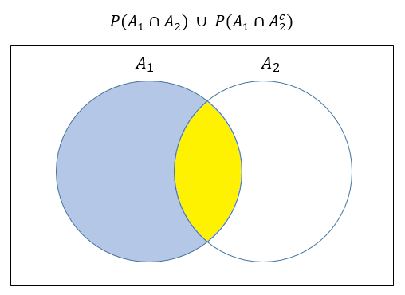

```{r setup, include=FALSE}
knitr::opts_chunk$set(echo = TRUE)
```

#### **1. (5 pts)** Sean $A_1$ y $A_2$ eventos del mismo espacio muestral $S$. Digamos que $P(A_1 \cup A_2)= 0.5$ y $P(A_1 \cup A^c_{2})= 0.8$

- #### Encuentre $P(A_1)$

####  -----Solución-----


#### Sabemos que $P(A_1 \cup A_2)= 0.5$ y $P(A_1 \cup A^c_{2})= 0.8$, entonces 

#### $$0.5 = P(A_1) + P(A_2) - P(A_1 \cap A_2) \quad (1)$$
#### $$0.8 = P(A_1) + P(A^c_2) - P(A_1 \cap A^c_2) \quad (2)$$


#### Sumando las ecuaciones $(1)$ y $(2)$ obtenemos:

#### $$1.3 = 2P(A_1) + P(A_2) + P(A^c_2) - \big[P(A_1 \cap A_2) + P(A_1 \cap A^c_2) \big]$$

#### Por propiedades de probabilidad sabemos que $P(A_2) + P(A^c_2) = 1$.

#### Ahora, mediante un diagram de Venn podemos darnos cuenta que  $P(A_1 \cap A_2) + P(A_1 \cap A^c_2) = P(A_1)$. 





#### Entonces,

#### $$1.3 = 2P(A_1) + 1 - P(A_1)$$

#### $$P(A_1) = 0.3$$


#### **2. (5 pts)** Sean $A$ y $B$ eventos de un espacio muestral $S$. Tenemos que $P(A^c) = \dfrac{1}{2}$ y $P(B) = \dfrac{3}{4}$. ¿Pueden ser $A$ y $B$ eventos mutuamente excluyentes?. Justifique su respuesta matemáticamente. 


#### -----Solución-----


#### Supongamos que $A$ y $B$ son eventos mutuamente excluyentes, entonces se cumple que:

#### $$P(A \cap B) = 0,$$

#### por lo tanto,

#### $$P(A \cup B) = P(A) + P(B) - 0$$
#### $$P(A \cup B) = \frac{1}{2} + \frac{3}{4} = \frac{5}{4} > 1 \quad \text{(Contradicción!)}$$

#### Llegamos a una contradicción, dado que una probabilidad no puede ser mayor que 1. Por lo tanto, $A$ y $B$ no pueden ser eventos mutuamente excluyentes.


#### **3. (10 pts)** En una clase de estadística hay 10 estudiantes, de los cuales  4 son hombres  y 6 son mujeres. En otra clase, esta vez de matemáticas, hay 16 estudiantes hombres y una cantidad desconocida de estudiantes de género femenino. Si se elige al azar un estudiante de cada clase (dos en total) y si sabemos que 0.44 es la probabilidad de que ambos estudiantes sean del mismo género. 

- #### Calcule el número de estudiantes de género femenino en la clase de matemáticas.


#### -----Solución-----


#### Definamos los siguientes eventos:

- #### $F_e$ = "Estudiantes mujeres en la clase de estadística".

- #### $M_e$ = "Estudiantes hombres en la clase de estadística".

- #### $F_m$ = "Estudiantes mujeres en la clase de matemáticas".

- #### $M_m$ = "Estudiantes hombres en la clase de matemáticas".

#### Sabemos que $0.44$ es la probabilidad de seleccionar los dos estudiantes del mismo género independientemente de la clase. Esto se traduce en:

#### $$0.44 = P\big[(F_e \cap F_m) \cup (M_e \cap M_m)\big]=$$
#### $$P(F_e \cap F_m) + P(M_e \cap M_m)=$$

#### $$P(F_e)*P(F_m) + P(M_e)*P(M_m),$$

#### luego,

#### $$0.44 =\frac{6}{10}*\frac{x}{16 + x} + \frac{4}{10}*\frac{16}{16 + x}$$

#### $$0.44 =\frac{6x}{10(16 + x)} + \frac{64}{10(16 + x)}$$

#### $$0.44 =\frac{6x + 64}{10(16 + x)}$$

#### $$0.44*10(16 + x) = 6x + 64$$

#### $$70.4 + 4.4x = 6x + 64$$
#### $$1.6x = 6.4$$

#### $$x = 4$$

#### Entonces, en la clase de matemáticas hay **4** mujeres.


#### **4. (5 pts)** En cierta universidad,

- #### Todos los estudiantes tienen al menos un auto.
- #### El 70% de los estudiantes tienen más de un automóvil.
- #### El 20% de los estudiantes tienen un automóvil deportivo.
- #### De esos estudiantes que tienen más de un automóvil, el 15% tiene un automóvil deportivo.

#### Con la información anterior, calcule la probabilidad de que un estudiante seleccionado al azar tenga exactamente un automóvil y que NO sea deportivo.


#### -----Solución-----


#### Definamos los siguientes eventos:

#### M = "Estudiantes que tienen más de un automóvil".

#### D = "Estudiantes que tienen un automóvil deportivo".

#### Queremos encontrar $P(M^c \cap D^c)$.

#### Entonces, según información del problema, tenemos:

#### $P(M) = 0.70$

#### $P(D) = 0.20$

#### También tenemos la probabilidad condicional  $P(D | M)=0.15$, por lo tanto, podemos usar la regla del producto:

#### $$P(D | M)= \frac{P(D \cap M)}{P(M)}$$

#### $$P(D \cap M)= P(D | M)P(M)$$
#### $$P(D \cap M)= 0.15*0.70$$
#### $$P(D \cap M)= 0.105.$$

#### Ahora podemos usar una tabla como ayuda para resolver el problema.


#### Entonces, $P(M^c \cap D^c) = 0.205$

#### Así, la probabilidad de seleccionar un estudiante al azar que tenga solo un carro y que no sea deportivo es $0.205$.


